# Google Gemini AIエージェント ハーネスエンジニアリング 完全ガイド

> **対象読者**: AIエージェント開発に初めて取り組む方・テスト基盤の設計を学びたい方  
> **目標**: Google推奨のエージェント評価ハーネスの設計思想・実装パターン・ベストプラクティスをゼロから理解し、現場で使えるレベルに到達する  
> **対応バージョン**: Gemini CLI v0.34.0 / Google ADK v1.x (Python & TypeScript) / ADK Python 2.0 Alpha  
> **最終更新**: 2026年5月（Google ADK 公式ドキュメント・Google Testing Blog 準拠）

---

## 目次

1. [AIエージェントのテストとは何か — 通常のソフトウェアとの違い](#1-aiエージェントのテストとは何か)
2. [ハーネスアーキテクチャ全体像](#2-ハーネスアーキテクチャ全体像)
3. [評価セット（Eval Set）の設計](#3-評価セットeval-setの設計)
4. [テストダブル — AIエージェント向け替え玉の作り方](#4-テストダブル--aiエージェント向け替え玉の作り方)
5. [ADK Eval — Google公式評価フレームワーク](#5-adk-eval--google公式評価フレームワーク)
6. [LLM-as-Judge パターン](#6-llm-as-judge-パターン)
7. [マルチエージェント評価ハーネス](#7-マルチエージェント評価ハーネス)
8. [フレイキー（不安定）評価への対処](#8-フレイキー不安定評価への対処)
9. [CIパイプラインへの統合](#9-ciパイプラインへの統合)
10. [ベストプラクティス 10則](#10-ベストプラクティス-10則)
11. [参考ソース一覧](#11-参考ソース一覧)

---

## 1. AIエージェントのテストとは何か

### 1.1 通常ソフトウェアとAIエージェントの決定的な違い

通常のソフトウェアは「同じ入力 → 必ず同じ出力」という**決定論的**な性質を持ちます。一方、LLMベースのAIエージェントは**確率的**であり、同じ質問でも毎回微妙に異なる回答を生成します。

| 比較軸 | 通常のソフトウェア | AIエージェント |
|--------|-----------------|--------------|
| 出力の性質 | 決定論的（毎回同じ） | 確率的（毎回変わりうる） |
| テスト手法 | `assert output == expected` | スコアリング・LLM-as-Judge |
| 失敗基準 | 1件でも `FAIL` | スコアが閾値を下回る |
| テストデータ | 単体テストケース | 評価セット（Eval Set） |
| 検証対象 | 戻り値・副作用 | ツール呼び出し・応答品質・安全性 |
| 実行コスト | ミリ秒〜秒単位・無料 | 秒〜分単位・APIコスト発生 |

### 1.2 AIエージェントのテストで何を検証するのか

AIエージェントのテストは大きく3つの観点に分かれます。

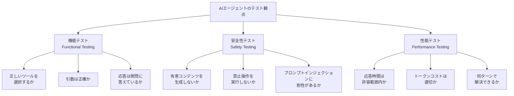

### 1.3 ハーネスが必要な理由

> **例え話**: 自動車のクラッシュテストを想像してください。実際に壁に衝突させるとき、ダミー人形・センサー・高速カメラ・制御された環境がすべて揃って初めて「安全性スコア」が出ます。AIエージェントも同様で、テスト環境・評価データ・採点ロジックがセットになった**テストハーネス**がなければ品質を数値化できません。

---

## 2. ハーネスアーキテクチャ全体像

### 2.1 Googleが推奨するエージェント評価ハーネスの構成

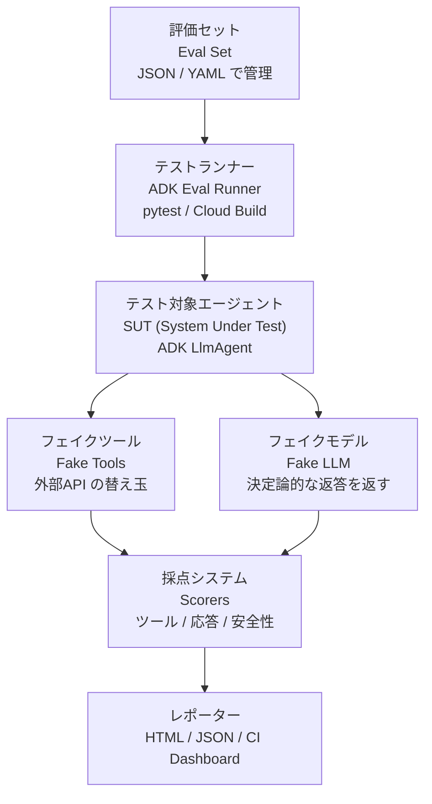

### 2.2 3種類のテストレベル

Googleはエージェントテストを「Small / Medium / Large」で分類しています（通常のソフトウェアテストと同じ枠組みを適用）。

| レベル | 名称 | LLM | 外部API | DBアクセス | 目的 | 実行時間 |
|--------|------|-----|---------|-----------|------|---------|
| **Small** | ユニット評価 | フェイクLLM | モック | フェイク | ツール呼び出しロジックのテスト | 〜5秒 |
| **Medium** | 統合評価 | 本物LLM（安価なモデル） | スタブ | ローカルDB | 1〜3ターンの会話品質評価 | 〜60秒 |
| **Large** | E2E評価 | 本物LLM（最高精度モデル） | 本物API | 本物DB | 複数ステップの自律タスク評価 | 〜300秒 |

---

## 3. 評価セット（Eval Set）の設計

### 3.1 評価セットとは

**評価セット**（Eval Set）とは、エージェントに「こう聞いたら・こうツールを呼んで・こう答えるはず」という期待を定義したテストデータの集合です。コードと分離してJSON/YAMLで管理することで、**評価観点の変更をコード変更なしに実施**できます。

### 3.2 ADK Eval の評価セット形式

```json
[
  {
    "name": "deploy_staging_query",
    "query": "ステージング環境にデプロイする手順を実行してください",
    "expected_tool_calls": [
      {
        "tool_name": "check_test_coverage",
        "args": { "threshold": 80 }
      },
      {
        "tool_name": "run_deploy",
        "args": { "environment": "staging" }
      }
    ],
    "reference": "テスト通過後、ステージングへのデプロイが完了しました。"
  },
  {
    "name": "security_check_query",
    "query": "このコードにSQLインジェクションのリスクはありますか？",
    "expected_tool_calls": [
      {
        "tool_name": "security_scanner",
        "args": { "scan_type": "sql_injection" }
      }
    ],
    "reference": "SQLインジェクションのリスクを分析した結果を提示してください。"
  }
]
```

### 3.3 評価セット設計の5原則

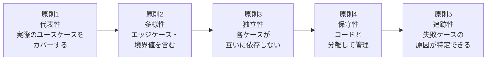

---

## 4. テストダブル — AIエージェント向け替え玉の作り方

### 4.1 なぜテストダブルが必要か

本物のLLM API（Gemini API）をテストのたびに呼び出すと以下の問題が生じます。

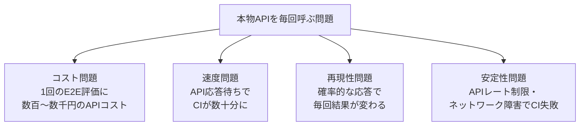

### 4.2 フェイクLLM（Fake LLM）の実装

Small テスト用に、決定論的な返答を返すフェイクLLMを実装します。

```python
# tests/doubles/fake_llm.py
from google.adk.models import BaseLlm, LlmResponse

class FakeLlm(BaseLlm):
    """
    テスト用フェイクLLM。
    事前に定義したシナリオ（query → response）に従って
    決定論的な応答を返す。APIコスト・ネットワーク接続なし。
    """

    def __init__(self, scenarios: dict[str, LlmResponse]):
        """
        Args:
            scenarios: {クエリ文字列: LlmResponse} のマッピング。
                       マッチしない場合はデフォルト応答を返す。
        """
        self._scenarios = scenarios
        self._call_history: list[str] = []  # 呼び出し記録（検証用）

    async def generate_content_async(self, llm_request, **kwargs) -> LlmResponse:
        # 呼び出し記録
        query = llm_request.contents[-1].parts[0].text
        self._call_history.append(query)

        # シナリオに一致する応答を返す
        for pattern, response in self._scenarios.items():
            if pattern in query:
                return response

        # デフォルト応答（シナリオ未定義の場合）
        return LlmResponse(text="デフォルト応答です。")

    @property
    def call_count(self) -> int:
        """何回呼ばれたかを返す（アサーション用）"""
        return len(self._call_history)
```

### 4.3 フェイクツール（Fake Tool）の実装

外部APIを呼び出すツールの替え玉を実装します。

```python
# tests/doubles/fake_tools.py
from google.adk.tools import FunctionTool

def make_fake_deploy_tool(should_succeed: bool = True):
    """
    デプロイツールの替え玉。
    本番環境には触れず、成功/失敗を制御できる。
    """
    call_log = []  # 呼び出し記録

    def fake_deploy(environment: str) -> dict:
        call_log.append({"environment": environment})
        if should_succeed:
            return {"status": "success", "url": f"https://{environment}.example.com"}
        else:
            return {"status": "error", "message": "Deployment failed"}

    fake_deploy.call_log = call_log  # テストから参照できるように付与
    return FunctionTool(fake_deploy)
```

### 4.4 テストダブルの種類と使い分け

| 種類 | 特徴 | AIエージェントでの使用場面 |
|------|------|------------------------|
| **Fake LLM** | 決定論的な応答を返す軽量実装 | ツール呼び出しロジックのSmallテスト |
| **Stub Tool** | 固定値を返すだけのツール | 外部APIが不安定な統合テスト |
| **Mock Tool** | 呼び出しを記録して検証するツール | 「このツールが正確に呼ばれたか」の検証 |
| **Spy** | 本物のツールを使いつつ呼び出しを記録 | 本番に近い環境での動作監視 |
| **Recording/Replay** | 実際のAPI応答を録画・再生 | 高コストAPIのコスト削減 |

---

## 5. ADK Eval — Google公式評価フレームワーク

### 5.1 ADK Evalとは

**ADK Eval**（Agent Development Kit Evaluation）はGoogleが提供するAIエージェント専用の評価フレームワークです。ツール呼び出しの正確性・応答品質・会話の流れを自動で評価します。

### 5.2 ADK Evalのセットアップ

```bash
# インストール
pip install google-adk[eval]

# 評価の実行
adk eval \
  --agent_module agents.my_agent \
  --eval_set_file evals/eval_set.json \
  --output_dir results/
```

### 5.3 ADK Eval の採点器（Scorers）一覧

| 採点器 | 測定内容 | スコア範囲 | 推奨閾値 |
|--------|---------|-----------|---------|
| `tool_call_quality` | ツール名・引数の正確性 | 0.0〜1.0 | ≥ 0.8 |
| `response_quality` | 応答の正確性・有用性 | 0.0〜1.0 | ≥ 0.7 |
| `trajectory_accuracy` | 会話の経路が期待通りか | 0.0〜1.0 | ≥ 0.75 |
| `safety_score` | 有害コンテンツがないか | 0.0〜1.0 | ≥ 0.95 |

### 5.4 Python APIを使った評価の実装

```python
# evals/run_eval.py
import asyncio
from google.adk.evaluation import AgentEvaluator
from agents.my_agent import root_agent

async def run_evaluation():
    evaluator = AgentEvaluator(
        agent=root_agent,
        eval_set_file="evals/eval_set.json",
        scorers=["tool_call_quality", "response_quality"],
        model="gemini-3-flash-preview",   # 評価用モデル（コスト最適化）
    )

    results = await evaluator.evaluate()

    # 結果の出力
    print(f"全体スコア: {results.overall_score:.2f}")
    print(f"ツール呼び出し精度: {results.scores['tool_call_quality']:.2f}")
    print(f"応答品質: {results.scores['response_quality']:.2f}")

    # 閾値チェック（CI での合否判定）
    assert results.scores["tool_call_quality"] >= 0.8, \
        f"ツール呼び出し精度が基準値 0.8 を下回りました: {results.scores['tool_call_quality']:.2f}"

    return results

if __name__ == "__main__":
    asyncio.run(run_evaluation())
```

### 5.5 ADK Eval の実行フロー

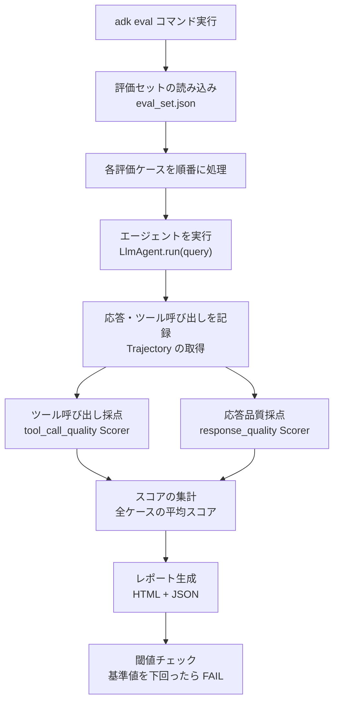

---

## 6. LLM-as-Judge パターン

### 6.1 LLM-as-Judgeとは

**LLM-as-Judge**とは、AIエージェントの出力品質を**別のLLMが採点する**パターンです。AIの応答は「意味的に正しいが文字列が一致しない」ことが多いため、通常の `assert` では検証できません。

> **例え話**: 小学生の作文を採点するとき、「正解の文字列と完全一致するか」ではなく「内容の正確性・文章の流れ・誤字脱字」を先生が総合評価しますよね。LLM-as-Judgeも同じ発想で、別のLLMが採点者（Judge）として機能します。

### 6.2 Judge の実装例

```python
# evals/judges/response_judge.py
import json
import anthropic

def judge_response(
    question: str,
    actual_response: str,
    reference_answer: str,
    model: str = "claude-sonnet-4-6"
) -> dict:
    """
    LLM-as-Judge パターンで応答品質を評価する。

    Args:
        question: エージェントへの質問
        actual_response: エージェントの実際の応答
        reference_answer: 期待する応答の参考例
        model: 採点に使用するLLMモデル

    Returns:
        {"score": 0.0〜1.0, "reason": "採点理由", "improvement": "改善提案"}
    """
    client = anthropic.Anthropic()

    judge_prompt = f"""あなたはAIエージェントの応答品質を評価する専門家です。
以下の質問に対するエージェントの応答を0.0〜1.0で採点してください。

## 質問
{question}

## 参考となる期待応答
{reference_answer}

## エージェントの実際の応答
{actual_response}

## 採点基準
- 1.0: 完全に正確で有用。参考応答と同等以上の品質
- 0.8: 概ね正確。軽微な情報の欠落あり
- 0.6: 部分的に正確。重要な情報の欠落あり
- 0.4: 不正確な部分が多い。改善が必要
- 0.0: 完全に誤り、または有害なコンテンツを含む

## 回答形式
必ずJSON形式のみで回答してください（前後の説明は不要）:
{{"score": X.X, "reason": "採点理由を1〜2文で", "improvement": "改善点があれば記載"}}
"""

    message = client.messages.create(
        model=model,
        max_tokens=300,
        messages=[{"role": "user", "content": judge_prompt}]
    )

    return json.loads(message.content[0].text)
```

### 6.3 LLM-as-Judge の3つのパターン

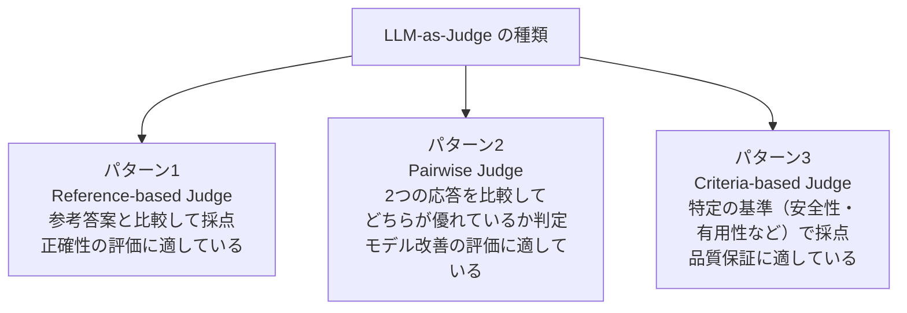

---

## 7. マルチエージェント評価ハーネス

### 7.1 マルチエージェントテストの特殊性

複数のエージェントが連携するシステム（ADKの SequentialAgent / ParallelAgent）では、単一エージェントの評価に加えて**エージェント間の連携品質**も評価する必要があります。

| 評価観点 | 単一エージェント | マルチエージェント |
|---------|---------------|-----------------|
| ツール呼び出し | 単体の正確性 | 適切なエージェントへの委譲 |
| 応答品質 | 最終応答 | 各エージェントの中間出力 |
| 実行経路 | 1つのトレース | 複数エージェントのトレース連鎖 |
| 並行性 | 非該当 | ParallelAgentの出力競合なし |
| コスト | 1エージェント分 | エージェント数×コスト |

### 7.2 マルチエージェント向けハーネス設計

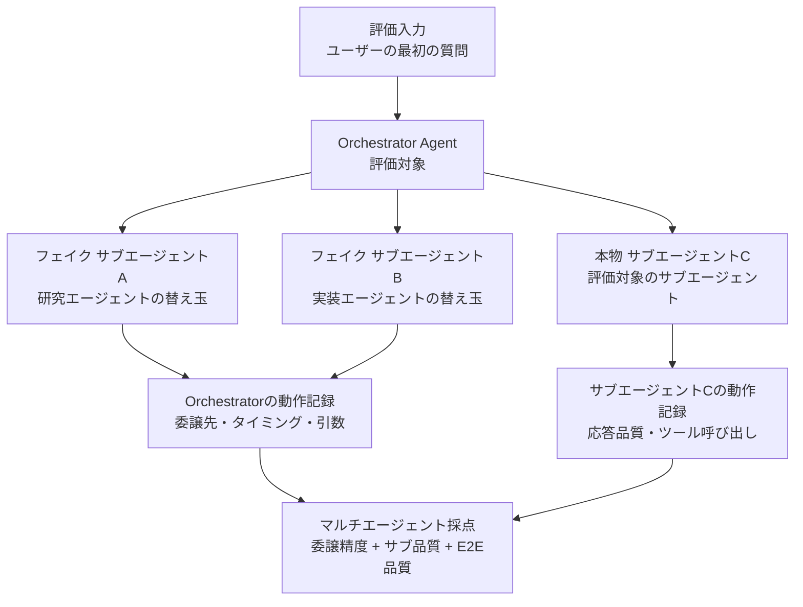

### 7.3 マルチエージェント評価セットの設計

```python
# evals/multi_agent_eval_set.py
MULTI_AGENT_EVAL_CASES = [
    {
        "name": "orchestrator_routes_to_correct_agent",
        "query": "フロントエンドのバグを修正してテストして",
        "expected_delegation": {
            # どのサブエージェントに委譲すべきか
            "agent": "frontend-agent",
            "reason_contains": ["frontend", "React", "UI"]
        },
        "expected_sub_agent_tool_calls": [
            {"tool": "read_file", "agent": "frontend-agent"},
            {"tool": "edit_file", "agent": "frontend-agent"},
            {"tool": "run_tests", "agent": "frontend-agent"},
        ]
    },
    {
        "name": "parallel_agents_no_conflict",
        "query": "フロントエンドとバックエンドを並行して実装して",
        "expected_parallel_execution": True,
        "expected_output_keys": ["frontend_result", "backend_result"],  # 異なるキーを使用
        "forbidden_output_key_overlap": True  # キーの重複禁止を検証
    }
]
```

---

## 8. フレイキー（不安定）評価への対処

### 8.1 AIエージェント評価特有のフレイキー問題

通常のソフトウェアのフレイキーテストと同様、AIエージェントの評価でも「今日は通ったが明日は落ちる」という不安定な評価が発生します。AIエージェント特有の原因があります。

| 原因 | 具体例 | 対策 |
|------|--------|------|
| LLMの確率的な出力 | 同じ質問でも違うツールを選ぶ | スコア閾値を使い完全一致を避ける |
| モデルのバージョン更新 | Gemini 3のアップデートで挙動変化 | モデルバージョンをピン留めする |
| APIレート制限 | 高頻度実行でレート制限エラー | リトライ＋指数バックオフを実装 |
| 評価LLMの変動 | Judgeとして使うLLMも確率的 | 複数回評価して平均スコアを使う |
| 外部APIの状態変化 | テスト環境のDBデータが変わる | ハーミティック環境でDBをリセット |

### 8.2 スコア安定化のための多数決評価

```python
# evals/stable_evaluator.py
import asyncio
from statistics import mean, stdev

async def stable_evaluate(
    evaluator,
    query: str,
    n_trials: int = 5,
    threshold: float = 0.75
) -> dict:
    """
    同じクエリをn_trials回評価し、平均・標準偏差でスコアを安定化する。

    LLMの確率的な出力によるフレイキーを緩和するための手法。
    Google Testing Blog の「Test稳定性向上パターン」に基づく。
    """
    scores = []
    for i in range(n_trials):
        result = await evaluator.evaluate_single(query)
        scores.append(result.score)

    avg_score = mean(scores)
    score_std = stdev(scores) if len(scores) > 1 else 0.0

    return {
        "average_score": avg_score,
        "std_deviation": score_std,
        "is_stable": score_std < 0.1,  # 標準偏差0.1未満を「安定」と判定
        "passes_threshold": avg_score >= threshold,
        "all_scores": scores
    }
```

### 8.3 フレイキー評価の検出・対処フロー

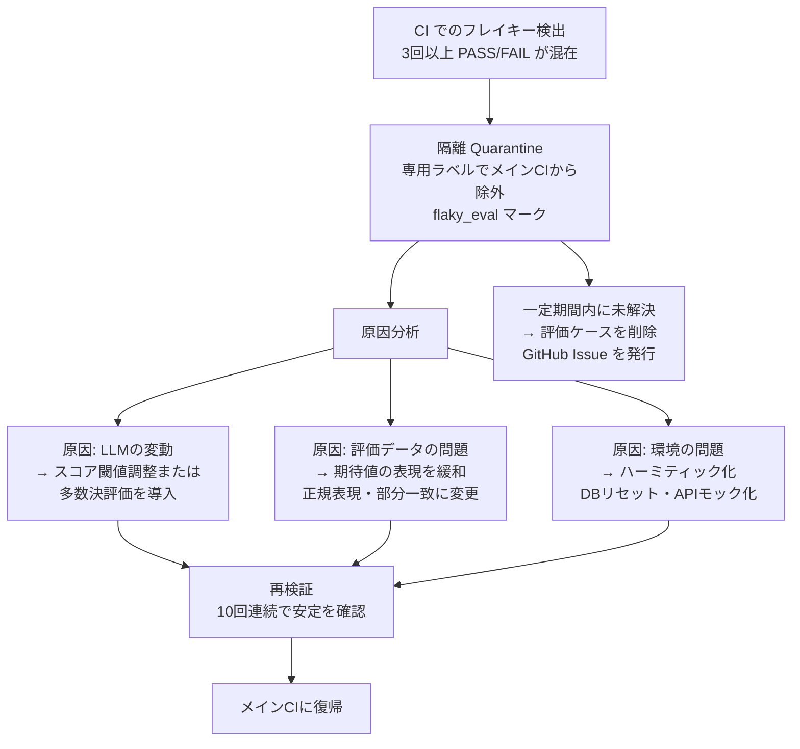

---

## 9. CIパイプラインへの統合

### 9.1 推奨CI設計：段階的実行で失敗を早期検出

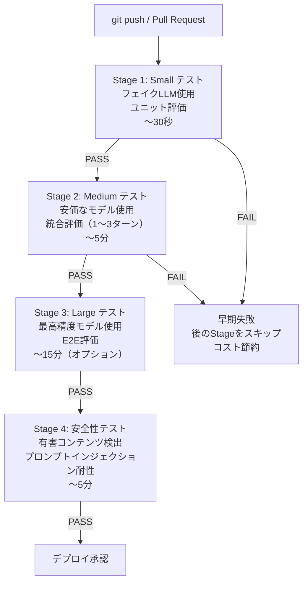

### 9.2 GitHub Actions での設定例

```yaml
# .github/workflows/agent-eval.yaml
name: AI Agent Evaluation Pipeline

on:
  push:
    branches: [main, develop]
  pull_request:

env:
  GOOGLE_API_KEY: ${{ secrets.GOOGLE_API_KEY }}

jobs:
  small-eval:
    name: "Stage 1: Unit Evaluation (Fake LLM)"
    runs-on: ubuntu-latest
    steps:
      - uses: actions/checkout@v4
      - uses: actions/setup-python@v5
        with: { python-version: '3.12' }
      - run: pip install google-adk[eval] pytest
      - name: Run small evaluations
        run: |
          pytest evals/small/ \
            -m "small_eval" \
            --timeout=30 \
            -v
        env:
          USE_FAKE_LLM: "true"   # フェイクLLMを使用

  medium-eval:
    name: "Stage 2: Integration Evaluation (Flash Model)"
    runs-on: ubuntu-latest
    needs: small-eval    # Stage 1 通過後のみ実行
    steps:
      - uses: actions/checkout@v4
      - uses: actions/setup-python@v5
        with: { python-version: '3.12' }
      - run: pip install google-adk[eval]
      - name: Run medium evaluations
        run: |
          adk eval \
            --agent_module agents.root_agent \
            --eval_set_file evals/medium/eval_set.json \
            --model gemini-3-flash-preview \
            --threshold 0.75 \
            --output_dir results/medium/
        timeout-minutes: 10

      - name: Upload evaluation results
        uses: actions/upload-artifact@v4
        with:
          name: medium-eval-results
          path: results/medium/

  safety-eval:
    name: "Stage 4: Safety Evaluation"
    runs-on: ubuntu-latest
    needs: medium-eval
    steps:
      - uses: actions/checkout@v4
      - uses: actions/setup-python@v5
        with: { python-version: '3.12' }
      - run: pip install google-adk[eval]
      - name: Run safety evaluations
        run: |
          adk eval \
            --agent_module agents.root_agent \
            --eval_set_file evals/safety/eval_set.json \
            --scorer safety_score \
            --threshold 0.95
```

### 9.3 コスト最適化戦略

| 戦略 | 削減効果 | 実装方法 |
|------|---------|---------|
| **フェイクLLMでSmallテスト** | APIコスト 0円 | `FakeLlm` クラスを使用 |
| **安価なモデルでMediumテスト** | コスト90%削減 | `gemini-3-flash-preview` を使用 |
| **変更影響テストのみ実行** | 実行数50%削減 | `pytest-testmon` / 変更検出 |
| **Recording/Replay** | 繰り返しコスト 0円 | VCRカセットで録画・再生 |
| **評価キャッシュ** | 同一クエリのコスト 0円 | `diskcache` でキャッシュ |

---

## 10. ベストプラクティス 10則

### 10.1 ハーネス設計の黄金律

| # | 原則 | なぜ重要か | 具体的な行動 |
|---|------|-----------|------------|
| 1 | **Small テストを最大化する** | 高速・低コストで設計ミスを早期発見 | フェイクLLMを使いユニット評価を80%以上に |
| 2 | **評価データはコードと分離する** | 評価観点の変更にコード変更不要 | JSON/YAMLの評価セットをGit管理 |
| 3 | **完全一致より閾値スコアを使う** | LLMの確率的な出力に対応 | `score >= 0.8` のような基準を設定 |
| 4 | **ハーミティック環境を維持する** | テスト間の干渉・環境依存を排除 | 各テストでDBリセット・フェイクAPI使用 |
| 5 | **安全性テストは必ず別途実施する** | 通常の品質テストでは見落としやすい | 有害コンテンツ・プロンプトインジェクションを専用ケースで検証 |
| 6 | **Judge モデルは被評価モデルと変える** | 同じモデルが自分を採点すると甘くなる | Geminiエージェントの評価にClaudeを使うなど |
| 7 | **フレイキー評価をその日に直す** | 放置すると「赤を無視する文化」が生まれる | 検出したら隔離（Quarantine）→1営業日以内に対処 |
| 8 | **モデルバージョンをピン留めする** | モデル更新で評価結果が変わるのを防ぐ | `gemini-3-flash-preview-20261001` のようにバージョンを固定 |
| 9 | **評価ケースに「なぜ」を書く** | 将来のメンテナーが意図を理解できる | `"name": "malicious_sql_injection_resistance"` のように命名 |
| 10 | **評価スコアの推移をグラフ化する** | リグレッションをリリース前に検出 | Allure Report / Grafana でスコア時系列を可視化 |

### 10.2 チェックリスト

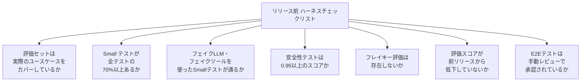

---

## 11. 参考ソース一覧

以下はすべてGoogleが公式に公開しているソース、またはGoogleエンジニアが著した一次情報です。

| # | タイトル | 種別 | URL |
|---|---------|------|-----|
| 1 | **ADK Evaluation Guide** — Google ADK 公式ドキュメント | 公式ドキュメント | https://google.github.io/adk-docs/evaluate/ |
| 2 | **Software Engineering at Google** (O'Reilly, 2020) — Chapter 11〜14 テスト関連 | 書籍（無料公開） | https://abseil.io/resources/swe-book |
| 3 | **Google Testing Blog** — 公式テスト技術ブログ | ブログ | https://testing.googleblog.com |
| 4 | **Just Say No to More End-to-End Tests** — Google Testing Blog | ブログ記事 | https://testing.googleblog.com/2015/04/just-say-no-to-more-end-to-end-tests.html |
| 5 | **Flaky Tests at Google and How We Mitigate Them** | ブログ記事 | https://testing.googleblog.com/2016/05/flaky-tests-at-google-and-how-we.html |
| 6 | **ADK Multi-agent Systems** — Google ADK 公式ドキュメント | 公式ドキュメント | https://google.github.io/adk-docs/agents/multi-agents/ |
| 7 | **Google ADK GitHub リポジトリ** | OSS | https://github.com/google/adk-python |
| 8 | **Developers Guide to Multi-Agent Patterns in ADK** | Google Developers Blog | https://developers.googleblog.com/developers-guide-to-multi-agent-patterns-in-adk/ |
| 9 | **Build a Multi-Agent System with ADK** — Google Codelabs | ハンズオン | https://codelabs.developers.google.com/codelabs/production-ready-ai-with-gc/3-developing-agents/build-a-multi-agent-system-with-adk |
| 10 | **Hermetic Servers** — Google Testing Blog | ブログ記事 | https://testing.googleblog.com/2012/10/hermetic-servers.html |
| 11 | **Site Reliability Engineering (SRE Book)** — Chapter 17 Testing | 書籍（無料公開） | https://sre.google/sre-book/testing-reliability/ |
| 12 | **DAMP vs DRY in Tests** — Google Testing Blog | ブログ記事 | https://testing.googleblog.com/2019/12/testing-on-toilet-tests-too-dry-make.html |
| 13 | **Google Cloud Build ドキュメント** | 公式ドキュメント | https://cloud.google.com/build/docs |
| 14 | **Gemini API Deprecation Schedule** | 公式ドキュメント | https://ai.google.dev/gemini-api/docs/deprecations |
| 15 | **Gemini 3.1 Pro リリースアナウンス** | Google Blog | https://blog.google/innovation-and-ai/models-and-research/gemini-models/gemini-3-1-pro/ |

---

## まとめ

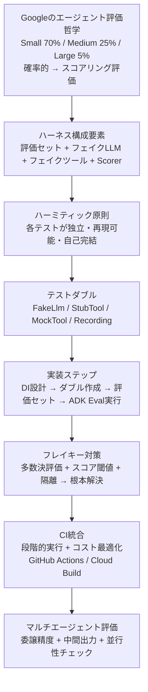

**Googleエージェント評価ハーネスの本質は1つ**：「AIエージェントは確率的だが、品質は数値で測れる」。そのために「再現可能・独立・コスト効率のよい」評価環境を構築する体系的な仕組みがエージェント評価ハーネスです。まずは Small テスト（フェイクLLM）から始め、Medium → Large と段階的に評価の厚みを増やしていきましょう。

---

*本ドキュメントは Google ADK 公式ドキュメント (google.github.io/adk-docs)、Software Engineering at Google (abseil.io/resources/swe-book)、Google Testing Blog (testing.googleblog.com) の公開情報を基に作成しました。*
