# SKILL.md 完全ガイド

## Google Gemini / Gemini CLI / Antigravity 対応版

> **対象読者**: AI エージェントツールを使い始めたばかりの初学者
> **目標**: SKILL.md とは何か、なぜ必要か、どう作るかを完全に理解する

---

## 目次

1. [全体像を把握する](#1-全体像を把握する)
2. [キーワード解説](#2-キーワード解説)
3. [SKILL.md とは何か](#3-skillmd-とは何か)
4. [3つのツールの違いと共通点](#4-3つのツールの違いと共通点)
5. [SKILL.md のディレクトリ構造](#5-skillmd-のディレクトリ構造)
6. [SKILL.md の書き方・構文ガイド](#6-skillmd-の書き方構文ガイド)
7. [スキルのパターン別サンプル](#7-スキルのパターン別サンプル)
8. [スキルのインストール方法](#8-スキルのインストール方法)
9. [スキルの配置場所（スコープ）](#9-スキルの配置場所スコープ)
10. [スキルの動作フロー図](#10-スキルの動作フロー図)
11. [よくあるエラーとベストプラクティス](#11-よくあるエラーとベストプラクティス)
12. [参考 URL 一覧](#12-参考-url-一覧)

---

## 1. 全体像を把握する

まず「なぜ SKILL.md が必要なのか」を理解しましょう。

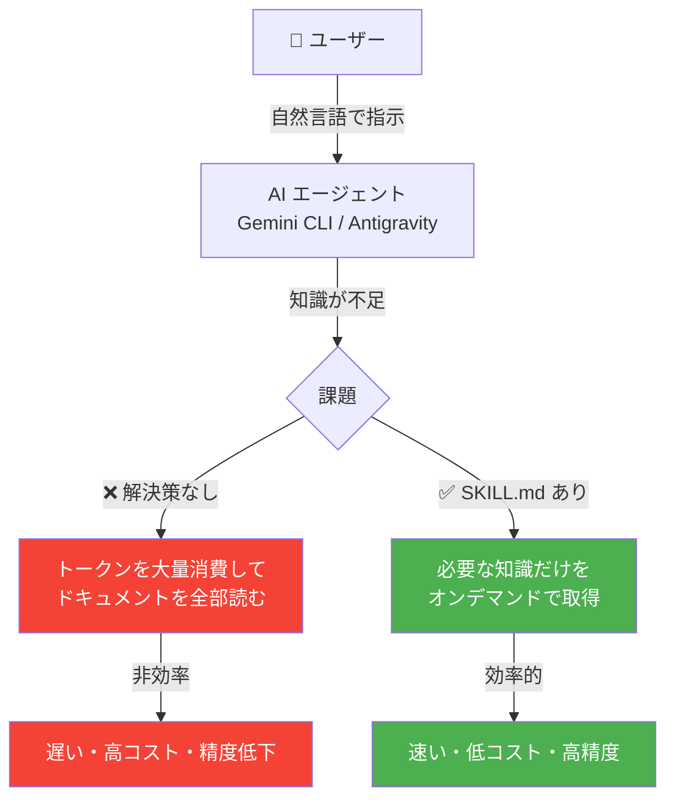

**SKILL.md を一言で言うと**:
> AIエージェントに「専門知識の教科書」を渡す仕組みです。必要なときだけ読み込まれるので、効率よく高精度な応答が得られます。

---

## 2. キーワード解説

| 用語 | 意味 | 例え |
| ------ | ------ | ------ |
| **Gemini CLI** | ターミナルで使えるGoogleのAIエージェント | シェルの中に住む AI アシスタント |
| **Antigravity** | Google製のエージェントファーストなIDE（VSCodeフォーク） | AIが主役のコードエディタ |
| **SKILL.md** | エージェントへの専門指示書（Markdownファイル） | AIへの「取扱説明書」 |
| **Agent Skills** | SKILL.md を使ったオープンスタンダード | スキルパッケージの共通規格 |
| **MCP** | Model Context Protocol。外部ツール連携の規格 | AIと外部ツールをつなぐ規格 |
| **コンテキストウィンドウ** | AIが一度に処理できる情報量 | AIの「作業記憶」の容量 |
| **ReAct ループ** | Reason（推論）→ Act（実行）を繰り返す動作 | 考えて→行動→考えて→行動... |

---

## 3. SKILL.md とは何か

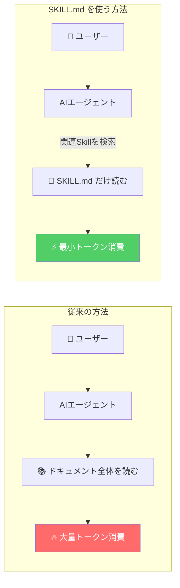

### SKILL.md の特徴

1. **オンデマンド読み込み** — 必要なときだけ AIのコンテキストに追加される
2. **再利用可能** — 一度書けばどのプロジェクトでも使い回せる
3. **オープンスタンダード** — Gemini CLI、Antigravity、Claude Code など複数ツールで共通利用可能
4. **段階的な詳細度（Progressive Disclosure）** — 名前と説明 → 本文 → 参照ファイル と3段階で読み込まれる

---

## 4. 3つのツールの違いと共通点

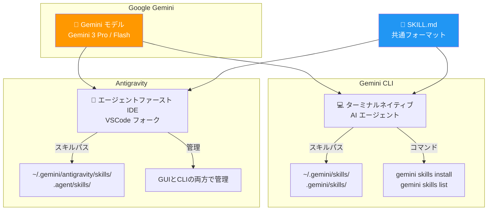

### ツール比較表

| 項目 | Gemini CLI | Antigravity |
| ------ | ----------- | ------------- |
| **形態** | ターミナルアプリ | IDE（エディタ） |
| **インターフェース** | コマンドライン | GUI + エージェントマネージャー |
| **対象ユーザー** | ターミナルを好む開発者 | IDE環境が好きな開発者 |
| **グローバルスキルパス** | `~/.gemini/skills/` | `~/.gemini/antigravity/skills/` |
| **ワークスペーススキルパス** | `.gemini/skills/` | `.agent/skills/` |
| **SKILL.md サポート** | ✅ フル対応 | ✅ フル対応 |
| **インストール方法** | `gemini skills install` コマンド | GUI または CLI |

---

## 5. SKILL.md のディレクトリ構造

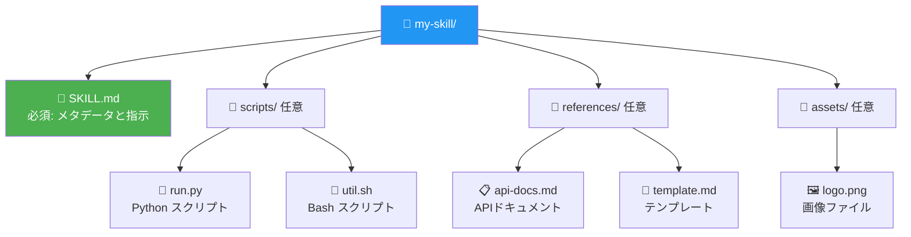

### 各ディレクトリの役割

```text
my-skill/
├── SKILL.md          # 【必須】 スキルの頭脳。指示・メタデータを記述
├── scripts/          # 【任意】 自動実行するスクリプト（Python/Bash/Node）
│   ├── run.py
│   └── util.sh
├── references/       # 【任意】 参照ドキュメント（必要時だけ読み込まれる）
│   └── api-docs.md
└── assets/           # 【任意】 画像・テンプレートなどの静的ファイル
    └── logo.png
```

---

## 6. SKILL.md の書き方・構文ガイド

### 基本構造

````markdown
---
name: スキル識別子（ハイフン区切り、英語小文字）
description: |
  いつ・何のためにこのスキルを使うかを記述。
  AIエージェントはこの説明を見てスキルを呼び出すか判断する。
  具体的なトリガーワードを含めると◎
---

# スキル名

## 概要
このスキルが何をするかを1〜2文で説明。

## 手順
エージェントへの具体的な指示をここに書く。

## 注意事項
- 注意点1
- 注意点2
````

### フロントマター（YAMLヘッダー）の詳細

```yaml
---
name: git-commit-formatter          # スキルID（必須）
description: |                      # トリガー説明（必須・最重要）
  Gitコミットメッセージを Conventional Commits 
  仕様に従って整形する。コミット、git commit、
  コミットメッセージ、という言葉が出たら必ず使うこと。
compatibility:                      # 依存関係（任意）
  - python >= 3.8
  - git
---
```

### description の書き方のコツ

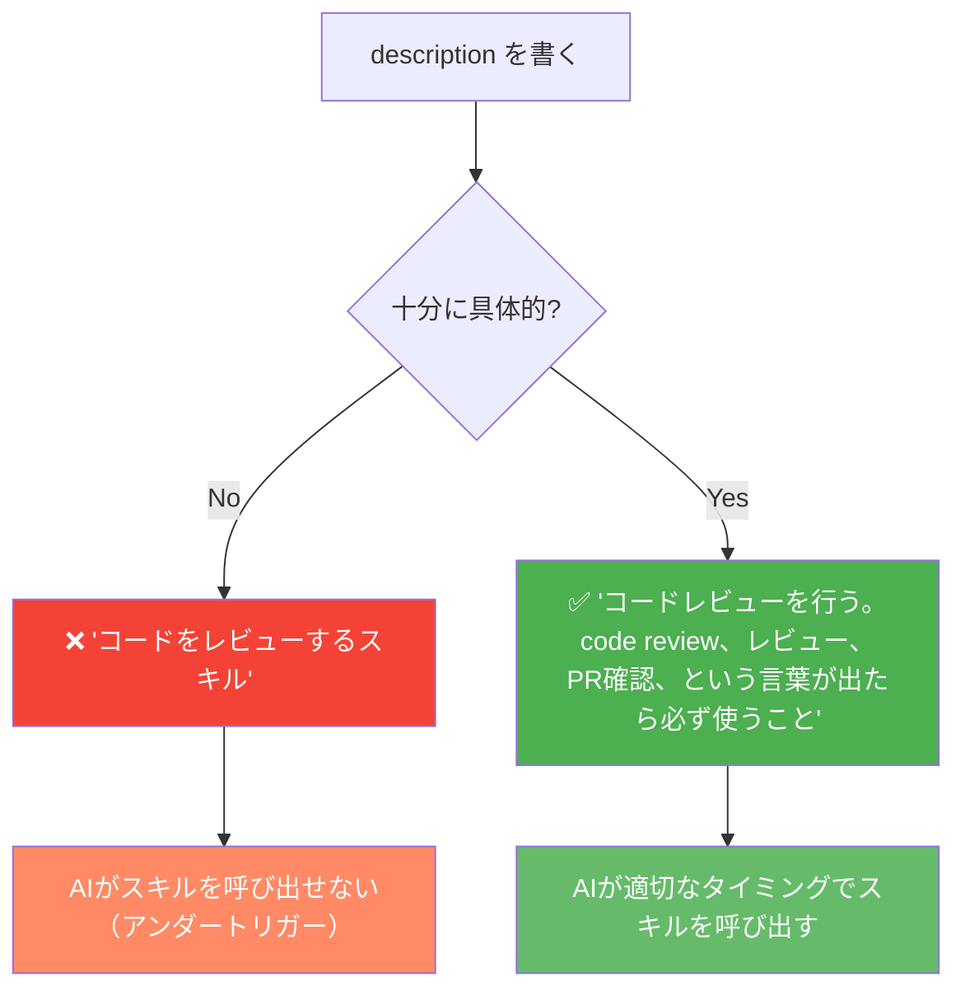

**ポイント**: `description` はAIのトリガーです。曖昧すぎるとスキルが呼ばれません。具体的なキーワードや「このような言葉が出たら使え」という指示を入れましょう。

---

## 7. スキルのパターン別サンプル

### パターン1: Basic（SKILL.md のみ）

最もシンプルな形。プロンプトエンジニアリングだけで完結するスキル。

````markdown
---
name: git-commit-formatter
description: |
  Gitコミットメッセージを Conventional Commits 仕様に整形する。
  「コミット」「commit」「コミットメッセージ」などが出たら使用。
---

# Git コミットフォーマッター

## ルール
コミットメッセージは必ず以下の形式にすること:

```
<type>(<scope>): <subject>

[optional body]
[optional footer]
```

## type の種類
- `feat`: 新機能
- `fix`: バグ修正
- `docs`: ドキュメント変更
- `style`: フォーマット変更
- `refactor`: リファクタリング
- `test`: テスト追加・修正
- `chore`: ビルドプロセス変更

## 例
```
feat(auth): ログイン機能を追加

ユーザーがメールとパスワードでログインできるようにした。
JWT トークンを使用した認証を実装。

Closes #123
```
````

---

### パターン2: Reference（SKILL.md + /references）

ドキュメントや仕様書を参照しながら動作するスキル。

```text
api-integrator/
├── SKILL.md
└── references/
    └── api-spec.md    ← API仕様書
```

````markdown
---
name: api-integrator
description: |
  外部APIとの統合コードを生成する。APIの仕様に基づき正確なコードを作成する。
  「API連携」「HTTP リクエスト」「fetch」などが出たら使用。
---

# API インテグレーター

## 手順
1. `references/api-spec.md` を読み込んでAPIの仕様を確認する
2. ユーザーが求めるエンドポイントを特定する
3. 仕様に基づき正確なコードを生成する

## 注意
必ず参照ファイルを読んでから実装すること。推測で書かないこと。
````

---

### パターン3: Tool Use（SKILL.md + /scripts）

スクリプトを実行するスキル。繰り返し作業の自動化に最適。

```text
db-migrator/
├── SKILL.md
└── scripts/
    └── migrate.py    ← 実行スクリプト
```

````markdown
---
name: db-migrator
description: |
  データベースマイグレーションを実行する。
  「マイグレーション」「DB更新」「スキーマ変更」が出たら使用。
---

# DB マイグレーター

## 実行方法
以下のスクリプトを使ってマイグレーションを実行する:

```bash
python scripts/migrate.py --env <environment> --version <version>
```

## 引数
- `--env`: 環境（dev / staging / prod）
- `--version`: マイグレーションバージョン番号

## 手順
1. ユーザーの指示から `env` と `version` を読み取る
2. スクリプトを実行する前に確認を求める
3. エラーが出た場合はロールバックコマンドを提示する
````

---

### パターン4: All-in-One（全要素）

最も高度なパターン。

```text
full-stack-generator/
├── SKILL.md
├── scripts/
│   └── scaffold.py
├── references/
│   └── best-practices.md
└── assets/
    └── template.tsx
```

---

## 8. スキルのインストール方法

### Gemini CLI でのインストール

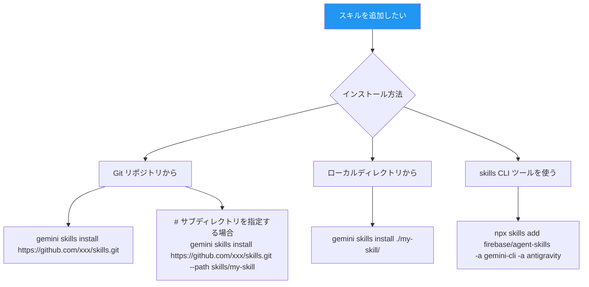

#### Gemini CLI コマンド一覧

```bash
# スキルをインストール（Git リポジトリから）
gemini skills install https://github.com/example/my-skills.git

# サブパスを指定してインストール
gemini skills install https://github.com/example/skills.git --path skills/firebase

# ローカルディレクトリからインストール
gemini skills install ./my-local-skill/

# インストール済みスキルを一覧表示
gemini skills list

# セッション中にスキルを無効化
/skills disable <スキル番号>

# スキルを更新
gemini skills update
```

### Antigravity でのインストール

```bash
# グローバルにインストール（全プロジェクトで使えるようにする）
cp -r my-skill/ ~/.gemini/antigravity/skills/

# ワークスペースにインストール（このプロジェクトだけ）
cp -r my-skill/ .agent/skills/
```

### skills CLI（統合管理ツール）でのインストール

両方のツールに同時にスキルを追加できる便利ツールです。

```bash
# Firebase スキルを Gemini CLI と Antigravity 両方に追加
npx skills add firebase/agent-skills -a gemini-cli -a antigravity

# Flutter 関連スキルを検索
npx skills find flutter

# スキルを削除
npx skills remove firebase/agent-skills

# インストール済みスキルを一覧表示
npx skills list
```

---

## 9. スキルの配置場所（スコープ）

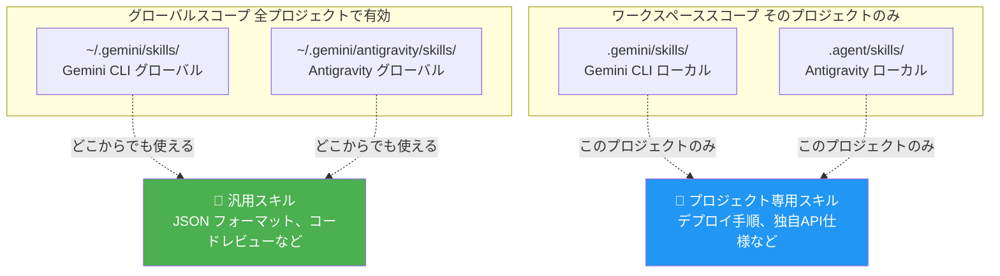

### スコープの選び方

| スコープ | 向いているスキル例 |
| --------- | ------------------ |
| **グローバル** | JSON整形、コードレビュー標準、コミットフォーマット |
| **ワークスペース** | このアプリのデプロイ手順、プロジェクト固有のAPI仕様 |

---

## 10. スキルの動作フロー図

### エージェントがスキルを読み込む流れ

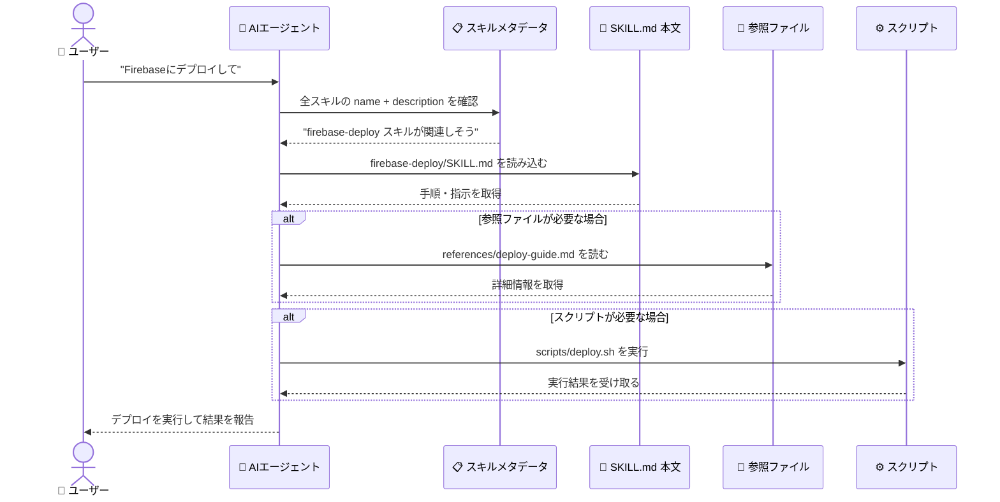

### Progressive Disclosure（段階的読み込み）

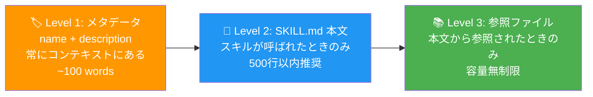

---

## 11. よくあるエラーとベストプラクティス

### ❌ やってはいけないこと

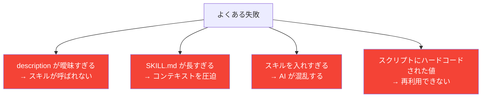

### ✅ ベストプラクティス

```markdown
## description の書き方
❌ 悪い例:
description: コードをレビューするスキル。

✅ 良い例:
description: |
  コードレビューを実行する。コードレビュー、review、PR確認、
  品質チェックという言葉が出たら必ずこのスキルを使うこと。
  PEP8、ESLint、スタイルガイドに準拠しているかを確認する。
```

### スキルの数の目安

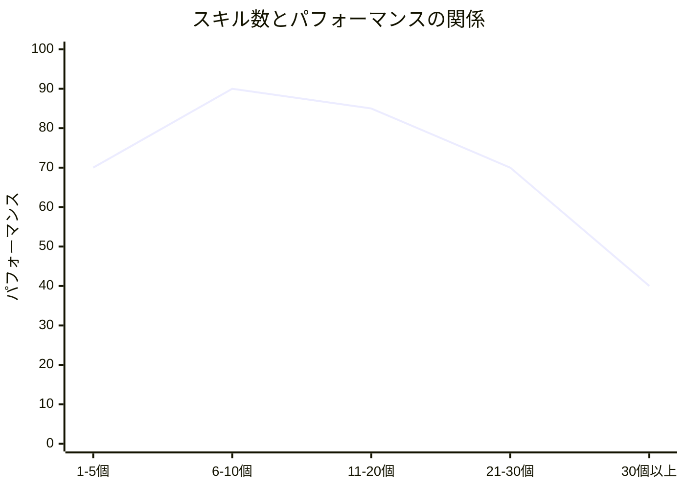

**目安**: アクティブなスキルは **10〜15個** 以内に抑えると性能が最も高くなります。使わなくなったスキルは無効化しましょう。

### チェックリスト

作成した SKILL.md を公開・使用する前に確認しましょう：

- [ ] `name` はハイフン区切りの英語小文字になっているか
- [ ] `description` にトリガーとなるキーワードが含まれているか
- [ ] SKILL.md 本文は 500 行以内か
- [ ] 大きな参照ファイルは `references/` に分離しているか
- [ ] スクリプトは引数で動作を変えられるようになっているか
- [ ] 実際にエージェントに呼び出されるかテストしたか

---

## 12. 参考 URL 一覧

### 公式ドキュメント

| リソース | URL |
| --------- | ----- |
| Gemini CLI 公式ドキュメント | <https://geminicli.com/docs> |
| Gemini CLI GitHub | <https://github.com/google-gemini/gemini-cli> |
| Google Antigravity 公式サイト | <https://antigravity.google/> |
| Gemini CLI (Google Cloud) | <https://docs.cloud.google.com/gemini/docs/codeassist/gemini-cli> |
| Gemini CLI リリースノート | <https://geminicli.com/docs/changelogs/> |

### チュートリアル・Codelab

| リソース | URL |
| --------- | ----- |
| Gemini CLI ハンズオン (Google Codelabs) | <https://codelabs.developers.google.com/gemini-cli-hands-on> |
| Antigravity Skills 入門 (Google Codelabs) | <https://codelabs.developers.google.com/getting-started-with-antigravity-skills> |
| Antigravity 入門 (Google Codelabs) | <https://codelabs.developers.google.com/getting-started-google-antigravity> |

### ブログ・解説記事

| リソース | URL |
| --------- | ----- |
| Gemini CLI 発表ブログ (Google) | <https://blog.google/technology/developers/introducing-gemini-cli-open-source-ai-agent/> |
| Antigravity vs Gemini CLI 比較 (Google Cloud) | <https://cloud.google.com/blog/topics/developers-practitioners/choosing-antigravity-or-gemini-cli> |
| Antigravity Skills チュートリアル (Medium) | <https://medium.com/google-cloud/tutorial-getting-started-with-antigravity-skills-864041811e0d> |
| Skills Made Easy (Medium) | <https://medium.com/google-cloud/skills-made-easy-with-google-antigravity-and-gemini-cli-5435139b0af8> |
| Gemini CLI 完全ガイド (Collabnix) | <https://collabnix.com/gemini-cli-the-complete-guide-to-googles-revolutionary-ai-command-line-interface-2025/> |

### コミュニティ・スキル集

| リソース | URL |
| --------- | ----- |
| Agent Skills 公式サイト | <https://agentskills.io> |
| スキルコミュニティ (skills.sh) | <https://skills.sh> |
| skills CLI (Vercel Labs) | <https://github.com/vercel-labs/skills> |
| Antigravity サンプルスキル集 | <https://github.com/rominirani/antigravity-skills> |
| Antigravity Awesome Skills (1000+ スキル) | <https://github.com/sickn33/antigravity-awesome-skills> |
| Gemini CLI 公式スキル | <https://github.com/google-gemini/gemini-skills> |

### Gemini 3 Flash / CLI 最新情報

| リソース | URL |
| --------- | ----- |
| Gemini 3 Flash in Gemini CLI (Google) | <https://developers.googleblog.com/gemini-3-flash-is-now-available-in-gemini-cli/> |
| Gemini CLI リリース履歴 | <https://github.com/google-gemini/gemini-cli/releases> |

---

## まとめ

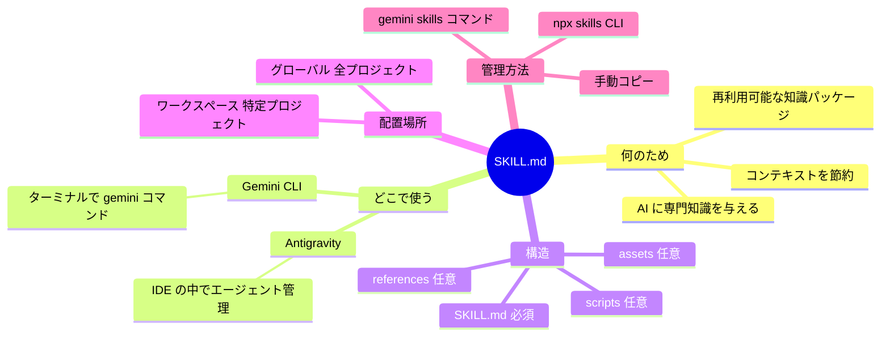

SKILL.md は、AIエージェントを「汎用アシスタント」から「あなた専用のスペシャリスト」へと変える強力な仕組みです。小さなMarkdownファイル一つから始められるので、ぜひ自分のプロジェクト専用スキルを作ってみてください！

## Google Gemini、Gemini CLIおよびAntigravityにおけるSKILL.mdの完全解剖と実践ガイド

## エージェント駆動開発のパラダイムシフトとコンテキスト飽和の課題

ソフトウェア開発の歴史において、開発環境は単なるテキストエディタから、コードの自動補完や静的解析を備えた統合開発環境（IDE）へと進化を遂げてきた。そして現在、人工知能の飛躍的な進歩に伴い、このパラダイムは根本的な変革の入り口に立っている。従来型のAI支援ツールが、人間の開発者が記述するコードを高速化するための「受動的な補完ツール」であったのに対し、次世代のプラットフォームは、AI自体が自律的なアクターとして計画、実行、検証を行う「エージェントファースト」のアプローチを採用している。この技術的進化の中心に位置するのが、Googleが提供する高度なAI駆動プラットフォームであるGoogle Antigravityと、ターミナルネイティブな開発を支援するGemini CLIである。

Google Antigravityは、従来のIDEの概念を拡張し、非同期で稼働する複数のエージェントを並列にオーケストレーションするための「ミッションコントロール」を提供する画期的なプラットフォームである。この環境では、エージェントは単にコードを生成するだけでなく、ブラウザを自律的に操作してUIのテストを行ったり、複雑なマルチステップのワークフローを計画したりする能力を持つ。一方、Gemini CLIは、コマンドラインインターフェースを主戦場とする技術者向けに設計されており、ターミナル環境から直接AIエージェントを呼び出し、ローカルのファイルシステムやシェルコマンドと密接に連携しながらタスクを処理する。

これらのプラットフォームは、Gemini 3 ProやAnthropicのClaude Sonnet 4.5、さらにはOpenAIのGPT-OSSといった最先端の推論モデルをサポートしており、コードベース全体の複雑なリファクタリングや長時間のデバッグセッションを処理することが可能である。しかし、モデルのコンテキストウィンドウが数百万トークン規模にまで拡大し、プロジェクト全体のソースコードを一度に入力できるようになったとしても、新たな技術的障壁が立ち塞がる。それが「コンテキストの飽和（Context Saturation）」と呼ばれる現象である。

コンテキストの飽和とは、エージェントに対して膨大なライブラリのドキュメント、プロジェクトの歴史的背景、無数のコーディング規約などを一度に与えすぎた結果、モデルの注意機構（Attention Mechanism）が分散し、重要な情報を見落としたり、推論の精度が著しく低下したりする問題である。エージェントに「すべてを読ませる」アプローチは、計算リソースの浪費（トークン消費の増大）を招くだけでなく、結果として出力の品質を低下させる。このジレンマを解決し、エージェントの能力をモジュール化して安全かつ効率的に拡張するためのオープンな標準規格として登場したのが「Agent Skills」であり、その中核を成す構成ファイルが`SKILL.md`である。

## **エコシステムの比較：Antigravity IDEとGemini CLIのアーキテクチャ**

Agent Skillsの仕様と`SKILL.md`の具体的な実装手法を深く掘り下げる前に、これらが稼働する2つの主要な環境の特性とアーキテクチャの違いを正確に理解しておく必要がある。AntigravityとGemini CLIは、基盤となるAgent Skillsの標準規格を完全に共有しているため、作成したスキルはいずれの環境でもシームレスに動作するポータビリティを持つ。しかし、対象とするユーザー層や、システムとエージェントがどのように対話するかというオーケストレーションの仕組みにおいて、両者は明確な哲学の違いを持っている。

| プラットフォーム特性 | Antigravity IDE | Gemini CLI |
| --- | --- | --- |
| **ターゲットユーザー** | アプリケーションの構築、UIの反復開発、非同期でのタスク実行を視覚的なフィードバックと共にAIに委任したい開発者 | ターミナル環境での作業を好み、パイプ処理、CI/CDパイプラインへの統合、自動化スクリプトの構築を行う技術者 |
| **インストールと導入** | `antigravity.google/download`から提供されるGUIベースのインストーラーによる容易なセットアップ。MacOS、Windows、Linuxに対応 | Node.js環境を前提とし、`npm install -g @google/gemini-cli`コマンドを用いた迅速なCLIベースのインストール |
| **エージェントのオーケストレーション** | 「Agent Manager」と呼ばれる専用のミッションコントロールダッシュボードを介して、複数のエージェントを直感的に並列管理 | `tmux`や複数のターミナルウィンドウを活用したマルチプレクシングによるプロセスベースの並列実行 |
| **インターフェースの優位性** | 統合ブラウザを用いた視覚的フィードバック、ネイティブデバッグ機能によるスタックトレースの自動捕捉と修正提案、アーティファクトによる結果の可視化 | ヘッドレスモードによるインタラクティブUIの排除（自動化に最適）、`gh`（GitHub CLI）や`gcloud`などのローカルツールとの直接的な統合と呼び出し |
| **拡張機能とプロトコル** | Open VSX拡張機能、MCP（Model Context Protocol）、およびAgent Skillsによる機能拡張 | Gemini CLI独自の拡張機能、MCP、およびAgent Skillsによる機能拡張 |
| **開発手法の方向性** | 充実したウォークスルーとオピニオネイテッド（設計思想が明確な）スペック駆動開発 | Conductor拡張機能などを用いた高度なカスタマイズが可能な柔軟なスペック駆動開発 |

このように、視覚的かつ非同期的なコラボレーションを重視するAntigravityと、CUIの柔軟性と自動化を極めるGemini CLIは、対極のアプローチをとりながらも、Agent Skillsという共通の「知識のパッケージ」を介して繋がっている。開発者は自身のワークフローに応じて最適な環境を選択しつつ、作成した`SKILL.md`の資産を両方のエコシステムで活用することが可能である。

## **Agent SkillsとSKILL.mdの基本原理とプログレッシブ・ディスクロージャー**

Agent Skillsは、AIエージェントに対して「特定のタスクを毎回完璧に実行する方法」を教えるための、再利用可能な知識とワークフローのパッケージ規格である。このオープンスタンダードは、Googleのエコシステムにとどまらず、AnthropicのClaude Code、OpenAIのCodex CLI、GitHub Copilotなど、主要なAIコーディングアシスタント間で広く採用されている。

エージェントに専門知識を付与する手段として、ワークスペース全体に適用される一般的なコンテキストファイル（例えば`GEMINI.md`など）が存在する。これらはプロジェクトの全体的な背景を常にエージェントに認識させるために有用であるが、あらゆる情報をここに詰め込むことは前述のコンテキスト飽和を引き起こす。Agent Skillsはこれとは対照的に、「オンデマンドの専門知識（On-demand expertise）」として機能する。このオンデマンド性を根底で支えているのが、「プログレッシブ・ディスクロージャー（Progressive Disclosure：段階的開示）」と呼ばれる高度なコンテキスト管理アーキテクチャである。

プログレッシブ・ディスクロージャーのメカニズムは、トークン消費を極限まで抑えつつ、モデルが必要な時に必要な情報だけを引き出せるように設計されている。このアーキテクチャは主に3つのレベルで構成される。

レベル1は「メタデータのロード」である。セッションが開始された時点では、エージェントのコンテキストウィンドウには、利用可能な各スキルのメタデータ（YAMLフロントマターに記載された`name`と`description`）のみがロードされる。これはスキル1つあたり約100トークンという非常に軽量な情報であるため、セキュリティ監査、クラウドデプロイメント、特定のフレームワークのテスト手法など、数十から数百のスキルを待機させておいても、モデルの推論能力を圧迫することはない。

レベル2は「指示内容の展開」である。ユーザーからのプロンプト（例：「このエンドポイントの認証に脆弱性がないか確認して」）を受け取ったエージェントは、自律的にロード済みのメタデータ群を走査し、関連するスキル（例：`security-auditor`）を特定する。そして、`activate_skill`ツールを呼び出すことによって初めて、該当するスキルの`SKILL.md`の本文（通常は5,000トークン未満）がコンテキストウィンドウに展開され、具体的な手順や制約事項がエージェントにインプットされる。

レベル3は「リソースとスクリプトの動的実行」である。`SKILL.md`の本文内で参照されている外部ドキュメントやスクリプトは、コンテキストに直接読み込まれるわけではない。エージェントは仮想マシン上のファイルシステムにアクセスするように、Bashコマンド等を用いて必要なファイルのみをオンデマンドで読み取る。さらに、検証スクリプト（例：`validate_form.py`）を実行する場合、そのスクリプトのソースコード自体はコンテキストにロードされず、スクリプトの実行結果（標準出力やエラーメッセージ）のみがトークンとして消費される。これにより、実質的に無制限の参照データや複雑なアルゴリズムを、コンテキスト制限を気にすることなくエージェントに提供することが可能となるのである。

また、このプログレッシブ・ディスクロージャーと並んで重要な概念が「決定論的ツール（Deterministic Tooling）の導入」である。大規模言語モデルは本質的に確率論的（非決定論的）なシステムであり、同じ入力に対しても異なる出力を返す可能性がある。複雑なワークフローにおいてエージェントに「推測」させることは、品質のばらつきやハルシネーション（もっともらしい嘘）の原因となる。スキルディレクトリ内にPythonやBashのスクリプトを同梱し、`SKILL.md`からそれを呼び出すよう指示することで、エージェントの動作に決定論的なプロセスを強制し、出力の一貫性と正確性を飛躍的に高めることができるのである。

## **SKILL.mdのアーキテクチャとディレクトリ構造の解剖**

ひとつのAgent Skillは、単一のファイルではなく、自己完結型のディレクトリ（フォルダ）として構成される。このディレクトリ構造は、エージェントがファイルシステム上でスキルを発見し、リソースを適切にパースするための厳格な規則に従っている。以下は、標準的なスキルのアーキテクチャを示すMermaid図解である。

### **コード スニペット**

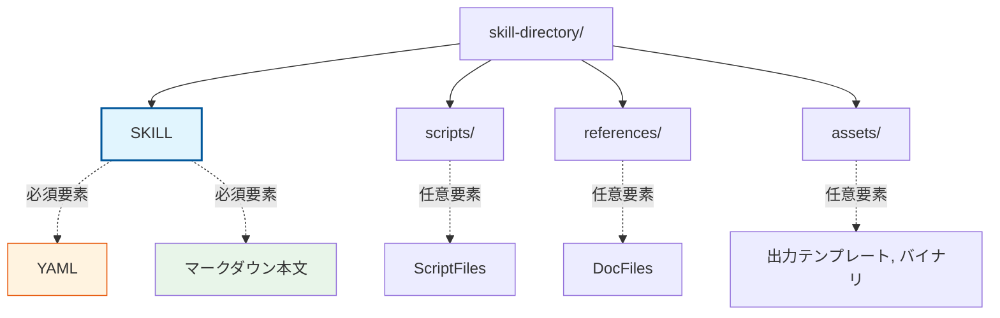

スキルディレクトリのルートに配置される`SKILL.md`は、スキルの「脳」として機能する中核的なファイルである。このファイルは、YAML形式のメタデータを記述するフロントマターと、AIに対する具体的な指示を記述するマークダウン本文の2つのセクションで構成される。

### **1. YAMLフロントマター（メタデータ定義）**

ファイルの最上部に配置され、トリプルダッシュ（`---`）で囲まれる領域がYAMLフロントマターである。ここには、エージェントがスキルの存在を認知し、発動条件を決定するためのルーティング情報が定義される。

フロントマターにおいて必須となる主要なフィールドは以下の通りである。

一つ目は`name`（文字列）である。これはスキルを一意に識別するための識別子であり、通常はケバブケース（小文字とハイフン）で記述される。多くのプラットフォームでは、この`name`フィールドの値と、スキルを格納しているディレクトリ名が完全に一致していることが要求される。また、Anthropicなどの一部の仕様では、最大64文字の制限や、XMLタグの禁止、さらには「anthropic」や「claude」といった特定の予約語の使用禁止など、厳格なバリデーションルールが存在する場合がある。

二つ目は`description`（文字列）である。これは人間向けの単なる説明文ではなく、エージェントに対する「トリガー条件（アクティベーション・トリガー）」として機能する極めて重要なフィールドである。エージェントは、ユーザーのプロンプトの意図と、この`description`の内容を意味論的に照合することで、スキルを起動すべきか否かを自律的に判断する。したがって、「このスキルは何をするものか」だけでなく、「どのような状況や文脈でエージェントがこのスキルを使用すべきか」を具体的かつ明確に記述する必要がある。

さらに、必須ではないものの、エコシステムによってはスキルの挙動を細かく制御するための拡張フィールドをサポートしている。例えば、`disable-model-invocation`というブール値フィールドを`true`に設定すると、エージェントによる自律的なスキルの呼び出し（推論に基づく自動実行）が無効化される。この設定は、データベースの削除やインフラのプロビジョニングといった危険な操作を伴うスキルや、ユーザーの明示的な許可（`/skill-name`コマンドによる手動呼び出し）を必要とするインタラクティブなワークフローにおいて非常に有用である。他にも、スキルの検索性や整理を向上させるための`category`フィールド（例：`productivity`, `health-wellness`など）や、バージョン管理のためのメタデータが提案・実装されている。

### **2. マークダウン本文（指示と制約の定義）**

フロントマターの下には、通常のマークダウン形式でスキルの本体を記述する。ここでは、エージェントがスキルをアクティブにした際にどのように振る舞うべきか、同梱されているスクリプトをどのように使用すべきかを示す、具体的かつ構造化されたプロンプト（Core Mandates）を記述する。

効果的な`SKILL.md`の本文は、単なる文章の羅列ではなく、標準化されたスキーマに従って構成されることが推奨されている。MicrosoftのCopilotプロンプトスキーマや、コミュニティの品質基準によれば、以下のようなセクション構成が理想的であるとされている。

まず、`# Title`としてスキルの名称を明確に定義し、続いて`## Overview`（概要）でスキルが達成する目的を簡潔に説明する。次に、`## Before Starting`（開始前の前提条件）として、ユーザーから提供されるべき必要な入力情報や、事前に行うべき準備を定義する。

スキルの核心部分は、`## Step-by-Step Guide`（実行手順）に記述される。ここでは、エージェントが実行すべきプロセスを論理的なステップに分解し、具体的な行動指示として記述する。エージェントに「抽象的な思考」を促すのではなく、「特定のファイルを読み込む」「リンターを実行する」「テスト結果を検証する」といった「具体的なアクション」を定義することが、出力の安定性を高める鍵となる。

さらに、プロンプトエンジニアリングにおけるFew-shot学習の原則に基づき、`## Examples`（使用例）のセクションを設けることが強く推奨される。ユーザーの入力例と、それに対するエージェントの理想的な出力構造（あるいは実行すべきコマンド）を提示することで、モデルは期待される振る舞いを正確に模倣するようになる。

最後に、`## Rules`または`## Best Practices`のセクションにおいて、エージェントが絶対に遵守すべき制約事項や、陥りやすいアンチパターンを定義する。例えば「推測でAPIを呼び出さないこと」「破壊的な変更を行う前には必ず確認を求めること」といった禁止事項（❌）と、推奨される行動（✅）を明確に区別して記述することで、エージェントの暴走を防ぐことができる。

## **初学者のためのSKILL.md作成：ステップバイステップ実践ガイド**

ここでは、Gemini CLIおよびAntigravity環境で実際に動作する実践的なAgent Skillをゼロから構築する手順を、ステップバイステップで解説する。例として、フロントエンドプロジェクトにおいて、AIが生成したコードの品質を均質化し、一般的なアンチパターンを排除するための「コード品質レビュアー（`frontend-reviewer`）」スキルを作成するプロセスを追う。

### **ステップ 1: ディレクトリの構築とスコープの決定**

最初に決定すべきは、スキルをどこに配置するかである。Gemini CLIおよび互換プラットフォームは、スキルを自動的に発見するために特定の階層（ディスカバリー・ティア）を走査する。

プロジェクト固有のルール（特定のチームのPRレビュープロセスなど）を定義する場合は、プロジェクトのルートディレクトリに`.gemini/skills/`（または汎用互換性を考慮した`.agents/skills/`）フォルダを作成し、Gitなどのバージョン管理システムにコミットしてチーム全体で共有する。一方で、ユーザー個人の生産性を高めるための汎用的なツールであれば、ホームディレクトリ直下のユーザースコープ（`~/.gemini/skills/` または `~/.agents/skills/`）に配置することで、すべてのプロジェクトを横断して利用することが可能になる。Antigravityのグローバルなインストールパスとして`~/.gemini/antigravity/skills`がデフォルト指定される場合もある。

今回は、ユーザースコープにスキルを作成する。ターミナルで以下のコマンドを実行し、スキル用のディレクトリを作成する。

```bash
mkdir -p ~/.agents/skills/frontend-reviewer
```

### **ステップ 2: SKILL.mdの生成とフロントマターの記述**

作成したディレクトリ内に`SKILL.md`ファイルを生成し、メタデータを定義する。このメタデータは、前述の通りエージェントのコンテキストウィンドウに常駐し、スキルの発動を制御する。

```yaml
---
name: frontend-reviewer
description: "ReactおよびTypeScriptプロジェクトのフロントエンドコードをレビューし、コンポーネント設計、パフォーマンス、アクセシビリティ（a11y）の観点から品質を向上させる際に使用する。コードの修正案を要求された場合や、プルリクエストの作成前に呼び出すこと。"
---
```

この`description`は、エージェントがタスクとスキルをマッチングさせるための強力な意味論的トリガーとなる。単なる機能説明ではなく、「いつ（When）」「どのような目的で（Why）」使用すべきかを具体的に記述することが重要である。

### **ステップ 3: コア・マンデート（指示本文）の構築**

フロントマターに続いて、エージェントに対する具体的な振る舞いをマークダウンで記述する。ここでは、AI特有の冗長な表現を避け、システムに対する厳格な命令として記述する。

## Frontend Code Reviewer

## Overview

このスキルは、フロントエンドのコンポーネントコードに対して、一貫性のある厳格なレビュープロセスを提供する。

## **When to Use This Skill**

- ユーザーから特定のUIコンポーネントのコードレビューを依頼された時。
- Reactフックの実装に関する最適化を求められた時。

## **Step-by-Step Guide**

1. **文脈と依存関係の解析**: レビュー対象のファイルだけでなく、それが依存するフックやユーティリティ関数も追跡して読み込むこと。
2. **静的解析のシミュレーション**: 型の安全性（`any`の不適切な使用等）と、Reactの依存配列（dependency array）の完全性を検証すること。
3. **パフォーマンス評価**: 不必要な再レンダリングを引き起こす可能性のある状態管理や、メモ化（`useMemo`, `useCallback`）の欠落を特定すること。
4. **アクセシビリティ（a11y）の確認**: WAI-ARIA属性が適切に設定されているか、キーボードナビゲーションが考慮されているかを確認すること。
5. **アーティファクトの生成**: 指摘事項は抽象的な言葉ではなく、必ず具体的な修正後のコードスニペットと共に提示すること。

## **Rules**

- ❌ **絶対に行わないこと**: 既存のビジネスロジックの意図を推測して勝手に変更すること。不明な点はユーザーに質問（ask_user）すること。
- ✅ **行うべきこと**: 変更提案の根拠として、公式のReactドキュメントや一般的なベストプラクティスを簡潔に引用すること。

## **Examples**

**Input**: `UserProfile.tsx`のパフォーマンスをレビューして。
**Output Structure**:

1. 概要: 現在の実装におけるレンダリングのボトルネック。
2. 修正案: `React.memo`の適用箇所と修正コード。
3. 副作用の検証: 修正による影響範囲の考察。

### **ステップ 4: アセットの同梱とリファレンスの活用**

`SKILL.md`単体でも十分に機能するが、エージェントに自律的な検証能力を持たせるために、リファレンスドキュメントやスクリプトを同梱することができる。例えば、チーム独自のCSS設計ガイドラインが存在する場合、ディレクトリ内に`references/css-guidelines.md`を配置し、`SKILL.md`の`Rules`セクションに「スタイリングのレビューは、必ず `references/css-guidelines.md` を読み込んでから実施すること」と追記する。これにより、エージェントは事前のコンテキストを消費することなく、レビュー実行時にのみガイドラインを動的に参照し、チーム独自の規約に基づいた高精度なレビューを実現する。

### **ステップ 5: スキルの品質検証と管理**

スキルを作成または編集した後は、それがプラットフォーム上で正しく認識され、構文エラーがないかを検証する必要がある。Gemini CLIには、スキルを管理・検証するための強力なユーティリティコマンドが備わっている。

ターミナルから `gemini skills list` コマンドを実行すると、システムがディスカバリー階層を走査し、ロードされたスキルのリストを表示する。ここで自身が作成した `frontend-reviewer` が表示されれば、認識は成功している。また、コミュニティのオープンソースプロジェクトなどでは、Pythonベースの検証スクリプト（`scripts/validate_skills.py`）や、`npm run validate`コマンドを用いて、フロントマターの記述漏れや品質基準（V4標準）を満たしているかをCI/CDパイプライン上で厳格にチェックする仕組みが提供されている。

さらにGemini CLI環境では、スキルを手動で作成する代わりに、`skill-creator`と呼ばれる組み込みのメタスキルを利用することもできる。ユーザーがプロンプトで「新しいスキルを作成したい」と要求すると、このメタスキルが自動的に起動し、`ask_user`ツールを用いて対話的に要件をヒアリングしながら、最適なディレクトリ構造と`SKILL.md`のボイラープレートを生成・リファクタリングしてくれるため、開発効率が飛躍的に向上する。

## **実行ライフサイクルとディスカバリーのメカニズム**

開発者が作成した`SKILL.md`が、実際のセッションにおいてどのようにエージェントに発見され、承認プロセスを経て実行されるのか、その技術的なライフサイクルを正確に把握することは、複雑なオーケストレーションを構築する上で不可欠である。このプロセスは、利便性とセキュリティのバランスを保つための厳格なシーケンスに従っている。

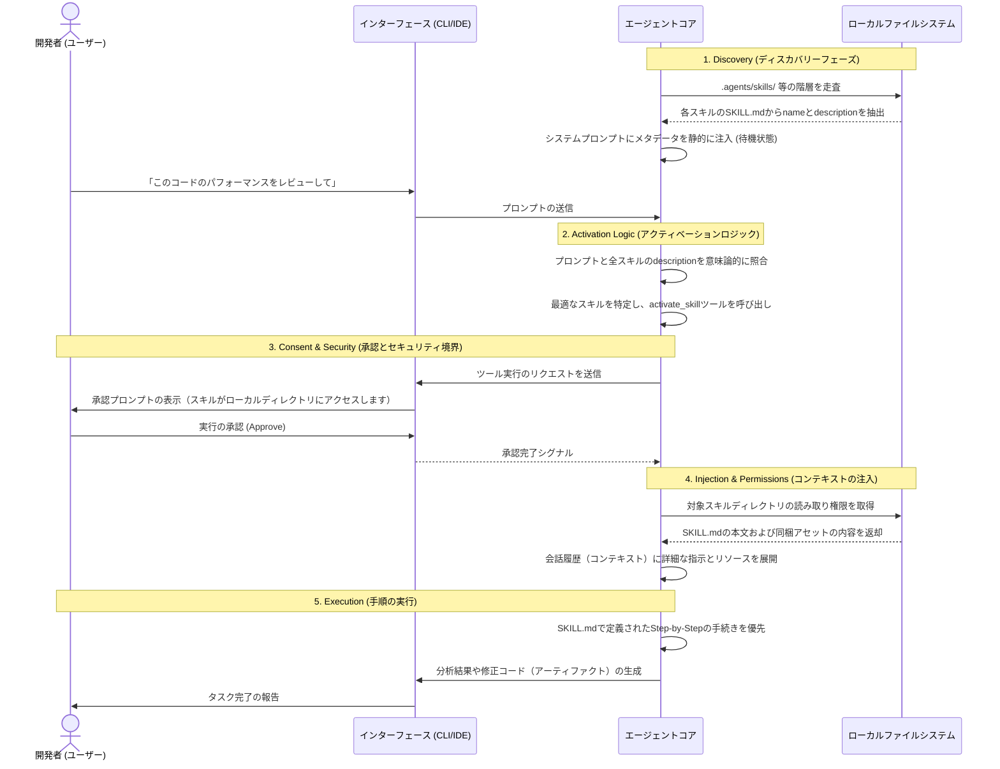

このシーケンスにおいて特筆すべきは、「Discovery（発見）」の段階における優先順位付けと、「Consent（承認）」におけるセキュリティの境界である。同じ名前を持つスキルが複数の階層に存在する場合、上位のスコープ（例えばワークスペース固有のスキル）が下位のスコープ（ユーザーのグローバルスキル）を上書き（オーバーライド）する仕様となっているため、プロジェクトごとに振る舞いを柔軟にカスタマイズすることが可能である。また、スキルがアクティブになる際、UI上にはスキルの名称、目的、およびエージェントがアクセスしようとしているディレクトリパスが明示され、ユーザーの承認を求める確認プロンプトが表示される。これにより、悪意のあるスクリプトの意図しない実行や、機密データへの不正アクセスを未然に防ぐプログレッシブなセキュリティモデルが確立されている。

## **決定論的ツールの統合：MCPとAgent Skillsの相乗効果**

エージェント駆動開発の進化において、Agent Skills単体でも強力なパラダイムシフトをもたらすが、その真価は「Model Context Protocol（MCP）」との統合によって発揮される。MCPとは、AIモデルと外部のデータソースやシステムを標準化されたプロトコルで接続するためのアーキテクチャである。Agent SkillsとMCPはしばしば競合する技術と誤解されがちであるが、実際にはこれらはシステムの異なる層を担う、極めて補完的な関係にある（<https://learn.microsoft.com/en-us/training/support/agent-skills）。>

MCPサーバーは、エージェントに対する「ツール（手足）」や「動的なデータパイプライン」を提供する。例えば、最新のクラウドサービスのAPI仕様を検索する機能や、リモートのデータベースに対してクエリを発行してコードサンプルを取得する機能など、静的なファイルシステムでは提供できない動的な機能（Search, Fetchなど）をエージェントに付与する。

対照的に、Agent Skills（`SKILL.md`）はエージェントに対する「知識と判断力（頭脳）」を提供する。MCPを通じて取得した生のデータをそのままモデルに投げ与えるだけでは、モデルはそれをどう活用すべきか迷ってしまう。そこで、`SKILL.md`の中で「クラウドのプロビジョニングを行う際は、まずMCPツールを利用して最新のリファレンスを検索し、そのデータに基づいて、このプロジェクト独自の命名規則とセキュリティポリシーに沿ってTerraformコードを生成せよ」という構造化されたガイダンスを提供するのである。

この相乗効果を体現する例として、MicrosoftのAzure Agent SkillsとLearn MCP Serverの連携が挙げられる。Learn MCP Serverが膨大な公式ドキュメントの中から関連するコンテンツを動的に取得する（Fetch機能）一方で、Agent Skillsは「何を調べるべきか」「いつ調べるべきか」「取得した情報をどう適用するか」という判断の枠組みを提供する。この連携により、AIアシスタントは常に最新の権威あるデータに基づきながらも、プロジェクト特有の文脈や制約を完全に理解した上でタスクを実行できる、強力な知能へと昇華する。

同様のアプローチは、Pythonプロジェクトにおけるワークフローを自動化する`pyhd`（Python + PhD）スキルや、AIによる冗長な文章を校正する`de-sloppify`スキルなどにも見られる。`pyhd`スキルは、Pythonコードの読解から編集、`ruff`リンターを用いたコードのサニタイズ、テストの実行までの一連のサイクルを管理する。また、`de-sloppify`スキルは、自然言語処理ライブラリ（NLTK）を利用してAI特有の「受動態の多用」や「名詞の過密」といったパターンを検知するローカルスクリプトを実行し、「スロップスコア」を算出する機能を持つ。これらの事例は、エージェントの非決定論的な生成能力と、ローカルスクリプトや外部APIの決定論的な処理能力を、`SKILL.md`という一つの設計図の中で見事に融合させている証左である。

## **Antigravityにおける高度な活用と「学習（Learning）」のプリミティブ**

Agent Skillsのアーキテクチャを理解した上で、この規格が最も高度に機能する環境であるGoogle Antigravityについて詳述する。Gemini CLIがターミナル内での単一タスクの高速化に特化しているのに対し、AntigravityはIDE自体をエージェントの活動拠点として再定義したマルチウィンドウプラットフォームである（<https://antigravity.google/docs/home>）。

Antigravityのエージェントは、ユーザーの要求の複雑さに応じて「Planning（計画）」モードと「Fast（高速）」モードを使い分ける。変数のリネームや簡単なBashコマンドの実行といった局所的なタスクにはFastモードが用いられるが、深い調査や複雑な機能の実装、コードベース全体にわたるリファクタリングにはPlanningモードが起動する。このPlanningモードにおいて、`SKILL.md`は単なる手順書から「戦略のフレームワーク」へと昇華する。エージェントは指定されたスキルに基づき、自律的にタスクをグループ化し、検証プロセスを立案する。

この自律的な計画と実行の過程で、エージェントと人間との対話を繋ぐ重要な要素が「アーティファクト（Artifacts）」である。開発者がエージェントに作業を委任する際、生のツール呼び出しのログや膨大なスタックトレースを人間が目で追うことは極めて非効率であり、信頼関係を構築できない。Antigravityはこれを解決するため、エージェントに対して「タスクリスト」「実装計画書」「UIコンポーネントのスクリーンショット」「ブラウザ操作の録画」といった有形の成果物（アーティファクト）を生成させる。ユーザーはAgent Managerの画面からこれらのアーティファクトを視覚的にレビューし、Googleドキュメントにコメントを残すような直感的な操作で、特定のテキストや画像領域に対して直接フィードバックを与えることができる。エージェントはこのフィードバックを受け取り、非同期でバックグラウンド実行を継続しながら、進行中のタスクに動的に修正を反映させていく。

さらに特筆すべきは、Antigravityが「学習（Learning）」をプラットフォームのコア・プリミティブ（基本構成要素）として深く統合している点である（<https://developers.googleblog.com/build-with-google-antigravity-our-new-agentic-development-platform/>）。従来のAIアシスタントは本質的にステートレスであり、あるセッションで苦労して解決した問題も、次のセッションには持ち越されず忘却されてしまう。しかしAntigravityでは、双方向の知識フロー（Dual-Direction> Knowledge Flow）を備えた高度なナレッジマネジメントシステムが実装されている。

エージェントが複雑なサブタスクを成功裏に完了させた際、有用であったコードスニペット、派生したアーキテクチャパターンの洞察、あるいは問題を解決するために踏んだ具体的な手順のシーケンスなどが、ナレッジベースに自律的かつ継続的に保存される。このナレッジベースはAgent Manager上で可視化され、開発者は過去の作業やフィードバックがどのように再利用されているかを追跡できる。

Agent Skills（`SKILL.md`）は、この学習サイクルにおける「構造化された初期知識」としての役割を担うと同時に、学習結果を永続化するための「器」としても機能する。プロジェクトの初期段階において、チームはベストプラクティスを`SKILL.md`に記述してエージェントに与える。エージェントはそのスキルを利用してタスクをこなし、ナレッジベースに経験を蓄積していく。そして開発者は、その蓄積された知見（特定のライブラリの新しいエッジケースや、より効率的なデバッグ手法など）を定期的に抽出し、`skill-creator`などを通じて元の`SKILL.md`を更新（リファクタリング）することで、エージェントの能力を組織全体の資産として継続的に進化させることができるのである。

## **コミュニティエコシステムとオープンなスキルの共有**

`SKILL.md`は純粋なマークダウンとYAMLという、開発者にとって最も親和性が高く、かつGit等のバージョン管理システムと相性の良いプレーンテキストのフォーマットで設計されている。このシンプルでポータブルな設計思想により、プラットフォームの垣根を越えた巨大なコミュニティエコシステムが急速に形成されている（<https://github.com/sickn33/antigravity-awesome-skills）。>

GitHub上に公開されているコミュニティ主導のリポジトリ（例: `sickn33/antigravity-awesome-skills`）には、世界中の開発者が作成した1,200種類を超える高度なスキルが集約されている。これらのスキルは、単なるコードの補完にとどまらず、ソフトウェア開発のライフサイクル全体を網羅する「ロール（役割）」ベースのパッケージとして提供されている。

例えば、「セキュリティ監査（Security Audit）」のロールには、エシカルハッキングの手法やOWASP Top 10のチェックリスト、AWS環境のペネトレーションテストの手順を詳細に定義したスキル（`@security-auditor`など）が含まれている。また、「シニアエンジニアリング（Senior Engineering）」のロールには、TDD（テスト駆動開発）の厳格なワークフロー（`@test-driven-development`）、クリーンアーキテクチャのガイドライン、Reactのデザインパターンをエージェントに強制するスキル群が用意されている。さらに、「グロース＆プロダクト（Growth & Product）」といった開発以外の領域においても、RICE（Reach, Impact, Confidence, Effort）スコアリングを用いた機能の優先順位付けや、SEO戦略の立案を支援するツールキットが提供されている。

開発者は、ターミナルから`npx antigravity-awesome-skills`等のコマンドを実行するだけで、これらの実践的なスキル群のバンドル（例えばWeb開発者向けの「Web Wizard」や、汎用的な「Essentials」など）を自身の環境（`~/.gemini/antigravity/skills`等）に瞬時にインストールできる。これにより、単独の開発者であっても、AIアシスタントを「設計から監査、マーケティングまでをこなすフルスタックの専門チーム」へと即座にアップグレードさせることが可能となるのである。

これらのオープンソーススキルは、前述のV4標準（5-Point Quality Check）などの厳格な品質基準に基づいて運用されており、エージェントに「どのように思考させるか」ではなく「具体的に何を検証し、どのようなアーティファクトを出力させるか」というプロンプトエンジニアリングの最良のショーケースとしても機能している。

## **結論と次世代のソフトウェアアーキテクチャ**

Google Gemini、Gemini CLI、およびGoogle Antigravityを取り巻くエコシステムにおいて、`SKILL.md`を中核とするAgent Skillsアーキテクチャは、大規模言語モデルに対する単なる「長大な命令書」の域を遥かに超えた、システム工学的なマイルストーンである。

これは、プログレッシブ・ディスクロージャーによるコンテキストウィンドウとトークン消費の極めて効率的な管理、確率論的に振る舞うLLMに対する決定論的な検証スクリプトの注入、そしてMCPサーバーを介した動的データと静的な「判断の枠組み（知識）」との高度な統合を実現するための、洗練されたオープンアーキテクチャである。

開発者は、複雑なドメイン知識、プロジェクト固有のアーキテクチャ制約、属人的になりがちな社内ワークフローを`SKILL.md`にカプセル化し、リポジトリの`.agents/skills/`にコミットすることで、それらを組織全体が共有・再利用可能な「生きたナレッジ」として運用することができる。特に、Antigravityのような自律的オーケストレーション環境においては、このスキルを土台としてエージェントがPlanningモードで非同期に思考し、アーティファクトを通じて人間とコラボレーションを行い、ナレッジベースを通じて継続的に自己学習していくという、ソフトウェア開発の新しいパラダイムが既に現実のものとなっている。

Agent Skillsのフォーマットは、自然言語とマークダウンという最も人間にとって直感的で親和性の高い形式を採用しながらも、背後ではシステムに対して厳密なトリガーと制約を提供する強固な架け橋となる。本稿で詳述したアーキテクチャの原理と`SKILL.md`の作成手順を深く理解し実践することで、開発者は次世代のエージェントファースト時代において、単なる「コードの書き手」から、高度なAIシステム全体を統括し、オーケストレーションする「アーキテクト」へと自身の役割を大きく進化させることができるだろう。

---

## **参照URL一覧**

本稿の技術的根拠および概念の解説において参照したすべてのURLを以下に示す。

| プラットフォーム・技術領域 | 参照元URL |
| --- | --- |
| **Google Antigravity / Gemini CLI 公式** | <https://antigravity.google/> |
| **Google Antigravity / Gemini CLI 公式** | <https://geminicli.com/> |
| **Google Antigravity / Gemini CLI 公式** | <https://antigravity.google/download> |
| **Google Antigravity / Gemini CLI 公式** | <https://antigravity.google/docs/agent> |
| **Google Antigravity / Gemini CLI 公式** | <https://antigravity.google/docs/skills> |
| **Google Antigravity / Gemini CLI 公式** | <https://antigravity.google/docs/home> |
| **Google Antigravity / Gemini CLI 公式** | <https://geminicli.com/docs/cli/skills/> |
| **Google Antigravity / Gemini CLI 公式** | <https://antigravity.google/blog/introducing-google-antigravity> |
| **Google Cloud / 開発者ブログ** | <https://developers.googleblog.com/build-with-google-antigravity-our-new-agentic-development-platform/> |
| **Google Cloud / 開発者ブログ** | <https://cloud.google.com/blog/topics/developers-practitioners/choosing-antigravity-or-gemini-cli> |
| **Google Cloud / 開発者ブログ** | <https://blog.google/innovation-and-ai/technology/developers-tools/gemini-3-developers/> |
| **Google Cloud / 開発者ブログ** | <https://codelabs.developers.google.com/getting-started-google-antigravity> |
| **Google Cloud / 開発者ブログ** | <https://codelabs.developers.google.com/gemini-cli/how-to-create-agent-skills-for-gemini-cli> |
| **Agent Skills オープンスタンダード / サードパーティ仕様** | <https://github.com/agentskills/agentskills> |
| **Agent Skills オープンスタンダード / サードパーティ仕様** | <https://agentskills.io/home> |
| **Agent Skills オープンスタンダード / サードパーティ仕様** | <https://code.visualstudio.com/docs/copilot/customization/agent-skills> |
| **Agent Skills オープンスタンダード / サードパーティ仕様** | <https://developers.openai.com/codex/skills/> |
| **Agent Skills オープンスタンダード / サードパーティ仕様** | <https://platform.claude.com/docs/en/agents-and-tools/agent-skills/overview> |
| **Agent Skills オープンスタンダード / サードパーティ仕様** | <https://platform.claude.com/docs/en/agents-and-tools/agent-skills/best-practices> |
| **Agent Skills オープンスタンダード / サードパーティ仕様** | <https://code.claude.com/docs/en/skills> |
| **Agent Skills オープンスタンダード / サードパーティ仕様** | <https://github.com/anthropics/skills> |
| **Agent Skills オープンスタンダード / サードパーティ仕様** | <https://github.com/anthropics/skills/issues/188> |
| **Agent Skills オープンスタンダード / サードパーティ仕様** | <https://github.com/pnp/copilot-prompts/blob/main/SKILL-SCHEMA.md> |
| **Agent Skills オープンスタンダード / サードパーティ仕様** | <https://learn.microsoft.com/en-us/training/support/agent-skills> |
| **Agent Skills オープンスタンダード / サードパーティ仕様** | <https://www.mintlify.com/blog/skill-md> |
| **Medium / 技術コミュニティ記事** | <https://medium.com/google-cloud/tutorial-getting-started-with-antigravity-skills-864041811e0d> |
| **Medium / 技術コミュニティ記事** | <https://medium.com/google-cloud/skills-made-easy-with-google-antigravity-and-gemini-cli-5435139b0af8> |
| **Medium / 技術コミュニティ記事** | <https://medium.com/google-cloud/mastering-agent-skills-in-gemini-cli-f3860f975fb0> |
| **Medium / 技術コミュニティ記事** | <https://medium.com/google-cloud/beyond-prompt-engineering-using-agent-skills-in-gemini-cli-04d9af3cda21> |
| **Medium / 技術コミュニティ記事** | <https://medium.com/google-cloud/building-agent-skills-with-skill-creator-855f18e785cf> |
| **Medium / 技術コミュニティ記事** | <https://medium.com/@tahirbalarabe2/what-is-google-antigravity-49872c58305f> |
| **Medium / 技術コミュニティ記事** | <https://danicat.dev/posts/agent-skills-gemini-cli/> |
| **Medium / 技術コミュニティ記事** | <https://danicat.dev/posts/20260227-gemini-cli-skills-part-2/> |
| **Medium / 技術コミュニティ記事** | <https://leehanchung.github.io/blogs/2025/10/26/claude-skills-deep-dive/> |
| **GitHub リポジトリ / Reddit / その他** | <https://github.com/sickn33/antigravity-awesome-skills> |
| **GitHub リポジトリ / Reddit / その他** | <https://github.com/sickn33/antigravity-awesome-skils/blob/main/CONTRIBUTING.md> |
| **GitHub リポジトリ / Reddit / その他** | <https://github.com/sickn33/antigravity-awesome-skills/blob/main/CATALOG.md> |
| **GitHub リポジトリ / Reddit / その他** | <https://github.com/sickn33/antigravity-awesome-skills/blob/main/apps/web-app> |
| **GitHub リポジトリ / Reddit / その他** | <https://github.com/danicat/skills/blob/main/experiment-analyst/SKILL.md> |
| **GitHub リポジトリ / Reddit / その他** | <https://google.github.io/adk-docs/> |
| **GitHub リポジトリ / Reddit / その他** | <https://www.reddit.com/r/ChatGPTCoding/comments/1plqdvi/best_way_to_use_gemini_3_cli_antigravity_kilocode/> |
| **GitHub リポジトリ / Reddit / その他** | <https://www.reddit.com/r/google_antigravity/comments/1qcuc8u/i_aggregated_58_skills_for_antigravity_into_one/> |
| **GitHub リポジトリ / Reddit / その他** | <https://www.reddit.com/r/GeminiCLI/comments/1qgitn2/experimentalskills_why_use_a_skillmd_when_i_have/> |
| **GitHub リポジトリ / Reddit / その他** | <https://visualstudiomagazine.com/articles/2025/11/20/google-joins-ai-ide-race-to-compete-with-vs-code-apparently-forking-vs-code.aspx> |
| **GitHub リポジトリ / Reddit / その他** | <https://cursor.com/docs/skills> |
| **GitHub リポジトリ / Reddit / その他** | <https://lobehub.com/it/skills/dandye-ai-runbooks-design-metadata-schema> |
| **GitHub リポジトリ / Reddit / その他** | <https://smithery.ai/skills/mcclowes/json-schema> |
| **GitHub リポジトリ / Reddit / その他** | <https://www.youtube.com/watch?v=gh9Y3tHeFXQ> |
| **GitHub リポジトリ / Reddit / その他** | <https://www.youtube.com/watch?v=Rw_tvHpcVKA> |

[**medium.com**Tutorial : Getting Started with Google Antigravity Skills](https://medium.com/google-cloud/tutorial-getting-started-with-antigravity-skills-864041811e0d)
[**codelabs.developers.google.com**Getting Started with Google Antigravity](https://codelabs.developers.google.com/getting-started-google-antigravity)
[**developers.googleblog.com**Build with Google Antigravity, our new agentic development platform](https://developers.googleblog.com/build-with-google-antigravity-our-new-agentic-development-platform/)
[**antigravity.google**Google Antigravity Documentation](https://antigravity.google/docs/home)
[**youtube.com**Google Antigravity is A New Era in AI-Assisted Software Development Live Demo how to use ! - YouTube](https://www.youtube.com/watch?v=Rw_tvHpcVKA)
[**cloud.google.com**Choosing Antigravity or Gemini CLI | Google Cloud Blog](https://cloud.google.com/blog/topics/developers-practitioners/choosing-antigravity-or-gemini-cli)
[**medium.com**Skills Made Easy with Google Antigravity and Gemini CLI | by Karl Weinmeister - Medium](https://medium.com/google-cloud/skills-made-easy-with-google-antigravity-and-gemini-cli-5435139b0af8)
[**blog.google**Gemini 3 for developers: New reasoning, agentic capabilities - Google Blog](https://blog.google/innovation-and-ai/technology/developers-tools/gemini-3-developers/)
[**danicat.dev**Mastering Agent Skills in Gemini CLI · danicat.dev](https://danicat.dev/posts/agent-skills-gemini-cli/)
[**geminicli.com**Agent Skills | Gemini CLI](https://geminicli.com/docs/cli/skills/)
[**code.visualstudio.com**Use Agent Skills in VS Code](https://code.visualstudio.com/docs/copilot/customization/agent-skills)
[**github.com**sickn33/antigravity-awesome-skills: The Ultimate Collection ... - GitHub](https://github.com/sickn33/antigravity-awesome-skills)
[**github.com**agentskills/agentskills: Specification and documentation for ... - GitHub](https://github.com/agentskills/agentskills)
[**developers.openai.com**Agent Skills - OpenAI for developers](https://developers.openai.com/codex/skills/)
[**platform.claude.com**Agent Skills - Claude API Docs](https://platform.claude.com/docs/en/agents-and-tools/agent-skills/overview)
[**medium.com**Mastering Agent Skills in Gemini CLI | by Daniela Petruzalek | Google Cloud - Medium](https://medium.com/google-cloud/mastering-agent-skills-in-gemini-cli-f3860f975fb0)
[**leehanchung.github.io**Claude Agent Skills: A First Principles Deep Dive - Han Lee](https://leehanchung.github.io/blogs/2025/10/26/claude-skills-deep-dive/)
[**github.com**copilot-prompts/SKILL-SCHEMA.md at main - GitHub](https://github.com/pnp/copilot-prompts/blob/main/SKILL-SCHEMA.md)
[**platform.claude.com**Skill authoring best practices - Claude API Docs](https://platform.claude.com/docs/en/agents-and-tools/agent-skills/best-practices)
[**github.com**Proposal: Add category metadata field to SKILL.md specification #188 - GitHub](https://github.com/anthropics/skills/issues/188)
[**medium.com**Beyond Prompt Engineering: Using Agent Skills in Gemini CLI | by Daniel Strebel - Medium](https://medium.com/google-cloud/beyond-prompt-engineering-using-agent-skills-in-gemini-cli-04d9af3cda21)
[**codelabs.developers.google.com**How to create Agent Skills for Gemini CLI - Google Codelabs](https://codelabs.developers.google.com/gemini-cli/how-to-create-agent-skills-for-gemini-cli)
[**learn.microsoft.com**Azure Agent Skills | Microsoft Learn](https://learn.microsoft.com/en-us/training/support/agent-skills)
[**medium.com**What is Google Antigravity? - Medium](https://medium.com/@tahirbalarabe2/what-is-google-antigravity-49872c58305f)
[**antigravity.google**Introducing Google Antigravity, a New Era in AI-Assisted Software Development](https://antigravity.google/blog/introducing-google-antigravity)
[**visualstudiomagazine.com**Google Joins AI IDE Race to Compete with VS Code, Apparently Forking VS Code](https://visualstudiomagazine.com/articles/2025/11/20/google-joins-ai-ide-race-to-compete-with-vs-code-apparently-forking-vs-code.aspx)
[**cursor.com**Agent Skills | Cursor Docs](https://cursor.com/docs/skills)
[**mintlify.com**skill.md: An open standard for agent skills - Mintlify](https://www.mintlify.com/blog/skill-md)
[**reddit.com**I aggregated 58 skills for Antigravity into one repo : r/google_antigravity - Reddit](https://www.reddit.com/r/google_antigravity/comments/1qcuc8u/i_aggregated_58_skills_for_antigravity_into_one/)
