# Google推奨 ハーネスエンジニアリング 完全ガイド

> **対象読者**: ソフトウェアエンジニアリングのテスト基盤に初めて触れる方
> **目標**: Googleが実践するテストハーネスの設計思想・実装パターン・ベストプラクティスをゼロから理解し、現場で使えるレベルに到達する
> **最終更新**: 2026年5月（Google Testing Blog / Software Engineering at Google 準拠）

---

## 目次

1. [ハーネスエンジニアリングとは何か](#1-ハーネスエンジニアリングとは何か)
2. [Googleのテスト哲学 — テストピラミッド](#2-googleのテスト哲学--テストピラミッド)
3. [テストハーネスを構成する5つの要素](#3-テストハーネスを構成する5つの要素)
4. [テストダブル — 替え玉の4種類](#4-テストダブル--替え玉の4種類)
5. [ハーミティックテスト — 孤立した清潔なテスト](#5-ハーミティックテスト--孤立した清潔なテスト)
6. [ステップバイステップ実装ガイド](#6-ステップバイステップ実装ガイド)
7. [フレイキーテスト対策](#7-フレイキーテスト対策)
8. [CIパイプラインへの組み込み](#8-ciパイプラインへの組み込み)
9. [AIエージェント評価ハーネス](#9-aiエージェント評価ハーネス)
10. [ベストプラクティス10則](#10-ベストプラクティス10則)
11. [参考ソース一覧](#11-参考ソース一覧)

---

## 1. ハーネスエンジニアリングとは何か

💡 この章では「テストハーネスとは何か」をゼロから説明します。後の章でハーネスを実際に組み立てる前に、この章でイメージをつかんでください。

### 1.1 ハーネスとは

**テストハーネス**（Test Harness）とは、テスト対象のコードを「安全かつ再現可能な環境」で動かすための**足場（スキャフォールディング）**のことです。

> **日常の例え話**: カーテストのクラッシュテストを想像してください。  
> 車を実際に壁に衝突させるとき、ダミー人形・センサー・高速カメラ・制御された壁面——これらすべてが「ハーネス（試験用足場）」です。  
> ハーネスがなければ「何が何に当たってどんな力がかかったか」を数値で再現できません。  
> ソフトウェアのテストも同じです。「本番と同じ条件を再現可能な形で用意する仕組み」がテストハーネスです。

### 1.2 なぜ Google がハーネスエンジニアリングを重視するのか

Googleは1日に**数億行のコード変更**と**数十億件のテスト**を実行します。この規模では「テストが適当」だと以下の問題が発生します。

| 問題 | 具体例 | ハーネスがない場合のコスト |
|------|--------|--------------------------|
| 再現不能なバグ | 本番にのみ発生する環境依存バグ | 調査に数日〜数週間 |
| フレイキーテスト | 同じコードで50%の確率で失敗 | CI信頼性崩壊 |
| 遅すぎるCI | E2Eテストが1回30分 | 開発速度が1/10以下 |
| テスト間の依存 | テストAを実行するとテストBが壊れる | 夜間ビルドが常に赤 |

これらを解決するための体系的アプローチが**ハーネスエンジニアリング**です。

### 1.3 ハーネスエンジニアリングの全体像

この図はハーネスエンジニアリングの全体像を表しています。左から右へ「テスト対象 → ハーネス層 → 検証」の流れで読んでください。

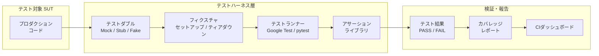

各ノードの意味：
- **SUT** (System Under Test)：実際にテストされるプロダクションコード
- **テストダブル**：本物の依存コンポーネントの「替え玉」（後述）
- **フィクスチャ**：各テストの前後に実行するセットアップ・クリーンアップ処理
- **テストランナー**：テストを実際に実行するフレームワーク
- **アサーション**：「期待値 = 実際の値」を比較する検証コード

📖 このセクションで登場した用語
- **テストハーネス（Test Harness）**：テストを安全・再現可能に実行するための足場全体
- **SUT（System Under Test）**：「テストされるシステム」の略。テスト対象のコードそのもの
- **フレイキーテスト（Flaky Test）**：同じコードで実行のたびに結果が変わる不安定なテスト
- **フィクスチャ（Fixture）**：各テスト実行前後に状態を整えるセットアップ/クリーンアップ処理

---

## 2. Googleのテスト哲学 — テストピラミッド

💡 この章では「どのテストをどれだけ書くべきか」というGoogleの判断基準を説明します。ここを理解することで、後の章でのハーネス設計判断が分かりやすくなります。

### 2.1 テストピラミッドとは

**テストピラミッド**（Testing Pyramid）は「テストの種類ごとの理想的な量の比率」を表す考え方です。

> **日常の例え話**: 建物の検査を想像してください。  
> ボルト1本の締め付けトルク検査（細かい部品 = ユニットテスト）は大量に行います。  
> 一方、完成した建物全体の耐震検査（全体 = E2Eテスト）は費用が高く時間がかかるため少数しか行いません。  
> ピラミッドの形は「下（小さい粒度）ほど多く、上（大きい粒度）ほど少なく」という比率を表しています。

この図はGoogleが推奨するテストピラミッドの構造です。下から上へ読み進めてください。

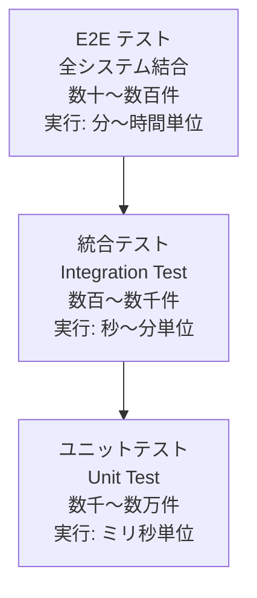

各ノードの意味：
- **ユニットテスト**：関数・クラス1つを単独でテスト。高速・低コスト。ピラミッドの土台
- **統合テスト**：複数のコンポーネントが協調動作するかをテスト。中速・中コスト
- **E2Eテスト**：ユーザー視点でシステム全体をテスト。低速・高コスト。頂点の少数

### 2.2 Google の Small / Medium / Large 分類

Googleは「ユニット/統合/E2E」より厳密な独自分類を使っています。

| サイズ | 日本語名 | 実行制限 | ネットワーク | DB | 外部サービス | 目標カバー率 |
|--------|---------|----------|------------|-----|-------------|------------|
| **Small** | 小テスト | 60秒以内 | 禁止 | 禁止 | 禁止 | 80%以上 |
| **Medium** | 中テスト | 300秒以内 | ローカルのみ | localhost のみ | 禁止 | 15%程度 |
| **Large** | 大テスト | 900秒以内 | 制限なし | 制限なし | 制限なし | 5%程度 |

> **なぜ「禁止」が多いのか**: ネットワークやDBを使うと「テストが失敗した原因がコードなのかインフラなのか分からなくなる」からです。Small テストが多いほど「失敗 = コードのバグ」という1対1の関係が保たれます。

### 2.3 テストピラミッドを守るべき理由

この図はテストがピラミッドの形から逆三角形に崩れたときの問題を表しています。

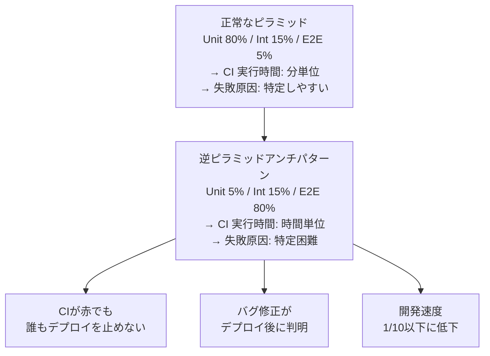

📖 このセクションで登場した用語
- **テストピラミッド（Testing Pyramid）**：ユニット→統合→E2Eの順に「多→少」にテストを配置するベストプラクティス
- **E2Eテスト（End-to-End Test）**：ユーザーの操作を模倣してシステム全体を通して動かすテスト
- **Small/Medium/Large**：Googleが使うテストサイズ分類。依存する外部リソースの多さで決まる
- **逆ピラミッド（Ice-cream Cone）**：E2Eテストが多すぎる失敗パターン。CI崩壊の主原因

---

## 3. テストハーネスを構成する5つの要素

💡 この章では「テストハーネスが何からできているか」を1つずつ説明します。5つの要素を全部理解することで、次章以降の実装が分かりやすくなります。

この図はテストハーネスを構成する5要素と、それらの関係を表しています。

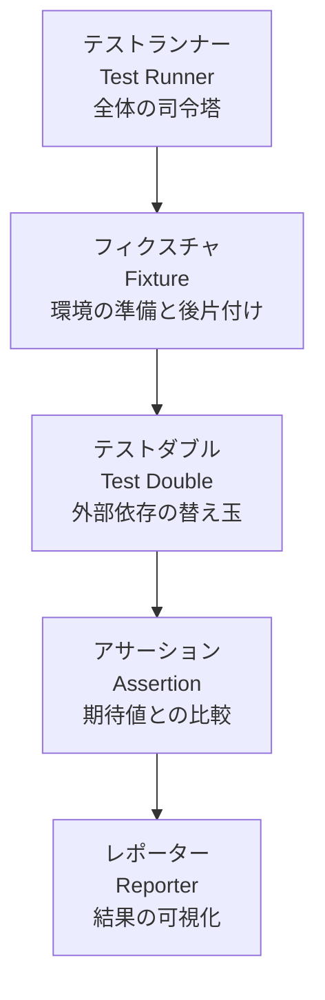

### 要素1: テストランナー（Test Runner）

**テストランナー**（＝全テストを順番に実行してくれる司令塔）です。「どのテストを・どの順番で・何回実行するか」を管理します。

| 言語 | Google推奨フレームワーク | 主な特徴 |
|------|------------------------|---------|
| C++ | **Google Test (gtest)** | Googleが開発・OSS公開。パラメータ化テスト対応 |
| Python | **pytest** | フィクスチャが強力。プラグイン豊富 |
| Go | **testing パッケージ** | 標準ライブラリに内蔵。Table-Driven Tests |
| Java | **JUnit5 + Google Truth** | Truth でアサーションが自然言語に近い |
| TypeScript | **Vitest / Jest** | 高速・ESM対応 |

### 要素2: フィクスチャ（Fixture）

**フィクスチャ**（＝テスト実行前後の「部屋の掃除」担当）です。

> **日常の例え話**: レストランのテーブル準備を想像してください。  
> 「食事前にテーブルを拭いてカトラリーを並べる（setUp）」「食事後に皿を下げてテーブルを拭く（tearDown）」  
> これをすべてのテーブル（テストケース）に対して自動で行う仕組みがフィクスチャです。

```python
# Python + pytest の例
# なぜクラスで囲むか: setUp/tearDown をテストケースグループでまとめて管理するため

class TestUserService:
    def setup_method(self):
        # テスト開始前: 毎回クリーンなDBを用意する
        # なぜ毎回作るか: テスト間の「汚染」を防ぐためのルール（後述）
        self.db = FakeDatabase()
        self.service = UserService(db=self.db)

    def teardown_method(self):
        # テスト終了後: DBを破棄してリソースを解放する
        self.db.close()

    def test_create_user_success(self):
        # ここでは self.service が必ずクリーンな状態であることが保証される
        result = self.service.create_user(name="Alice")
        assert result.id is not None
```

### 要素3: テストダブル（Test Double）

「替え玉」です。詳細は次章で説明します。

### 要素4: アサーション（Assertion）

**アサーション**（＝「期待どおりだよね？」と確認する係）です。

```python
# Google Truth スタイルに近いアサーション（Python）
# なぜ assert x == y より優れるか: 失敗時のエラーメッセージが人間に分かりやすいため

# ❌ 分かりにくいエラー
assert result == expected  # Error: AssertionError

# ✅ 分かりやすいエラー（pytest でも同等効果）
assert result == expected, f"期待値 {expected} に対して実際値 {result} でした"
```

### 要素5: レポーター（Reporter）

**レポーター**（＝テスト結果をグラフ・ダッシュボードで見やすくする係）です。Googleは**Sponge**という内部テスト結果分析ツールを持っています。OSS世界では **Allure Report** や **pytest-html** が相当します。

📖 このセクションで登場した用語
- **テストランナー（Test Runner）**：テストを自動で実行・管理するフレームワーク
- **フィクスチャ（Fixture）**：テスト実行前後の環境セットアップ/クリーンアップ処理
- **アサーション（Assertion）**：「期待値 = 実際値」の一致を検証するコード
- **Google Test (gtest)**：GoogleがC++向けに開発・OSSとして公開したテストフレームワーク

---

## 4. テストダブル — 替え玉の4種類

💡 この章では「外部依存を持つコードをどうテストするか」という中核技術を説明します。ここを理解することで、DBや外部APIに依存するコードも単体でテストできるようになります。

### 4.1 なぜ「替え玉」が必要なのか

テスト対象のコードが「外部データベース」「外部API」「メール送信サービス」などに依存していると、次の問題が生じます。

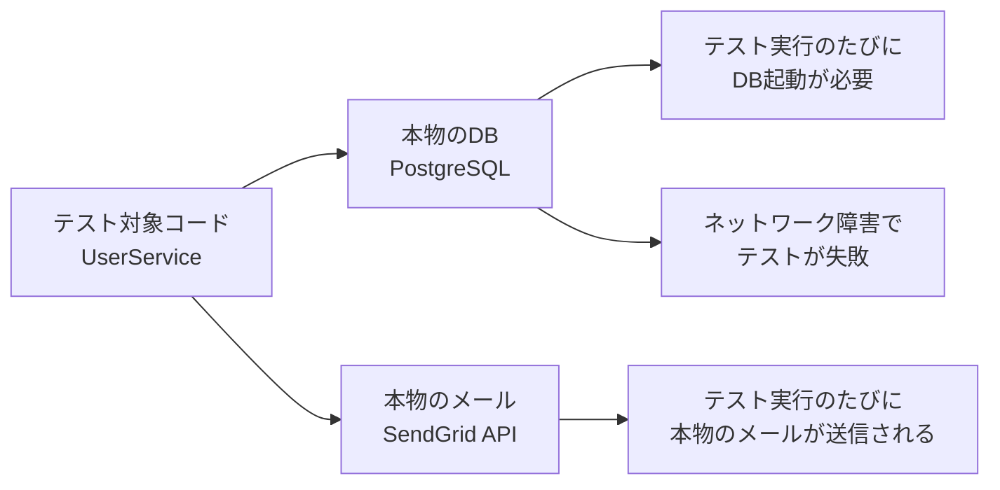

このため「本物の外部依存を替え玉に差し替える」のがテストダブルの役割です。

> **日常の例え話**: 映画のスタントマンを想像してください。  
> 主役俳優の代わりに危険なシーンをこなすスタントマンが「テストダブル」です。  
> 「似た外見・特定のシーンだけ動く」という点がテストダブルと共通しています。

### 4.2 4種類のテストダブル

| 種類 | 日本語名 | 動作 | いつ使うか |
|------|---------|------|-----------|
| **Stub** | スタブ | 固定値を返すだけ | 「値が返ってくればいい」場合 |
| **Mock** | モック | 呼び出しを記録・検証する | 「このメソッドが呼ばれたか確認したい」場合 |
| **Fake** | フェイク | 本物に近いが軽量な実装 | DBの代わりにメモリ上で動く実装 |
| **Spy** | スパイ | 本物を使いつつ呼び出しを記録 | 既存コードを変更せず動作を監視したい場合 |

### 4.3 Stub（スタブ）の例

**スタブ**（＝「聞かれたら決まった答えを返すだけの案内板」）です。ロジックなし・記録なし・ただ固定値を返します。

```python
# なぜスタブを使うか:
# 本物の天気APIを呼ぶと「ネットワーク障害」「APIキー切れ」でテストが落ちるため
# 替え玉を使ってテスト対象コードの判断ロジックのみをテストする

class StubWeatherApi:
    """本物のWeatherApiの替え玉。常に晴れを返す。"""
    def get_weather(self, city: str) -> str:
        return "sunny"  # 固定値を返すだけ。ネットワーク接続なし

def test_suggest_activity_when_sunny():
    # スタブを本物のAPIの代わりに注入する（Dependency Injection）
    stub_api = StubWeatherApi()
    service = ActivitySuggester(weather_api=stub_api)

    suggestion = service.suggest(city="Tokyo")

    # 晴れのとき「外出を勧める」ロジックのみをテストできる
    assert suggestion == "Let's go outside!"
```

### 4.4 Mock（モック）の例

**モック**（＝「呼び出されたことを記録して後で報告するカメラ」）です。「このメソッドが・何回・どんな引数で呼ばれたか」を検証します。

```python
from unittest.mock import MagicMock

def test_email_sent_on_registration():
    # なぜモックを使うか: 本物のメールが送信されると受信ボックスが汚れるため
    mock_mailer = MagicMock()
    service = UserService(mailer=mock_mailer)

    service.register(email="user@example.com")

    # 「send_email が1回・正しい引数で呼ばれたか」を検証する
    mock_mailer.send_email.assert_called_once_with(
        to="user@example.com",
        subject="Welcome!"
    )
```

### 4.5 Fake（フェイク）の例

**フェイク**（＝「本物より軽いが実際に動く模造品」）です。インメモリDBが典型例です。

```python
# なぜフェイクはスタブより優れることがあるか:
# スタブは「固定値を返す」だけなので複雑なロジックをテストできない
# フェイクは「実際に動く」のでCRUD操作のような複雑な操作をテストできる

class FakeUserRepository:
    """本物のPostgreSQLの代わりに辞書で動くインメモリDB"""

    def __init__(self):
        # メモリ上の辞書でデータを管理。DBなし・ネットワークなし
        self._store: dict[str, User] = {}

    def save(self, user: User) -> None:
        self._store[user.id] = user  # 辞書に保存するだけ

    def find_by_id(self, user_id: str) -> User | None:
        return self._store.get(user_id)  # 辞書から取得するだけ

def test_update_user_email():
    fake_repo = FakeUserRepository()
    service = UserService(repo=fake_repo)

    # 複雑なCRUD操作をDBなしでテストできる
    user = service.create_user(name="Alice")
    service.update_email(user.id, new_email="new@example.com")

    saved = fake_repo.find_by_id(user.id)
    assert saved.email == "new@example.com"
```

### 4.6 どのテストダブルを選ぶか

この図は状況に応じたテストダブルの選択フローです。上から下へ読み進めてください。

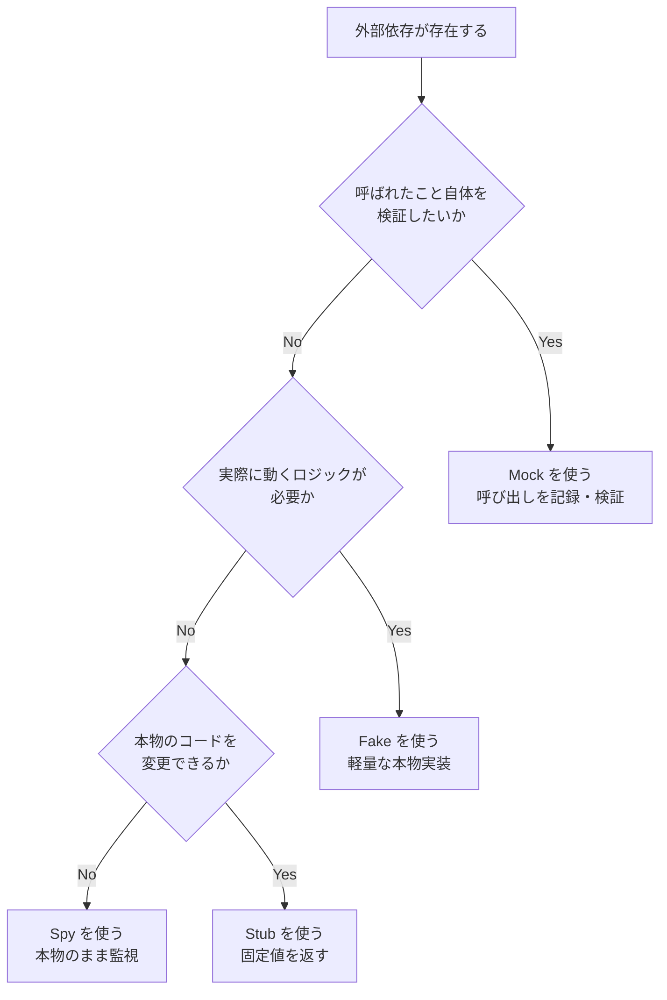

📖 このセクションで登場した用語
- **テストダブル（Test Double）**：テスト用に本物の依存コンポーネントの代わりに使う替え玉の総称
- **スタブ（Stub）**：固定値を返すだけのシンプルな替え玉
- **モック（Mock）**：呼び出しを記録して後から検証できる替え玉
- **フェイク（Fake）**：実際に動作するが軽量な代替実装（インメモリDBなど）
- **スパイ（Spy）**：本物のコードを動かしつつ呼び出しを記録する替え玉
- **DI（Dependency Injection）**：依存するオブジェクトを外から注入する設計パターン

---

## 5. ハーミティックテスト — 孤立した清潔なテスト

💡 この章では「テストの独立性をどう保証するか」というGoogle独自のコンセプトを説明します。この考え方がハーネスエンジニアリングの根幹です。

### 5.1 ハーミティックとは

**ハーミティック**（Hermetic、「密閉された」の意）とは、「テストが外の世界に一切依存しない・影響を与えない」状態のことです。

> **日常の例え話**: 宇宙服を着た宇宙飛行士を想像してください。  
> 宇宙服は外の真空・放射線・温度変化から宇宙飛行士を完全に「密閉」して守ります。  
> ハーミティックテストも「外部のDB状態・ネットワーク状況・時刻・他のテスト」から完全に隔離されたテストです。

### 5.2 ハーミティックの3原則

| 原則 | 意味 | 実装方法 |
|------|------|---------|
| **孤立性（Isolation）** | 他のテストの実行順・実行有無に結果が依存しない | 各テストで独立したフィクスチャを使う |
| **冪等性（Idempotency）** | 何回実行しても同じ結果になる | 時刻・乱数・外部APIを排除する |
| **自己完結性（Self-containment）** | テストデータを自分で作り・自分で片付ける | DB初期化をsetUpで行う |

### 5.3 ハーミティックを破るアンチパターン

この図はハーミティックを破る代表的なアンチパターンを表しています。

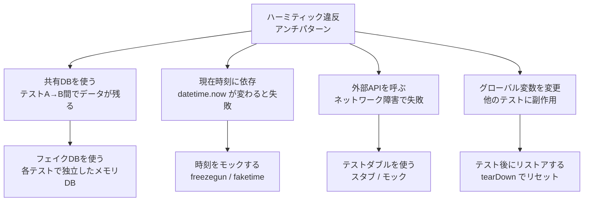

📖 このセクションで登場した用語
- **ハーミティック（Hermetic）**：外部に依存せず完全に密閉・独立したテストの性質
- **孤立性（Isolation）**：テストが他のテストの実行結果に影響されない性質
- **冪等性（Idempotency）**：同じ操作を何回繰り返しても同じ結果になる性質
- **自己完結性（Self-containment）**：テストデータの準備・片付けをテスト自身が行う性質

---

## 6. ステップバイステップ実装ガイド

💡 この章では「実際にテストハーネスをゼロから構築する手順」を5ステップで説明します。ここまでの理論を実際のコードで確認してください。

この図はステップ1〜5の実装フローです。上から下へ順番に実行します。

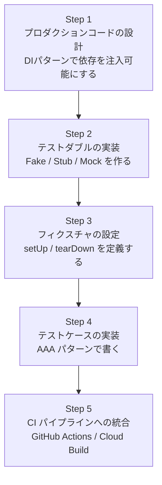

### Step 1: DI（依存性注入）設計

**DI（Dependency Injection）**（＝「必要な道具を外から渡してもらう」設計）です。テスト時に本物の依存を替え玉に差し替えるために必須です。

```python
# ❌ DIなしの設計: テスト不可能
class UserService:
    def __init__(self):
        # ハードコードされたDB接続。テスト時に替え玉を差し込めない
        self._db = PostgreSQLDatabase(host="prod.db.example.com")

# ✅ DIありの設計: テスト可能
from typing import Protocol

class UserRepository(Protocol):
    """リポジトリのインターフェース定義（Goのinterfaceに相当）"""
    def save(self, user: "User") -> None: ...
    def find_by_id(self, user_id: str) -> "User | None": ...

class UserService:
    def __init__(self, repo: UserRepository):
        # 外から渡してもらう。本番ではPostgreSQL実装、テストではFake実装が入る
        self._repo = repo
```

### Step 2: テストダブルの実装

```python
# フェイクDBの実装（本物のPostgreSQLの替え玉）
class FakeUserRepository:
    def __init__(self):
        self._store: dict[str, User] = {}

    def save(self, user: User) -> None:
        # メモリ上の辞書への保存。DBなし・高速
        self._store[user.id] = user

    def find_by_id(self, user_id: str) -> User | None:
        return self._store.get(user_id)
```

### Step 3: フィクスチャの設定

```python
import pytest

@pytest.fixture
def fake_repo():
    """各テスト関数に渡されるクリーンなフェイクリポジトリ。
    なぜ fixture を使うか: 毎回 FakeUserRepository() を書く手間を省き、
    さらに各テストが必ず独立したインスタンスを使うことを保証するため。
    """
    return FakeUserRepository()

@pytest.fixture
def user_service(fake_repo):
    """依存関係を注入済みのサービスインスタンスを返す。
    fake_repo をコンストラクタに渡してテスト可能な状態にする。
    """
    return UserService(repo=fake_repo)
```

### Step 4: AAAパターンでテストを書く

**AAAパターン**（Arrange-Act-Assert）とは「準備→実行→検証」の3段構成でテストを書くGoogleの標準スタイルです。

```python
def test_register_user_saves_to_repository(user_service, fake_repo):
    # ── Arrange（準備）: テストに必要なデータを用意する ──
    user_data = {"name": "Alice", "email": "alice@example.com"}

    # ── Act（実行）: テスト対象のコードを1つだけ呼ぶ ──
    # なぜ1つだけか: 複数呼ぶと「どれが失敗原因か」分からなくなるため
    created_user = user_service.register(**user_data)

    # ── Assert（検証）: 期待どおりの結果になっているか確認する ──
    saved = fake_repo.find_by_id(created_user.id)
    assert saved is not None,       "ユーザーがリポジトリに保存されていること"
    assert saved.name == "Alice",   "名前が正しく保存されていること"
    assert saved.email == "alice@example.com", "メールが正しく保存されていること"
```

### Step 5: Google Test (C++) でハーネスを組む例

```cpp
// Google Test による C++ テストハーネスの例
// なぜ Google Test が推奨されるか:
// パラメータ化テスト・死亡テスト・スイートのネスト等の高度な機能を持つため

#include <gtest/gtest.h>
#include <gmock/gmock.h>

// モッククラスの定義（GMock マクロを使用）
class MockEmailService : public EmailServiceInterface {
public:
    // なぜ MOCK_METHOD を使うか: 呼び出し回数・引数を自動で記録・検証する機能が付くため
    MOCK_METHOD(void, Send, (const std::string& to, const std::string& subject), (override));
};

// テストフィクスチャクラス（SetUp/TearDown を定義する）
class UserServiceTest : public testing::Test {
protected:
    void SetUp() override {
        // 各テスト実行前: フェイクオブジェクトを注入してサービスを初期化
        mock_email_ = std::make_unique<MockEmailService>();
        service_ = std::make_unique<UserService>(mock_email_.get());
    }

    std::unique_ptr<MockEmailService> mock_email_;
    std::unique_ptr<UserService> service_;
};

// テストケース: 登録時にウェルカムメールが送信されるか
TEST_F(UserServiceTest, RegisterSendsWelcomeEmail) {
    // Arrange: メールが1回・正しい引数で呼ばれることを期待として設定
    EXPECT_CALL(*mock_email_, Send(
        testing::Eq("alice@example.com"),
        testing::HasSubstr("Welcome")
    )).Times(1);

    // Act: ユーザー登録を実行
    service_->Register("alice@example.com");
    // Assert: EXPECT_CALL で定義した期待が満たされなければ自動でFAIL
}
```

📖 このセクションで登場した用語
- **DI（Dependency Injection）**：コンストラクタ等で依存オブジェクトを外から注入する設計パターン
- **Protocol（Python）**：Go の interface に相当。メソッド名と型だけを定義する抽象型
- **AAAパターン（Arrange-Act-Assert）**：テストを「準備・実行・検証」の3段に分けるGoogleの標準スタイル
- **GMock**：Google Test に付属するモックライブラリ。C++でMockオブジェクトを生成する

---

## 7. フレイキーテスト対策

💡 この章では「なぜかたまに失敗するテスト」を根本解決する方法を説明します。フレイキーテストはGoogleが最も力を入れて解消してきた問題の1つです。

### 7.1 フレイキーテストとは

**フレイキーテスト**（Flaky Test）とは「同じコードで実行のたびに PASS/FAIL が変わる不安定なテスト」です。

> **日常の例え話**: 天気予報が「明日は降ったり止んだり」と言うようなものです。  
> 予測不能なため「信頼できない情報源」として扱われてしまいます。  
> フレイキーなテストも「信頼できないCI」として無視されるようになり、本物のバグを見逃す原因になります。

### 7.2 フレイキーの4大原因と解決策

| 原因 | 具体例 | 解決策 |
|------|--------|--------|
| **時刻依存** | `datetime.now()` を使った条件分岐 | 時刻をDIで注入・`freezegun` でモック |
| **並行性** | スレッド間のレースコンディション | `asyncio.Lock` / Mutex で排他制御 |
| **テスト順序依存** | テストAがDBを汚したままテストBが実行 | tearDown でDB完全クリア |
| **乱数依存** | `random.random()` を使った条件分岐 | シードを固定 `random.seed(42)` |

### 7.3 Googleのフレイキーテスト検出フロー

この図はGoogleが実践するフレイキーテスト検出・解消のフローです。

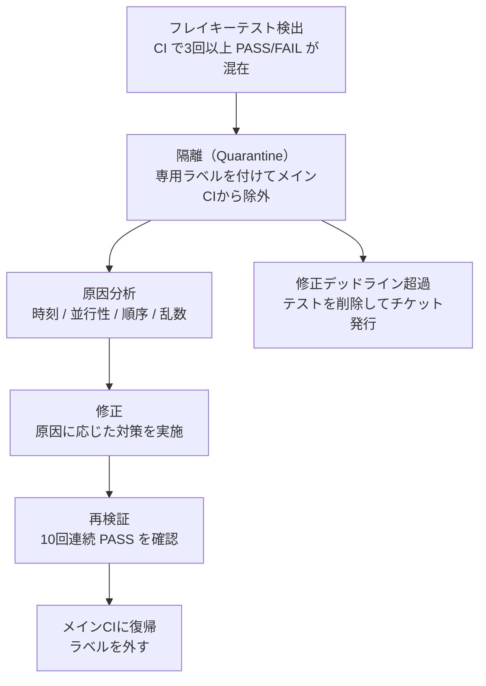

各ノードの意味：
- **隔離（Quarantine）**：フレイキーテストをメインCIから切り離してCI全体を守る応急処置
- **デッドライン超過**：一定期間（Googleでは1週間程度）内に修正されなければ削除するルール

📖 このセクションで登場した用語
- **フレイキーテスト（Flaky Test）**：同じコードで実行のたびに合否が変わる不安定なテスト
- **レースコンディション（Race Condition）**：複数のスレッドが同じリソースに競合アクセスすることで発生する不定動作
- **隔離（Quarantine）**：問題のあるテストをメインCIから一時的に切り離す手法
- **freezegun**：PythonでdatetimeをモックするOSSライブラリ

---

## 8. CIパイプラインへの組み込み

💡 この章では「作ったテストハーネスを毎回自動実行する仕組み」を説明します。ここまでの知識を自動化することで、開発速度と品質が同時に向上します。

### 8.1 Google Cloud Build の設定例

```yaml
# cloudbuild.yaml
# なぜ Cloud Build を使うか:
# Google内部では Borg / Spanner で実行されるが、
# 外部ではCloud Buildが同等の「隔離されたテスト環境」を提供するため

steps:
  # Step 1: 依存パッケージのインストール
  - name: 'python:3.12-slim'
    entrypoint: pip
    args: ['install', '-r', 'requirements.txt']

  # Step 2: ユニットテストの実行（Small テスト）
  # なぜ先にユニットテストを実行するか: 失敗時の早期検出でCDを節約するため
  - name: 'python:3.12-slim'
    entrypoint: pytest
    args: ['-m', 'small', '--tb=short', '-q']

  # Step 3: 統合テストの実行（Medium テスト）
  - name: 'python:3.12-slim'
    entrypoint: pytest
    args: ['-m', 'medium', '--tb=short']
    env:
      - 'DB_HOST=localhost'  # Cloud Build内のサービスコンテナに接続

services:
  # テスト専用の一時DBコンテナ（ハーミティックを保つため毎回新規作成）
  - name: 'postgres:16'
    env:
      - 'POSTGRES_DB=testdb'
      - 'POSTGRES_PASSWORD=testpass'
```

### 8.2 GitHub Actions での例

```yaml
# .github/workflows/test.yaml
name: Harness Test Pipeline

on: [push, pull_request]

jobs:
  small-tests:
    runs-on: ubuntu-latest
    steps:
      - uses: actions/checkout@v4
      - uses: actions/setup-python@v5
        with: { python-version: '3.12' }
      - run: pip install -r requirements.txt
      # ユニットテスト（外部依存なし）
      - run: pytest -m small --cov=src --cov-report=xml

  medium-tests:
    runs-on: ubuntu-latest
    # Small が通過してから Medium を実行（失敗の早期検出）
    needs: small-tests
    services:
      postgres:
        image: postgres:16
        env:
          POSTGRES_DB: testdb
          POSTGRES_PASSWORD: testpass
        options: >-
          --health-cmd pg_isready
          --health-interval 10s
    steps:
      - uses: actions/checkout@v4
      - uses: actions/setup-python@v5
        with: { python-version: '3.12' }
      - run: pip install -r requirements.txt
      - run: pytest -m medium
        env:
          DB_HOST: localhost
```

### 8.3 テスト実行時間の最適化戦略

| 戦略 | 効果 | 実装方法 |
|------|------|---------|
| **並列実行** | 実行時間を1/N に短縮 | `pytest-xdist -n auto` |
| **シャーディング** | 大規模テストを複数マシンに分散 | `--shard-index 0 --num-shards 4` |
| **キャッシング** | 依存インストール時間を省略 | GitHub Actions `actions/cache` |
| **変更影響テスト** | 変更されたコードに関連するテストのみ実行 | `pytest-testmon` |

📖 このセクションで登場した用語
- **Cloud Build**：GoogleのマネージドCI/CDサービス。隔離されたコンテナでビルド・テストを実行
- **シャーディング（Sharding）**：テストを複数のマシン/コンテナに分散実行して高速化する技術
- **pytest-xdist**：pytestテストを複数CPUコアで並列実行するプラグイン

---

## 9. AIエージェント評価ハーネス

💡 この章では「AIエージェント（LLMベースのシステム）専用のテストハーネス」を説明します。通常のソフトウェアテストとは異なるAI評価の仕組みを理解できます。

### 9.1 なぜAIエージェントに特別なハーネスが必要か

通常のソフトウェアは「入力A → 出力B」が決定論的に決まります。しかしAIエージェントは確率的です。

| 特性 | 通常のソフトウェア | AIエージェント |
|------|------------------|---------------|
| 出力 | 決定論的（毎回同じ） | 確率的（毎回異なる可能性） |
| テスト手法 | assert output == expected | スコアリング・LLM-as-Judge |
| 失敗基準 | 1件でも FAIL = 問題 | スコアが閾値を下回った = 問題 |
| 評価データ | 単体テストケース | 評価セット（eval set） |

### 9.2 Google ADK Eval — AIエージェント評価ハーネス

**ADK Eval**（Agent Development Kit Evaluation）はGoogleが提供するAIエージェント向け評価ハーネスです。

```python
# ADK eval のテストデータセット例
# なぜ JSON で管理するか:
# データとコードを分離して「評価観点の変更」をコード変更なしに実施できるため

# evals/eval_set.json
[
    {
        "name": "deploy_query_test",
        "query": "本番環境にデプロイする方法を教えてください",
        "expected_tool_calls": [
            {
                "tool_name": "check_test_coverage",
                "args": {"threshold": 80}
            },
            {
                "tool_name": "run_deploy",
                "args": {"environment": "production"}
            }
        ],
        "expected_response_contains": ["デプロイ", "完了"]
    }
]
```

### 9.3 LLM-as-Judge（LLMが採点者になるパターン）

```python
# なぜ LLM-as-Judge を使うか:
# AIの出力が「意味的に正しいが文字列が異なる」場合、
# 通常の assert では検証できないため、別のLLMに採点させる

import anthropic

def evaluate_response(question: str, actual_response: str) -> float:
    """0.0〜1.0のスコアで回答品質を評価する。1.0が最高品質。"""
    client = anthropic.Anthropic()

    judge_prompt = f"""
    以下の質問に対する回答を0.0〜1.0で採点してください。
    1.0=完全に正確で有用、0.0=全く誤り・有害

    質問: {question}
    回答: {actual_response}

    採点理由と共に、JSON形式で {"score": X.X} のみ返してください。
    """

    message = client.messages.create(
        model="claude-sonnet-4-6",
        max_tokens=100,
        messages=[{"role": "user", "content": judge_prompt}]
    )

    import json
    result = json.loads(message.content[0].text)
    return result["score"]
```

### 9.4 AIエージェント評価ハーネスの全体フロー

この図はADK evalが実行する評価ハーネスのフローです。

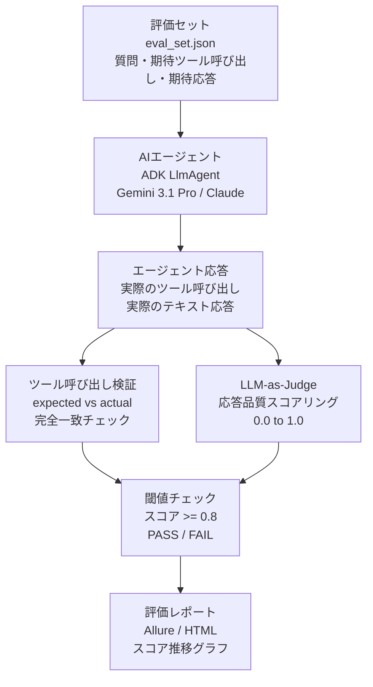

📖 このセクションで登場した用語
- **ADK Eval**：Google ADKに付属するAIエージェント専用評価フレームワーク
- **評価セット（Eval Set）**：AIエージェントのテストに使うQ&Aペアのデータセット
- **LLM-as-Judge**：AIの出力品質を別のLLMが採点するパターン
- **確率的（Probabilistic）**：同じ入力でも実行のたびに異なる出力が返る性質

---

## 10. ベストプラクティス10則

💡 この章では「Googleが実際の開発で守っている10のルール」をまとめます。各ルールに「なぜそうするか」を必ず添えています。

| # | 原則 | なぜ重要か | 具体的行動 |
|---|------|-----------|-----------|
| 1 | **テストはDAMP、コードはDRY** | テストの「読みやすさ」はコードの「再利用性」より優先 | テストに冗長に見える変数名・コメントを許容する |
| 2 | **1テスト1アサーション** | 失敗時の原因特定を簡単にする | テスト関数名に「何をテストしているか」を明記 |
| 3 | **テストコードも本番品質** | テストが腐ると本番コードも腐る | コードレビューでテストコードも必ず確認 |
| 4 | **フィクスチャは最小限に** | 大きいSetUpは「何が必要か」を分かりにくくする | 必要なセットアップをテスト関数内に書く |
| 5 | **公開インターフェースのみテスト** | 実装の詳細をテストすると変更のたびに壊れる | private メソッドを直接テストしない |
| 6 | **テストサイズラベルを付ける** | CI の実行順序・並列化を最適化できる | `@pytest.mark.small` / `@pytest.mark.medium` |
| 7 | **フレイキーテストはその日に直す** | 放置すると「赤を無視する文化」が生まれる | 検出したら1時間以内にQuarantine |
| 8 | **テストカバレッジは70%以上** | 重要なパスが必ずカバーされることを保証 | カバレッジレポートをCIで必須チェック |
| 9 | **テストを削除する勇気を持つ** | 意味のないテストは誤った安心感を生む | 保守コストが価値を上回ったら削除 |
| 10 | **テスト名は仕様書として書く** | テスト名を読むだけで動作仕様が分かる | `test_register_user_sends_welcome_email_to_valid_address` |

### 10.1 DAMP vs DRY

**DAMP**（Descriptive And Meaningful Phrases）とは「テストコードはDRY（繰り返しを避ける）より読みやすさを優先する」という原則です。

```python
# ❌ DRY を守りすぎたテスト（読みにくい）
def _make_user(name="default", email="default@test.com"):
    return User(name=name, email=email)

def test_a():
    user = _make_user()  # このヘルパーが何をするか読む必要がある
    ...

# ✅ DAMP なテスト（少し冗長だが読みやすい）
def test_register_user_with_valid_email():
    # 何をテストしているかがテスト内だけで完結する
    user = User(name="Alice", email="alice@example.com")
    service = UserService(repo=FakeUserRepository())
    ...
```

### 10.2 カバレッジ目標の設定

| テスト種別 | 推奨カバレッジ | なぜその値か |
|-----------|--------------|------------|
| ビジネスロジック層 | **90%以上** | バグが高コストな場所のため |
| インフラ層（DBアダプター等） | **70%以上** | 変更頻度が低いため |
| UI層 | **60%以上** | 仕様変更が多くテストが壊れやすいため |
| 設定ファイル | **対象外** | テストの費用対効果が低いため |

📖 このセクションで登場した用語
- **DAMP（Descriptive And Meaningful Phrases）**：テストコードは「繰り返し」より「読みやすさ」を優先するべきという原則
- **DRY（Don't Repeat Yourself）**：繰り返しを避ける原則。プロダクションコードに適用するが、テストでは過剰適用に注意
- **カバレッジ（Coverage）**：テストが実際に実行したコードの割合（行数・分岐数ベース）

---

## 11. 参考ソース一覧

> 以下はすべてGoogleが公式に公開しているソース、またはGoogleエンジニアが著した一次情報です。

| # | タイトル | 種別 | URL |
|---|---------|------|-----|
| 1 | **Software Engineering at Google** (O'Reilly, 2020) | 書籍（無料公開） | https://abseil.io/resources/swe-book |
| 2 | **Google Testing Blog** — 公式テスト技術ブログ | ブログ | https://testing.googleblog.com |
| 3 | **Google Test (googletest)** — C++テストフレームワーク公式GitHub | OSS / ドキュメント | https://github.com/google/googletest |
| 4 | **The Practical Test Pyramid** — Martin Fowler (Googleのアプローチを引用) | 記事 | https://martinfowler.com/articles/practical-test-pyramid.html |
| 5 | **Just Say No to More End-to-End Tests** — Google Testing Blog | ブログ記事 | https://testing.googleblog.com/2015/04/just-say-no-to-more-end-to-end-tests.html |
| 6 | **Test Doubles** — Google SWE Book Chapter 13 | 書籍章 | https://abseil.io/resources/swe-book/html/ch13.html |
| 7 | **Hermetic Servers** — Google Testing Blog | ブログ記事 | https://testing.googleblog.com/2012/10/hermetic-servers.html |
| 8 | **Flaky Tests at Google and How We Mitigate Them** | ブログ記事 | https://testing.googleblog.com/2016/05/flaky-tests-at-google-and-how-we.html |
| 9 | **Google ADK Evaluation Guide** | 公式ドキュメント | https://google.github.io/adk-docs/evaluate/ |
| 10 | **Site Reliability Engineering (SRE Book)** — Chapter 17 Testing | 書籍（無料公開） | https://sre.google/sre-book/testing-reliability/ |
| 11 | **Google Cloud Build ドキュメント** | 公式ドキュメント | https://cloud.google.com/build/docs |
| 12 | **DAMP vs DRY in Tests** — Google Testing Blog | ブログ記事 | https://testing.googleblog.com/2019/12/testing-on-toilet-tests-too-dry-make.html |

---

## まとめ

この図はGoogleハーネスエンジニアリングの全体像を一枚で表しています。

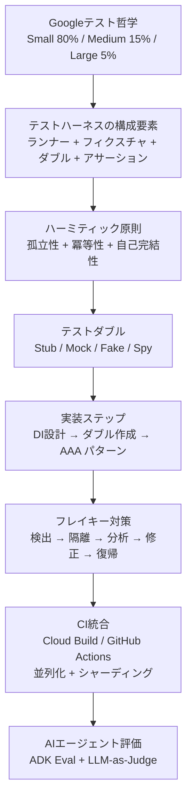

**Googleハーネスエンジニアリングの本質は1つ**：「テストは信頼できる情報源でなければならない」。そのために「再現可能・独立・高速」な環境を作る体系的な仕組みがテストハーネスです。

---

*本ドキュメントは Software Engineering at Google (abseil.io/resources/swe-book) および Google Testing Blog (testing.googleblog.com) の公開情報を基に作成しました。*
