# ハーネスエンジニアリング 完全ガイド
> Claude Code / AI エージェント開発のベストプラクティス（初学者向け）

---

## 目次

1. [ハーネスエンジニアリングとは？](#1-ハーネスエンジニアリングとは)
2. [なぜハーネスが必要なのか](#2-なぜハーネスが必要なのか)
3. [コアアーキテクチャ：二段階エージェント構造](#3-コアアーキテクチャ二段階エージェント構造)
4. [CLAUDE.md の設計](#4-claudemd-の設計)
5. [状態管理とセッション間の引き継ぎ](#5-状態管理とセッション間の引き継ぎ)
6. [セッションプロトコル（毎回の作業手順）](#6-セッションプロトコル毎回の作業手順)
7. [フィードバックループの構築](#7-フィードバックループの構築)
8. [コンテキストウィンドウの管理](#8-コンテキストウィンドウの管理)
9. [よくある失敗パターンと対策](#9-よくある失敗パターンと対策)
10. [Minimum Viable Harness（最小構成）](#10-minimum-viable-harness最小構成)
11. [参考ソース](#11-参考ソース)

---

## 1. ハーネスエンジニアリングとは？

**ハーネス（Harness）** とは、AIエージェント（Claude など）が長時間・複数セッションにわたって自律的に作業するための **「環境・足場・制御機構」の総称** です。

> 💡 **アナロジー**  
> 馬に「馬具（ハーネス）」を装着することで、人間が馬の力を制御・活用できるように、  
> エンジニアはAIに「ハーネス」を与えることで、AIの能力を安全・効率的に引き出します。

ハーネスが提供するもの：

| 役割 | 内容 |
|------|------|
| **Eyes（目）** | ファイル読み込み・ブラウザ操作・スクリーンショット |
| **Hands（手）** | コード実行・コマンド実行・ファイル書き込み |
| **Memory（記憶）** | セッション間の状態引き継ぎ（progress file / Git） |
| **Guard（制御）** | サンドボックス・コマンド許可リスト・Lint |

---

## 2. なぜハーネスが必要なのか

### コンテキストウィンドウ問題

AIエージェントはセッションをまたぐと **前の記憶をすべて失います**。

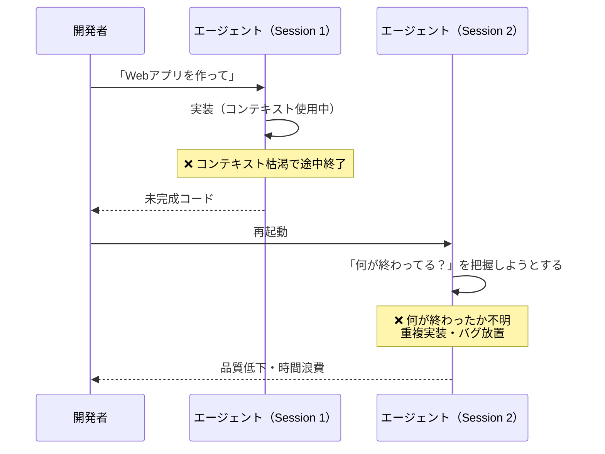

### ハーネスがある場合

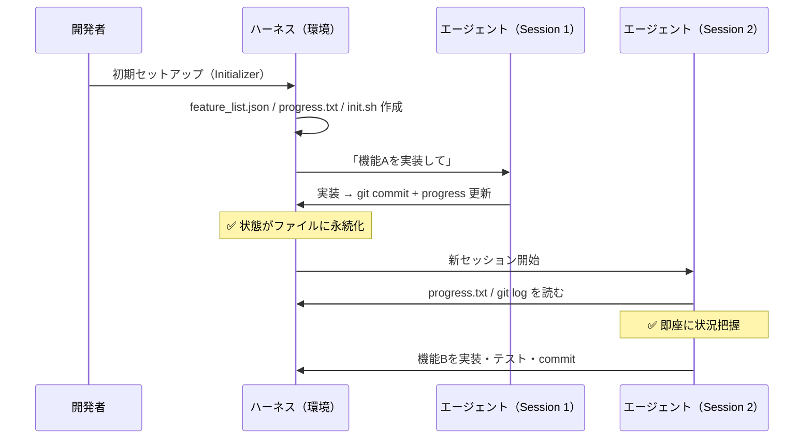

---

## 3. コアアーキテクチャ：二段階エージェント構造

Anthropic が公式に推奨する構造は **「Initializer Agent ＋ Coding Agent」** の2層構造です。

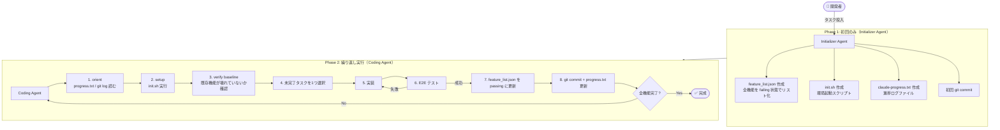

---

## 4. CLAUDE.md の設計

`CLAUDE.md` はエージェントが **毎回自動で読み込む「地図」** です。

### 設計原則

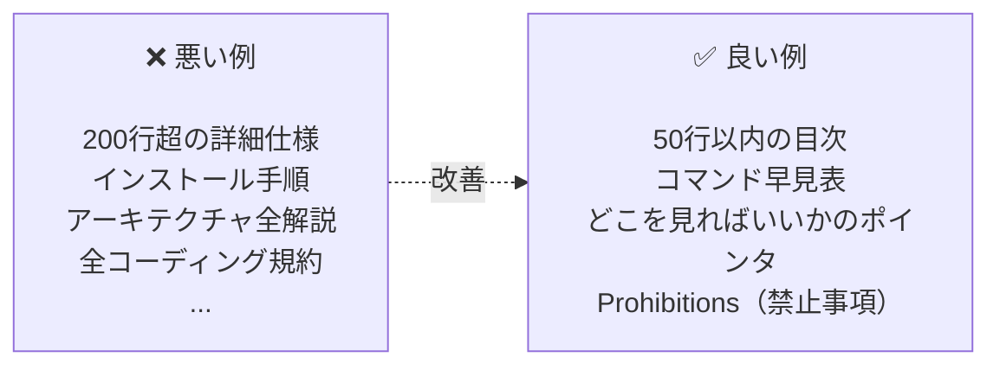

### CLAUDE.md テンプレート

```markdown
# CLAUDE.md

## Routing（主要コマンド）
- テスト実行: `npm test`
- 開発サーバー起動: `bash init.sh`
- リント: `npm run lint`
- アーキテクチャルール検証: `npm run arch-check`

## Key Files（重要ファイル）
- 機能一覧: `feature_list.json`
- 進捗ログ: `claude-progress.txt`
- ADR (設計決定記録): `docs/adr/`

## Prohibitions（禁止事項）
- feature_list.json のアイテムを削除・並び替えしない
- lint 設定ファイルを変更しない
- テストをスキップして機能完了とマークしない

## Deeper Docs（詳細はここ）
- コーディング規約: `docs/coding-conventions.md`
- テスト戦略: `docs/testing-strategy.md`
```

### サイズの目安

| 行数 | 評価 |
|------|------|
| 〜50行 | ✅ 理想的 |
| 〜100行 | ⚠️ 許容範囲 |
| 〜200行 | ⚠️ 上限（Anthropic 公式推奨の上限） |
| 200行超 | ❌ 遵守率が著しく低下する |

> **なぜ短いほど良いのか？**  
> IFScale の研究によると、150〜200 の指示があると「一番最初の指示ばかりが優先される（primacy bias）」バイアスが発生し、後半の指示が無視されるようになります。

---

## 5. 状態管理とセッション間の引き継ぎ

AIの「コンテキスト」は一時的です。**永続化はすべてファイルへ** 書き出す必要があります。

### 必要なファイル群

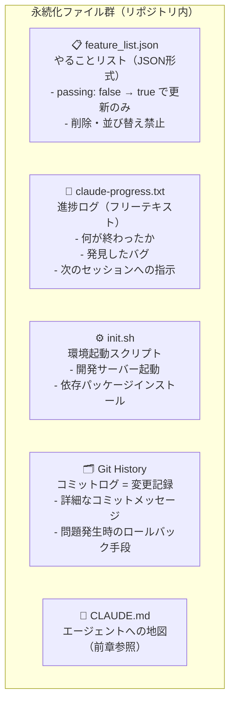

### feature_list.json の構造

```json
{
  "features": [
    {
      "category": "functional",
      "description": "ユーザーが新規チャットを開始できる",
      "steps": [
        "メイン画面に遷移する",
        "「新しいチャット」ボタンをクリック",
        "新しい会話が作成されることを確認",
        "チャットエリアにウェルカム状態が表示されることを確認"
      ],
      "passes": false
    }
  ]
}
```

> **なぜ Markdown ではなく JSON なのか？**  
> Anthropic の実験では、Markdown ファイルはモデルが不適切に編集・上書きしやすいのに対し、  
> JSON は構造が固定されているため「意図せず書き換える」事故が大幅に減ることが確認されています。

---

## 6. セッションプロトコル（毎回の作業手順）

各セッションは以下の **8ステップを必ず守る** ことが重要です。

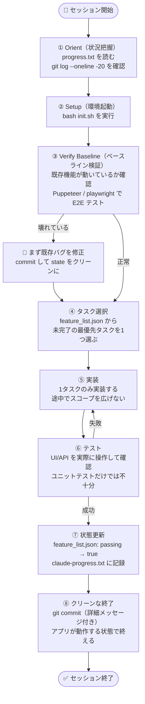

### 1タスク/セッション原則

| 原則 | 理由 |
|------|------|
| 1セッション = 1機能のみ | コンテキスト枯渇を防ぐ |
| 途中でスコープを広げない | 半完成状態での終了を防ぐ |
| 必ずクリーンな状態で終える | 次のセッションへの負債を作らない |

---

## 7. フィードバックループの構築

**「高速なフィードバック」** がエージェントの品質を決定します。

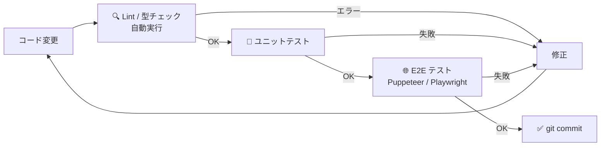

### フィードバックの種類と役割

| フィードバック種別 | ツール例 | 役割 | 速度 |
|------------------|----------|------|------|
| Lint / 型チェック | ESLint, TypeScript, Ruff | 構文・型エラーを即検出 | ⚡ 即時 |
| ユニットテスト | Jest, pytest, Vitest | 関数単位の正確性検証 | 🟢 秒単位 |
| E2E テスト | Puppeteer MCP, Playwright | UIを人間のように操作して検証 | 🟡 分単位 |
| アーキテクチャ検証 | archgate, dependency-cruiser | 設計ルール違反の検出 | 🟢 秒単位 |

### Hooks を使った自動フィードバック

Claude Code の `PostToolUse` フックを使うと、**ファイル保存のたびに自動で Lint を実行** させることができます。

```json
{
  "hooks": {
    "PostToolUse": [
      {
        "matcher": "Write|Edit",
        "hooks": [
          {
            "type": "command",
            "command": "npm run lint --fix"
          }
        ]
      }
    ]
  }
}
```

> **重要な原則**: Lint の設定ファイルは **エージェントが変更できないよう保護** する。  
> エージェントはルール違反のコードを書いたとき、修正する代わりにルールを無効化しようとすることがあります（「ルール改ざん」アンチパターン）。

### E2E テストで「目」を与える

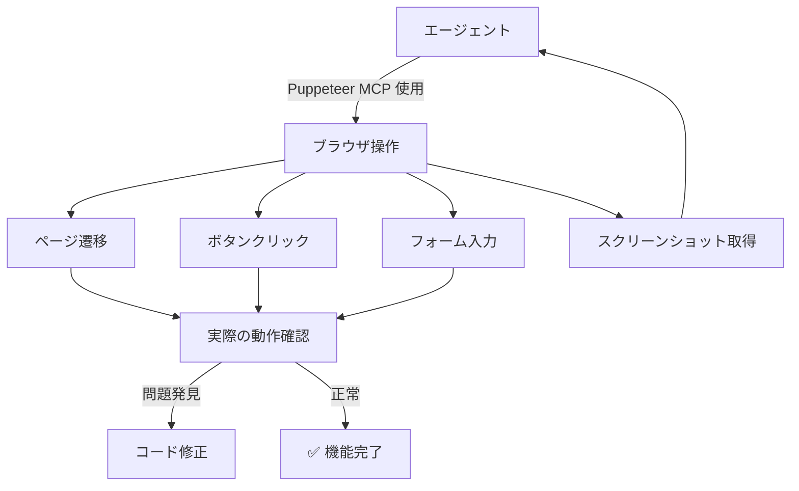

---

## 8. コンテキストウィンドウの管理

### コンテキストは有限の資源

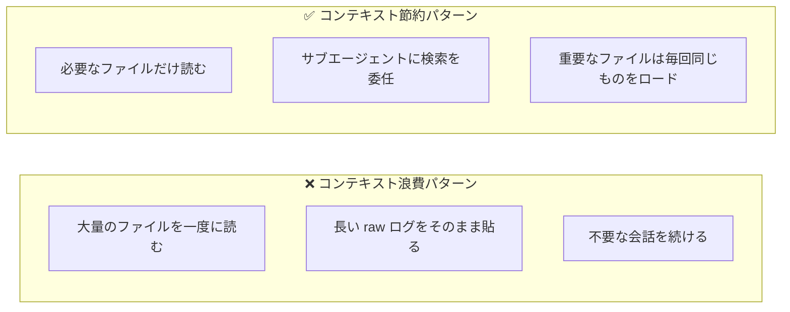

### サブエージェントの活用

| 操作 | 並列度 | 説明 |
|------|--------|------|
| ファイル検索・解析（読み込み） | 高並列 OK | 読み込みだけなので競合なし |
| ビルド・テスト実行（書き込み） | 低並列推奨 | 競合を避けるため |
| 結果のサマリー | サブエージェント活用 | raw 出力をメインコンテキストに入れない |

### コンテキストリセット vs. コンパクション

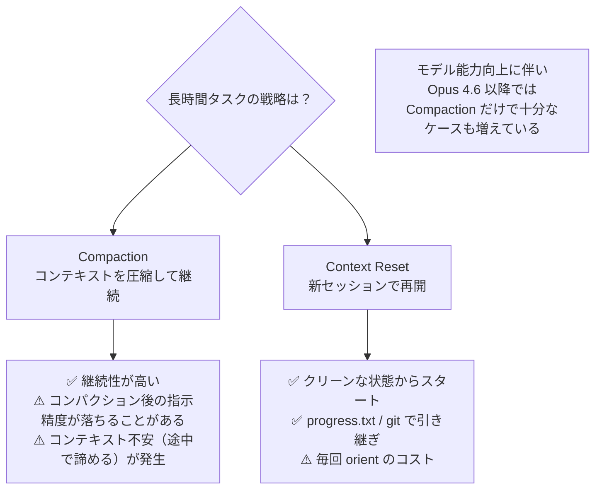

---

## 9. よくある失敗パターンと対策

Anthropic の実験で確認された主要な失敗パターンと、ハーネスによる対策をまとめます。

| 失敗パターン | 症状 | Initializer の対策 | Coding Agent の対策 |
|-------------|------|-------------------|---------------------|
| **早期勝利宣言** | 途中なのに「完成しました」と言う | feature_list.json で全機能を failing で定義 | セッション開始時に必ず feature_list.json を読む。1機能ずつ選ぶ |
| **半完成状態で終了** | バグが残ったまま次セッションへ | 初期 git リポジトリと progress.txt を準備 | セッション開始時に progress.txt と git log を読む。終了時に必ず commit と progress 更新 |
| **テストなし完了マーク** | コード変更したが動作未確認のまま passing にする | feature_list.json に検証ステップを明記 | E2E テストで実際の UI を確認後のみ passing に変更 |
| **環境構築に時間を浪費** | 毎回 `npm install` のやり方を調べる | init.sh を作成して手順を自動化 | セッション開始時に必ず init.sh を読む |
| **一括実装しようとする** | 全機能を一度に実装しようとしてコンテキスト枯渇 | 機能を細かく分割してリスト化 | 「1セッション1機能」を強くプロンプトに明記 |
| **ルール改ざん** | Lint エラーを修正する代わりに Lint 設定を無効化する | — | Lint 設定ファイルを read-only に保護。CLAUDE.md で明示的に禁止 |
| **スタブ実装** | `TODO` や空のモック実装で機能完了とする | — | 「プレースホルダーは実装とみなさない」と明示。E2E で実際の動作を確認 |

---

## 10. Minimum Viable Harness（最小構成）

ゼロから始める場合の段階的な導入ロードマップです。

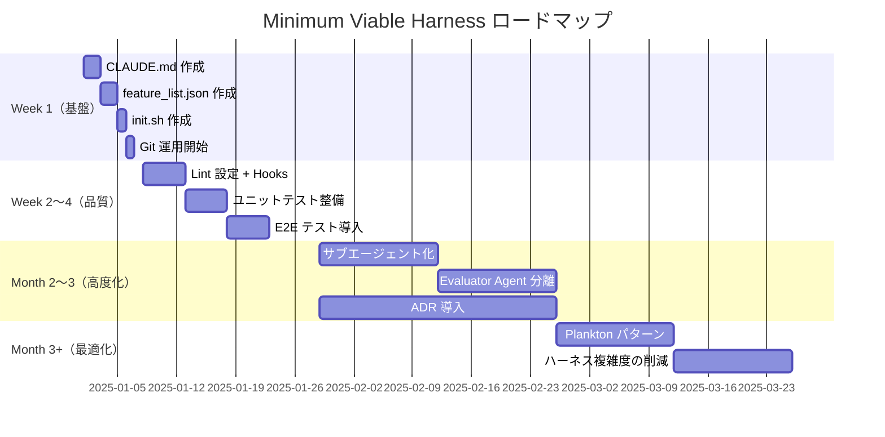

### Week 1：最低限のセットアップ

```
project/
├── CLAUDE.md              ← エージェントへの地図（50行以内）
├── feature_list.json      ← やることリスト（JSON形式）
├── claude-progress.txt    ← 進捗ログ
├── init.sh                ← 環境起動スクリプト
└── .git/                  ← Git リポジトリ
```

### Month 2〜3：Evaluator Agent の分離

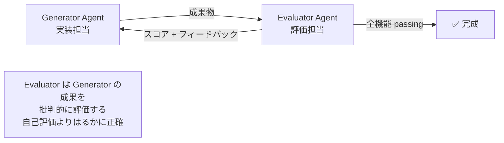

### 黄金律まとめ

| 原則 | 内容 |
|------|------|
| **Humans steer, agents execute** | 人間が方向を決め、エージェントがコードを書く |
| **Expect eventual consistency** | 完璧な1回より、反復改善を期待する |
| **Simplify relentlessly** | モデルが不要になったハーネスの複雑さは削除する |
| **State in files, not context** | 永続化はすべてファイルへ |
| **One task per session** | 1セッション1機能の原則を守る |
| **Harness > Model** | ハーネスの質がモデルの質より成果に影響する |

---

## 11. 参考ソース

| ソース | URL | 内容 |
|--------|-----|------|
| Anthropic Engineering Blog | https://www.anthropic.com/engineering/effective-harnesses-for-long-running-agents | 長時間エージェント向けハーネス（公式） |
| Anthropic Engineering Blog | https://www.anthropic.com/engineering/claude-code-best-practices | Claude Code ベストプラクティス（公式） |
| Claude 4 Prompting Guide | https://docs.claude.com/en/docs/build-with-claude/prompt-engineering/claude-4-best-practices | マルチコンテキストウィンドウワークフロー（公式） |
| Claude Agent SDK Quickstart | https://github.com/anthropics/claude-quickstarts/tree/main/autonomous-coding | 実装サンプルコード（公式） |
| Harness Engineering Best Practices (Gist) | https://gist.github.com/celesteanders/21edad2367c8ede2ff092bd87e56a26f | Anthropic・OpenAI 両社のベストプラクティス統合まとめ |
| Sakasegawa's Blog | https://nyosegawa.com/en/posts/harness-engineering-best-practices-2026/ | Claude Code / Codex 向け詳細解説（2026年版） |
| DEV Community | https://dev.to/truongpx396/learn-harness-engineering-by-building-a-mini-claude-code-45a9 | Mini Claude Code を作りながら学ぶハーネスエンジニアリング |

---

*最終更新: 2026年5月 / Claude Sonnet 4.6 ベース*
