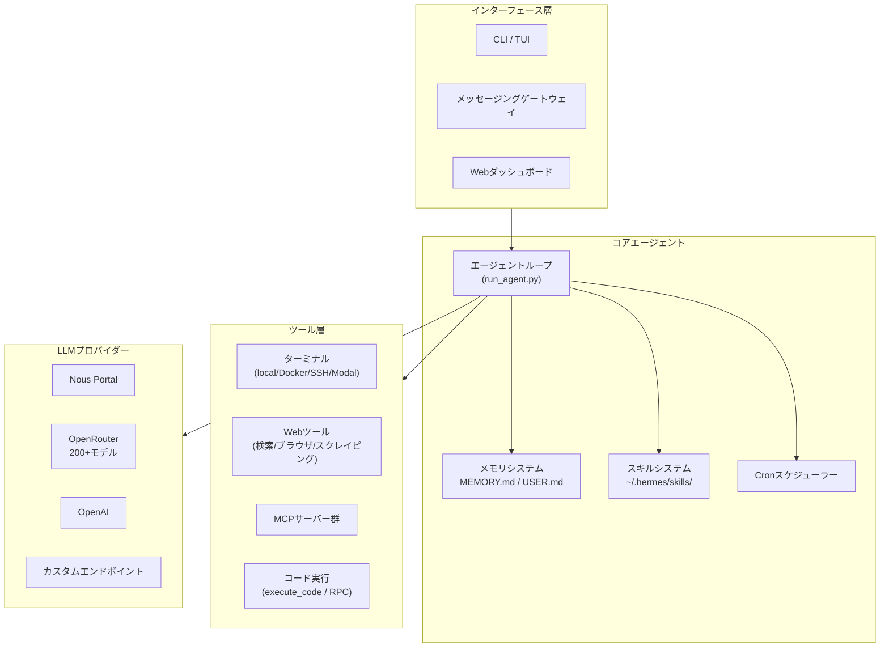
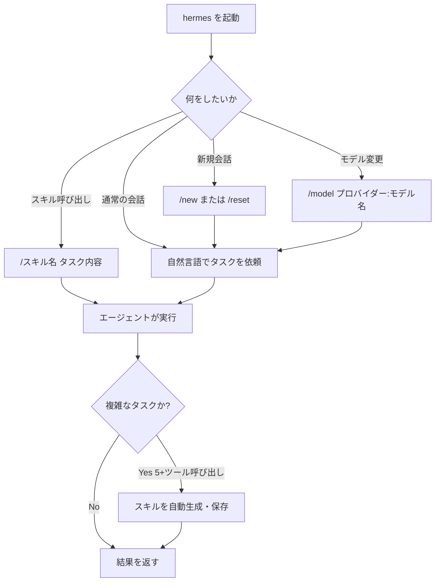
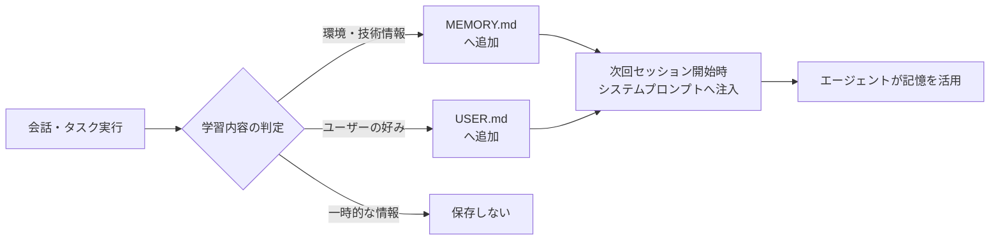
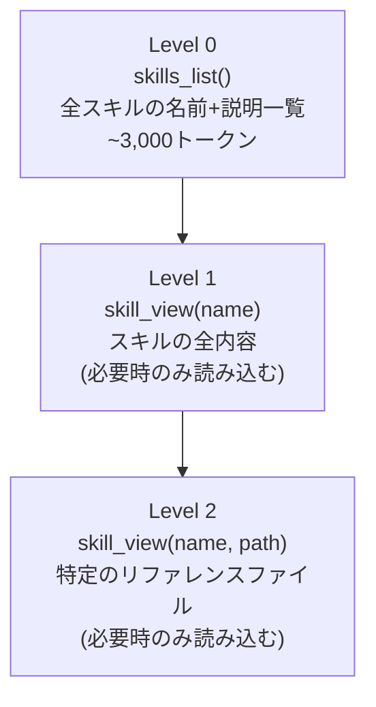
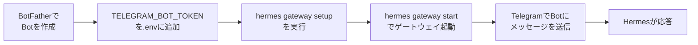
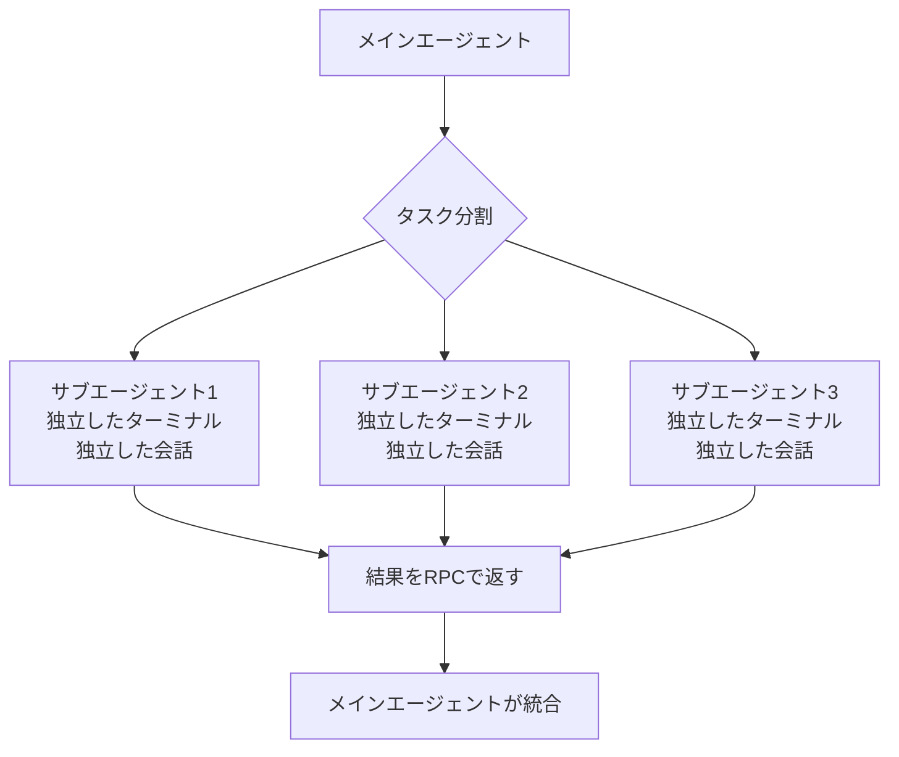
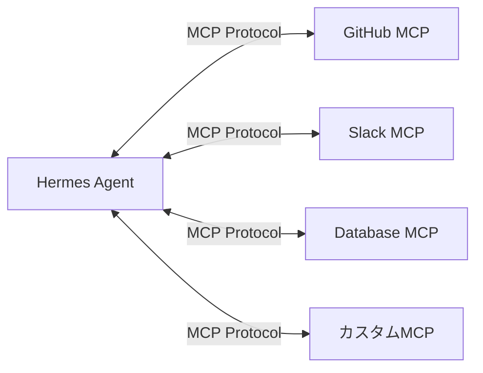

# Hermes Agent 完全ガイド — 初学者からプロまで

> **対象読者:** AIエージェント初学者〜中級者  
> **バージョン:** Hermes Agent v0.15.2（2026年6月時点）  
> **ライセンス:** MIT  
> **作成者:** Nous Research

---

## 目次

1. [Hermes Agentとは何か](#1-hermes-agentとは何か)
2. [アーキテクチャ全体像](#2-アーキテクチャ全体像)
3. [ステップ1 — インストール](#3-ステップ1--インストール)
4. [ステップ2 — 初期セットアップ](#4-ステップ2--初期セットアップ)
5. [ステップ3 — 基本操作マスター](#5-ステップ3--基本操作マスター)
6. [ステップ4 — メモリシステムの活用](#6-ステップ4--メモリシステムの活用)
7. [ステップ5 — スキルシステムの活用](#7-ステップ5--スキルシステムの活用)
8. [ステップ6 — メッセージングゲートウェイ連携](#8-ステップ6--メッセージングゲートウェイ連携)
9. [ステップ7 — スケジュール自動化（Cron）](#9-ステップ7--スケジュール自動化cron)
10. [ステップ8 — サブエージェントと並列処理](#10-ステップ8--サブエージェントと並列処理)
11. [ステップ9 — MCP連携](#11-ステップ9--mcp連携)
12. [ステップ10 — セキュリティベストプラクティス](#12-ステップ10--セキュリティベストプラクティス)
13. [ユースケース別活用例](#13-ユースケース別活用例)
14. [トラブルシューティング](#14-トラブルシューティング)
15. [参考リソース](#15-参考リソース)

---

## 1. Hermes Agentとは何か

Hermes AgentはNous Researchが開発したオープンソースの**自己改善型AIエージェント**です。単なるチャットボットやIDEのコーディング補助ツールとは根本的に異なります。

### 従来のAIツールとの比較

| 特徴 | 従来のチャットボット | 従来のCoding Copilot | Hermes Agent |
|------|-------------------|--------------------|--------------|
| 記憶の持続性 | セッション内のみ | プロジェクト内のみ | クロスセッション永続記憶 |
| スキル習得 | なし | なし | 経験から自律的にスキル生成 |
| 稼働場所 | Webブラウザ | IDE内 | サーバー・VPS・サーバーレス |
| 通知・連絡 | なし | なし | Telegram/Discord/Slackなど20以上 |
| 並列処理 | なし | なし | サブエージェント委譲・並列実行 |
| スケジュール実行 | なし | なし | 自然言語cronスケジューリング |

### 3つのコアコンセプト

**1. 学習ループ（Learning Loop）**  
複雑なタスクを完了するたびに、エージェントはそのアプローチを「スキル」として自動保存します。次回同様のタスクに直面したとき、保存されたスキルを参照して効率的に処理します。

**2. 永続メモリ（Persistent Memory）**  
`MEMORY.md`（環境・学習内容）と`USER.md`（ユーザープロファイル）の2ファイルがセッションをまたいで記憶を保持します。これにより「先週教えた設定を今週また教える」という手間が不要になります。

**3. どこでも動く（Lives Where You Do）**  
`$5/月のVPS`から`GPUクラスター`、`Daytona/Modalのサーバーレス環境`まで対応。TelegramでメッセージしながらクラウドVMが作業を継続するという運用が可能です。

---

## 2. アーキテクチャ全体像



---

## 3. ステップ1 — インストール

### 動作環境

| OS | 対応状況 | インストール方法 |
|----|---------|----------------|
| Linux | 完全対応 | curl one-liner |
| macOS | 完全対応 | curl one-liner |
| WSL2 | 完全対応 | curl one-liner |
| Windows (Native) | 完全対応 | PowerShell one-liner |
| Android (Termux) | 対応（一部制限あり） | curl one-liner |

### インストール手順

**Linux / macOS / WSL2:**

```bash
curl -fsSL https://raw.githubusercontent.com/NousResearch/hermes-agent/main/scripts/install.sh | bash
```

**Windows (PowerShell):**

```powershell
iex (irm https://raw.githubusercontent.com/NousResearch/hermes-agent/main/scripts/install.ps1)
```

インストーラーが自動的に処理するもの：`uv`、`Python 3.11`、`Node.js`、`ripgrep`、`ffmpeg`

インストール完了後：

```bash
source ~/.bashrc   # シェルをリロード
hermes             # 起動確認
```

### インストール後のディレクトリ構造

```
~/.hermes/
├── config.yaml          # 設定ファイル
├── .env                 # APIキー等の環境変数
├── memories/
│   ├── MEMORY.md        # エージェントの記憶
│   └── USER.md          # ユーザープロファイル
├── skills/              # スキルディレクトリ
│   └── ...
└── state.db             # セッション履歴（SQLite）
```

---

## 4. ステップ2 — 初期セットアップ

### 推奨パス: Nous Portal経由（最速）

```bash
hermes setup --portal
```

このコマンド一つで以下が完了します。

- OAuthログイン
- モデルプロバイダーの設定
- Tool Gateway（Webサーチ、画像生成、TTS、クラウドブラウザ）の有効化

現在の状態確認：

```bash
hermes portal status
```

### 手動セットアップ（APIキーを個別管理したい場合）

```bash
hermes setup
```

セットアップウィザードが順番に案内します。

```bash
hermes model     # LLMプロバイダー・モデルの選択
hermes tools     # 使用するツールの設定
```

### 主要なLLMプロバイダー対応表

| プロバイダー | 特徴 | 設定コマンド例 |
|------------|------|--------------|
| Nous Portal | 300+モデル、Tool Gateway込み | `hermes setup --portal` |
| OpenRouter | 200+モデル、従量課金 | `hermes model` → OpenRouter選択 |
| OpenAI | GPT-4o系 | `OPENAI_API_KEY`を`.env`に追加 |
| Anthropic | Claude系 | `ANTHROPIC_API_KEY`を`.env`に追加 |
| ローカルエンドポイント | Ollama等 | カスタムURL設定 |

---

## 5. ステップ3 — 基本操作マスター

### CLIでの基本的な会話フロー



### 主要スラッシュコマンド一覧

| コマンド | 説明 | 使用例 |
|---------|------|--------|
| `/new` | 新規会話を開始 | `/new` |
| `/model` | モデルを切り替え | `/model openrouter:claude-3.5-sonnet` |
| `/compress` | コンテキストを圧縮（トークン節約） | `/compress` |
| `/usage` | トークン使用量を確認 | `/usage` |
| `/skills` | スキル一覧を表示 | `/skills` |
| `/retry` | 直前のターンをやり直し | `/retry` |
| `/undo` | 直前のターンを取り消し | `/undo` |
| `/personality` | キャラクターを設定 | `/personality professional` |
| `/stop` | 実行中のタスクを中断 | `/stop` |

### 重要な運用 tip

**コンテキスト圧縮を活用する:** 長時間のセッションではトークン消費が増えます。定期的に `/compress` を実行してコストを抑えましょう。

**`/insights` でセッションを振り返る:**

```bash
/insights --days 7    # 過去7日間のサマリー
```

---

## 6. ステップ4 — メモリシステムの活用

メモリシステムはHermes Agentの最も強力な機能の一つです。2種類のファイルで構成されます。

### メモリファイルの役割

| ファイル | 対象 | 文字制限 | 保存場所 |
|---------|------|---------|---------|
| `MEMORY.md` | 環境・プロジェクト・学習内容 | 2,200文字 (~800トークン) | `~/.hermes/memories/MEMORY.md` |
| `USER.md` | ユーザーの好み・スタイル・プロファイル | 1,375文字 (~500トークン) | `~/.hermes/memories/USER.md` |

### メモリ保存のフロー



### 保存すべき情報 vs 保存すべきでない情報

**保存すべき情報（エージェントが自律的に保存）:**
- `~/code/api は Go 1.22 + chi router + sqlcを使用`
- `このサーバーはUbuntu 22.04、Docker + Podmanインストール済み`
- `ユーザーはTypeScriptをJavaScriptより好む`
- `stagingサーバーはSSHポート2222（通常の22ではない）`

**保存すべきでない情報:**
- "`ユーザーがPythonについて質問した`" — 曖昧すぎる
- 大きなコードブロックやログファイル
- `SOUL.md`や`AGENTS.md`の内容（別の仕組みで管理）

### メモリの外部プロバイダー

高度なユースケース向けに8種類の外部メモリプロバイダーが利用可能です。

```bash
hermes memory setup    # プロバイダーを選択・設定
hermes memory status   # 現在の状態を確認
```

| プロバイダー | 特徴 |
|------------|------|
| Honcho | 弁証法的ユーザーモデリング |
| Mem0 | セマンティック検索 |
| Hindsight | 自動ファクト抽出 |
| Supermemory | クロスセッション検索 |

### セッション検索

過去の会話をFTS5全文検索で検索できます。

```bash
hermes sessions list           # セッション一覧
/session_search "先週の議論"    # 会話内で過去を検索
```

---

## 7. ステップ5 — スキルシステムの活用

スキルはHermesの「手続き記憶（procedural memory）」です。Markdownファイルとして`~/.hermes/skills/`に保存されます。

### スキルの3層構造（Progressive Disclosure）



これによりトークン消費を最小化しながら必要な情報を取得します。

### スキルの使い方

インストール済みスキルはすべてスラッシュコマンドとして利用可能です。

```bash
/plan マイクロサービス移行の実装計画を立案して
/github-pr-workflow 認証リファクタリングのPRを作成
/axolotl Llama 3をファインチューニングしたい
```

### Skills Hubからのインストール

```bash
hermes skills browse                              # 全スキル一覧を閲覧
hermes skills search kubernetes                   # キーワード検索
hermes skills install openai/skills/k8s           # GitHubリポジトリからインストール
hermes skills install official/security/1password # 公式オプショナルスキル
```

### 主要なスキルソース

| ソース | 説明 | 例 |
|-------|------|-----|
| `official` | Hermesリポジトリ同梱の公式スキル | `official/security/1password` |
| `skills-sh` | Vercelのスキルディレクトリ | `skills-sh/vercel-labs/agent-skills/...` |
| `github` | GitHubリポジトリ直接指定 | `openai/skills/k8s` |
| `well-known` | サイトの`/.well-known/skills/`から発見 | `well-known:https://mintlify.com/docs/...` |
| `browse-sh` | Browserbaseの200+サイト自動化スキル | `browse-sh/airbnb.com/search-listings-...` |
| `url` | 直接URLから単一SKILL.mdをインストール | `https://example.com/SKILL.md` |

### 自分のスキルを作成する

スキルはMarkdownファイルです。`~/.hermes/skills/my-skill/SKILL.md`を作成します。

```markdown
---
name: my-deploy-workflow
description: 本番環境へのデプロイ手順
version: 1.0.0
metadata:
  hermes:
    tags: [deploy, production]
    category: devops
---

# デプロイワークフロー

## いつ使うか
production環境へのデプロイが必要なとき。

## 手順
1. `make test` でテストを実行
2. `git tag v{version}` でタグを作成
3. `gh pr create` でPRを作成

## 注意事項
- stagingで必ず確認してからproductionへ
```

### スキルバンドル（複数スキルの組み合わせ）

よく一緒に使うスキルをバンドルとして定義できます。

```bash
hermes bundles create backend-dev \
  --skill github-code-review \
  --skill test-driven-development \
  --skill github-pr-workflow \
  -d "バックエンド開発タスク用バンドル"
```

使用：

```bash
/backend-dev 認証ミドルウェアをリファクタリングして
```

---

## 8. ステップ6 — メッセージングゲートウェイ連携

Hermesはターミナルだけでなく20以上のプラットフォームから利用できます。

### 対応プラットフォーム

| カテゴリ | プラットフォーム |
|---------|---------------|
| チャット | Telegram, Discord, Slack, WhatsApp, Signal |
| メール・SMS | Email, SMS, BlueBubbles (iMessage) |
| 企業向け | Microsoft Teams, Google Chat, DingTalk, Feishu, WeCom |
| その他 | Matrix, Mattermost, Home Assistant, QQ Bot |

### Telegramゲートウェイの設定



セットアップ：

```bash
hermes gateway setup    # ガイダンスに従って設定
hermes gateway start    # ゲートウェイプロセスを起動
```

### クロスプラットフォームの継続性

ゲートウェイの強みは**プラットフォームをまたいだ会話継続**です。

1. 朝、Telegramでタスクを依頼
2. 外出中にDiscordで進捗確認
3. 帰宅後、CLIで詳細な作業を継続

すべて同じ会話コンテキストで継続します。

---

## 9. ステップ7 — スケジュール自動化（Cron）

自然言語でスケジュールを定義し、任意のプラットフォームへ配信できます。

### 設定例

```bash
hermes cron add "毎朝9時にGitHubのissueサマリーをTelegramで送信"
hermes cron add "毎週月曜日の朝にログファイルをバックアップして結果をSlackに通知"
hermes cron add "毎日夕方18時にその日のコミット一覧をメールで送信"
```

### Cronコマンド一覧

```bash
hermes cron list     # 登録済みタスク一覧
hermes cron run 1    # タスクIDを指定して即時実行（テスト用）
hermes cron delete 1 # タスクを削除
```

### ユースケース例

| タスク | スケジュール | 配信先 |
|-------|-----------|--------|
| 日次レポート生成 | 毎日9:00 | Email |
| ログバックアップ | 毎日0:00 | Slack |
| 週次セキュリティ監査 | 毎週月曜 | Telegram |
| デプロイ前チェックリスト | Git pushトリガー | Discord |

---

## 10. ステップ8 — サブエージェントと並列処理

Hermesは複雑なタスクをサブエージェントに委譲して並列実行できます。

### サブエージェントの動作



### Programmatic Tool Calling（execute_code）

`execute_code`を使うと、複数のツール呼び出しをPythonスクリプトにまとめ、1回の推論呼び出しで実行できます（コンテキストコスト削減）。

```python
# execute_code内でツールをRPC呼び出し
results = []
for repo in repos:
    result = tools.terminal(f"cd {repo} && git log --oneline -10")
    results.append(result)
```

### ターミナルバックエンド

| バックエンド | 特徴 | 用途 |
|-----------|------|------|
| `local` | ローカルマシン | 開発・テスト |
| `docker` | Dockerコンテナ | 分離・再現性 |
| `ssh` | リモートSSH | 本番サーバー |
| `modal` | サーバーレス | アイドル時コストほぼゼロ |
| `daytona` | サーバーレス永続化 | クラウド開発環境 |
| `singularity` | HPC環境 | 研究・科学計算 |

---

## 11. ステップ9 — MCP連携

Model Context Protocol（MCP）サーバーを追加することで、Hermesの機能を無限に拡張できます。

### MCPの接続フロー



### MCPサーバーの追加

```bash
# config.yamlに追記
hermes config set mcp.servers.github.url "https://api.github.com/mcp"

# または直接config.yamlを編集
```

設定例（`~/.hermes/config.yaml`）：

```yaml
mcp:
  servers:
    my-github:
      url: https://api.github.com/mcp
      name: GitHub MCP
    my-db:
      command: ["npx", "mcp-server-sqlite", "--db", "~/mydb.sqlite"]
```

### 公式コミュニティリソース

- `computer-use-linux` — Linux デスクトップ操作MCPサーバー（AT-SPI、Wayland/X11対応）
- `HermesClaw` — WeChat連携コミュニティブリッジ

---

## 12. ステップ10 — セキュリティベストプラクティス

### コマンド承認モード

危険なコマンドを自動実行しないよう、承認ルールを設定します。

```yaml
# ~/.hermes/config.yaml
security:
  command_approval: true     # コマンド実行前に承認を求める
  approval_patterns:
    - "rm -rf"
    - "sudo *"
    - "curl * | bash"
```

### 環境変数の安全な管理

```bash
# APIキーは~/.hermes/.envに保存（コミットしない）
echo "OPENAI_API_KEY=sk-..." >> ~/.hermes/.env
echo "TELEGRAM_BOT_TOKEN=..." >> ~/.hermes/.env
```

### Dockerサンドボックスの活用

信頼できないコードや外部スクリプトを実行する際はDockerバックエンドを使用します。

```bash
hermes config set terminal.backend docker
```

### メモリのセキュリティスキャン

メモリエントリは保存前に自動的にスキャンされます。以下のパターンはブロックされます。

- プロンプトインジェクション
- 資格情報の外部送信
- SSHバックドア
- 不可視Unicode文字

### DMペアリング（メッセージングゲートウェイ）

Telegramなどのゲートウェイでは、許可ユーザーのみがエージェントにアクセスできるよう設定します。

```bash
hermes gateway setup   # セットアップ時に許可ユーザーIDを設定
```

---

## 13. ユースケース別活用例

### ユースケース1: 個人開発者の自動化エージェント

```
シナリオ: GitHubのissue管理を自動化したい

設定:
1. hermes setup --portal でセットアップ
2. /skills install openai/skills/github-workflow
3. Telegramゲートウェイを設定
4. Cronで毎日9時に「未処理issueをトリアージして優先度をTelegramに送信」

効果: 朝起きると優先タスクが整理されている
```

### ユースケース2: チーム開発の知識ベース構築

```
シナリオ: チームの技術的知見をエージェントに蓄積したい

設定:
1. ~/.hermes/skillsにチーム固有のSKILL.mdを作成
2. GitHubリポジトリをチームスキルのtapとして登録
3. AGENTS.md（プロジェクト規約）をワークスペースに配置

コマンド:
hermes skills tap add myteam/hermes-skills
hermes skills install myteam/hermes-skills/deploy-runbook

効果: 新メンバーも即座にチームの規約に従った作業が可能
```

### ユースケース3: リサーチ自動化

```
シナリオ: 毎週の技術トレンドレポートを自動生成したい

設定:
1. Nous Portalで Webサーチ + ブラウザツールを有効化
2. Cronで毎週月曜朝に実行

Cronタスク:
"今週のAI/MLの主要論文とニュースを収集して、
3段階（重要度高/中/低）で分類した週次レポートを
Markdownで生成してメールで送信"
```

### ユースケース4: サーバー監視エージェント

```
シナリオ: VPSでサーバー監視を自動化したい

設定:
1. $5/月のVPSにHermesをインストール
2. SSHバックエンドで本番サーバーに接続
3. Telegramゲートウェイを設定

Cronタスク:
"毎時0分にサーバーのディスク使用量、メモリ、
主要プロセスをチェックし、異常があればTelegramに即時通知"
```

---

## 14. トラブルシューティング

### 診断コマンド

```bash
hermes doctor          # 環境診断（問題の特定）
hermes update          # 最新バージョンに更新
hermes config show     # 現在の設定を表示
```

### よくある問題と解決策

| 問題 | 原因 | 解決策 |
|-----|------|--------|
| モデルへの接続失敗 | APIキーが未設定 | `~/.hermes/.env`にキーを追加 |
| コマンドが見つからない | パスが未設定 | `source ~/.bashrc`を実行 |
| メモリが保存されない | 文字数制限 | `/compress`後に再試行 |
| スキルが表示されない | プラットフォーム制限 | `platforms:`フィールドを確認 |
| GitHub API制限 | レート制限 | `GITHUB_TOKEN`を`.env`に追加 |

### ログの確認

```bash
# セッション履歴の確認
hermes sessions list

# 詳細ログ（デバッグ時）
HERMES_LOG_LEVEL=debug hermes
```

### OpenClaw（旧バージョン）からの移行

```bash
hermes claw migrate           # インタラクティブ移行
hermes claw migrate --dry-run # プレビューのみ
```

---

## 15. 参考リソース

### 公式ドキュメント

| リソース | URL |
|---------|-----|
| 公式ホームページ | https://hermes-agent.nousresearch.com/ |
| ドキュメント | https://hermes-agent.nousresearch.com/docs/ |
| クイックスタート | https://hermes-agent.nousresearch.com/docs/getting-started/quickstart |
| CLI リファレンス | https://hermes-agent.nousresearch.com/docs/reference/cli-commands |
| スキルシステム | https://hermes-agent.nousresearch.com/docs/user-guide/features/skills |
| メモリシステム | https://hermes-agent.nousresearch.com/docs/user-guide/features/memory |
| メッセージングゲートウェイ | https://hermes-agent.nousresearch.com/docs/user-guide/messaging |
| セキュリティ | https://hermes-agent.nousresearch.com/docs/user-guide/security |
| アーキテクチャ | https://hermes-agent.nousresearch.com/docs/developer-guide/architecture |
| MCP連携 | https://hermes-agent.nousresearch.com/docs/user-guide/features/mcp |
| Cronスケジューリング | https://hermes-agent.nousresearch.com/docs/user-guide/features/cron |
| Tips & ベストプラクティス | https://hermes-agent.nousresearch.com/docs/guides/tips |
| FAQ | https://hermes-agent.nousresearch.com/docs/reference/faq |

### GitHubリポジトリ

| リソース | URL |
|---------|-----|
| メインリポジトリ | https://github.com/NousResearch/hermes-agent |
| CONTRIBUTING.md | https://github.com/NousResearch/hermes-agent/blob/main/CONTRIBUTING.md |
| リリースノート | https://github.com/NousResearch/hermes-agent/releases |
| Issues | https://github.com/NousResearch/hermes-agent/issues |

### コミュニティ

| リソース | URL |
|---------|-----|
| Discord | https://discord.gg/NousResearch |
| Skills Hub | https://agentskills.io |
| Nous Research | https://nousresearch.com |
| Nous Portal | https://portal.nousresearch.com |

### 関連エコシステム

| リソース | URL |
|---------|-----|
| skills.sh（Vercel公式スキルディレクトリ） | https://skills.sh/ |
| agentskills.io（オープンスキル標準） | https://agentskills.io/specification |
| browse.sh（サイト自動化スキル200+） | https://browse.sh/ |
| ClawHub（コミュニティマーケットプレイス） | https://clawhub.ai/ |
| Honcho（ユーザーモデリングライブラリ） | https://github.com/plastic-labs/honcho |
| computer-use-linux（Linux操作MCP） | https://github.com/avifenesh/computer-use-linux |

---

> **最終更新:** 2026年6月3日  
> **Hermes Agent バージョン:** v0.15.2  
> **ライセンス:** MIT License — Built by Nous Research
