# OpenAI ハーネスエンジニアリング 完全ガイド 2026

> **対象読者**: AIエージェント開発に興味のある初学者〜中級者  
> **最終更新**: 2026年5月  
> **前提知識**: Python基礎 / Git基本操作 / OpenAI API の概念的理解

---

## 目次

1. [ハーネスエンジニアリングとは何か？](#1-ハーネスエンジニアリングとは何か)
2. [なぜ必要なのか？ — 背景と課題](#2-なぜ必要なのか--背景と課題)
3. [OpenAI Evals フレームワークの全体像](#3-openai-evals-フレームワークの全体像)
4. [5ステップでゼロから始めるセットアップ](#4-5ステップでゼロから始めるセットアップ)
5. [Eval の3大パターン](#5-eval-の3大パターン)
6. [ハーネス設計のベストプラクティス](#6-ハーネス設計のベストプラクティス)
7. [AGENTS.md / TEST.md とハーネスの統合](#7-agentsmd--testmd-とハーネスの統合)
8. [CI/CD パイプラインへの組み込み](#8-cicd-パイプラインへの組み込み)
9. [上級テクニック — カスタム Eval の作成](#9-上級テクニック--カスタム-eval-の作成)
10. [よくある落とし穴と対策](#10-よくある落とし穴と対策)
11. [参考ソース一覧](#11-参考ソース一覧)

---

## 1. ハーネスエンジニアリングとは何か？

**ハーネスエンジニアリング（Harness Engineering）**とは、AIモデル・エージェントの品質を**体系的・自動的に評価するためのテスト基盤**を設計・構築する工学的手法です。

### 1.1 「ハーネス」という言葉の意味

ソフトウェアエンジニアリングでは「テストハーネス（Test Harness）」と呼ばれる概念が古くからあります。これは「被試験体（System Under Test）を取り囲み、制御・計測する仕組み全体」を指します。

AIの文脈では、これが以下を意味します。

| 従来のソフトウェアテスト | AI ハーネスエンジニアリング |
|---|---|
| 関数の入出力が一意に決まる | モデルの出力は確率的・非決定的 |
| Pass / Fail の二値判定 | スコア・グレードによる多段階評価 |
| ユニットテスト・統合テスト | Eval（評価セット）・ベンチマーク |
| 手動または自動アサーション | LLM-as-Judge / 人手評価 / 統計的検定 |
| ローカルでのみ実行 | クラウド・並列実行・大規模サンプリング |

### 1.2 OpenAI におけるハーネスエンジニアリングの定義

OpenAI 公式ドキュメントでは、ハーネスエンジニアリングを次の3層構造で定義しています。

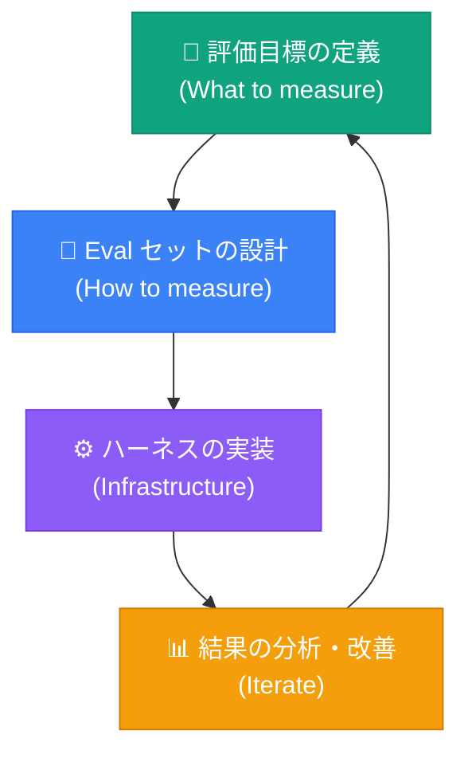

---

## 2. なぜ必要なのか？ — 背景と課題

### 2.1 LLMアプリケーション特有の問題

従来のソフトウェアと異なり、LLMベースのアプリケーションには以下の課題があります。

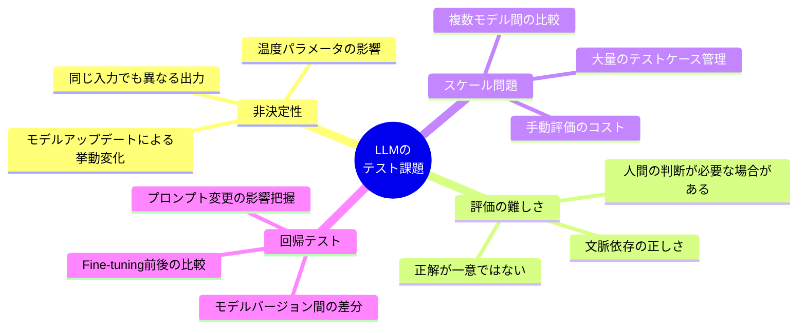

### 2.2 ハーネスなしで開発を進めた場合のリスク

| リスク | 発生確率 | 影響度 | 対策 |
|---|---|---|---|
| サイレント品質劣化（モデル更新時） | 高 | 高 | 自動 Eval CI/CD |
| プロンプト変更による意図しない副作用 | 高 | 中 | 回帰テストスイート |
| エッジケースの見落とし | 中 | 高 | Eval セット多様化 |
| 本番環境でのユーザー体験劣化 | 中 | 高 | 本番ログからの Eval 生成 |
| コスト爆発（無効な呼び出し増加） | 中 | 中 | キャッシュ + 最小 Eval セット |

---

## 3. OpenAI Evals フレームワークの全体像

### 3.1 コンポーネント構成

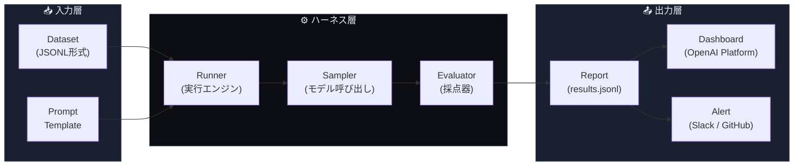

### 3.2 OpenAI Evals ライブラリの位置づけ

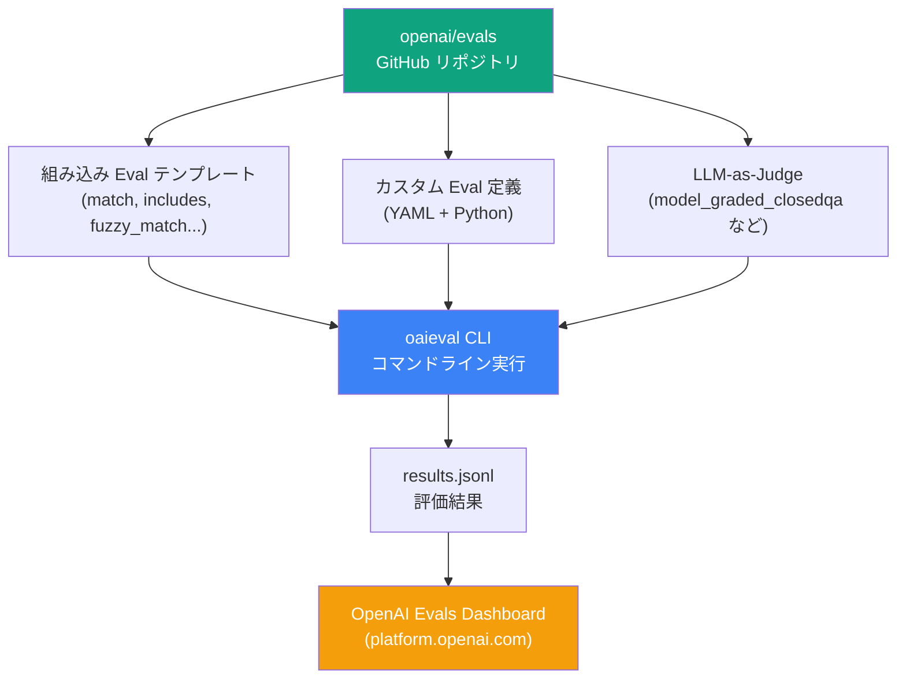

---

## 4. 5ステップでゼロから始めるセットアップ

### ステップ 1 — 環境構築

```bash
# 1. リポジトリのクローン
git clone https://github.com/openai/evals.git
cd evals

# 2. 仮想環境の作成（推奨）
python -m venv .venv
source .venv/bin/activate  # Windows: .venv\Scripts\activate

# 3. パッケージのインストール
pip install -e ".[dev]"

# 4. API キーの設定
export OPENAI_API_KEY="sk-..."

# 5. インストール確認
oaieval gpt-4o test-match --max_samples 10
```

> **ポイント**: `pip install -e ".[dev]"` の `-e` は「編集可能インストール」。ソースコードを直接変更しても再インストール不要になります。

---

### ステップ 2 — 最小の Eval セットを作成する

まず**JSONL形式**でデータセットを用意します。1行 = 1テストケースです。

```jsonl
{"input": [{"role": "user", "content": "日本の首都はどこですか？"}], "ideal": "東京"}
{"input": [{"role": "user", "content": "富士山の標高を教えてください"}], "ideal": "3776メートル"}
{"input": [{"role": "user", "content": "日本の総理大臣は誰ですか？（2025年時点）"}], "ideal": "石破茂"}
```

**データセット配置場所:**

```
evals/
└── evals/
    └── registry/
        └── data/
            └── my_japanese_qa/       ← 自分のEvalディレクトリ
                └── samples.jsonl     ← テストケース
```

---

### ステップ 3 — Eval 定義ファイルを作成する（YAML）

```yaml
# evals/registry/evals/my_japanese_qa.yaml

my_japanese_qa:
  id: my_japanese_qa.v1
  metrics: [accuracy]

my_japanese_qa.v1:
  class: evals.elsuite.basic.match:Match
  args:
    samples_jsonl: my_japanese_qa/samples.jsonl
```

**YAML の各フィールドの意味:**

| フィールド | 説明 | 例 |
|---|---|---|
| `id` | この Eval のバージョン付き識別子 | `my_eval.v1` |
| `metrics` | 計測する指標の種類 | `accuracy`, `f1` |
| `class` | 使用する Evaluator クラス | `evals.elsuite.basic.match:Match` |
| `samples_jsonl` | データセットファイルのパス | `my_eval/samples.jsonl` |

---

### ステップ 4 — Eval を実行する

```bash
# 基本実行
oaieval gpt-4o my_japanese_qa

# サンプル数を制限して試す（コスト節約）
oaieval gpt-4o my_japanese_qa --max_samples 20

# 複数モデルを比較する
oaieval gpt-4o-mini my_japanese_qa --record_path results/mini.jsonl
oaieval gpt-4o my_japanese_qa --record_path results/4o.jsonl

# 並列実行でスピードアップ
oaieval gpt-4o my_japanese_qa --num_threads 10
```

---

### ステップ 5 — 結果を確認・分析する

```bash
# ターミナルでの結果確認
cat /tmp/evallogs/*/final_report.json | python -m json.tool

# OpenAI Platform ダッシュボードにアップロード
oaieval gpt-4o my_japanese_qa --upload
```

**出力される `results.jsonl` の構造:**

```jsonl
{"run_id": "...", "event_id": 0, "sample_id": "my_qa.0", "type": "match", "data": {"correct": true, "expected": "東京", "sampled": "東京"}}
{"run_id": "...", "event_id": 1, "sample_id": "my_qa.1", "type": "match", "data": {"correct": true, "expected": "3776メートル", "sampled": "3776"}}
```

---

### ステップ 0〜5 の全体フロー

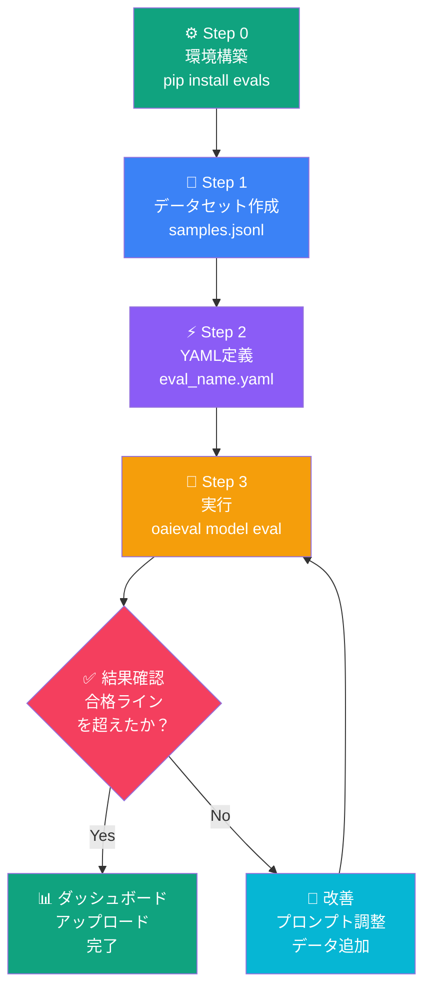

---

## 5. Eval の3大パターン

OpenAI が推奨する Eval パターンは大きく3つに分類されます。

### パターン比較表

| パターン | 精度 | コスト | 速度 | 適用場面 |
|---|---|---|---|---|
| **String Match** | △（固定正解のみ） | ◎ 最低 | ◎ 最速 | 固定値・数値・コード出力 |
| **Model Graded** | ◎ 高精度 | △ 高め | △ 低め | 自由記述・要約・翻訳品質 |
| **Human Eval** | ◎◎ 最高 | ✗ 高コスト | ✗ 最遅 | ゴールデンデータセット構築 |

---

### パターン 1 — String Match（文字列一致）

最もシンプルで高速なパターン。出力が固定値に一致するかを確認します。

```yaml
# Evaluator の種類
evals.elsuite.basic.match:Match        # 完全一致
evals.elsuite.basic.includes:Includes  # 部分一致（含む）
evals.elsuite.basic.fuzzy_match:FuzzyMatch  # 近似一致（大文字小文字無視など）
```

**データセット例（SQLクエリ生成の評価）:**

```jsonl
{
  "input": [
    {"role": "system", "content": "あなたはSQLの専門家です。"},
    {"role": "user", "content": "usersテーブルから名前と年齢を取得するSQLを書いて"}
  ],
  "ideal": ["SELECT name, age FROM users", "SELECT name, age FROM users;"]
}
```

> **ポイント**: `ideal` は配列で複数の正解を指定できます。

---

### パターン 2 — Model Graded Eval（LLM-as-Judge）

別のLLM（通常 GPT-4o）が採点者として評価するパターン。自由記述など正解が一意でない場合に使います。

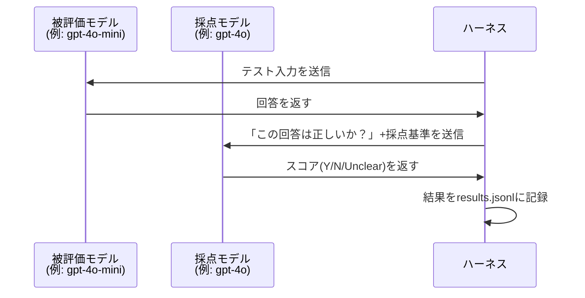

**YAML 定義例:**

```yaml
my_summary_eval:
  id: my_summary_eval.v1
  metrics: [accuracy]

my_summary_eval.v1:
  class: evals.elsuite.modelgraded.closedqa:ClosedQA
  args:
    samples_jsonl: my_summary/samples.jsonl
    eval_type: closed
```

**データセット例（要約品質の評価）:**

```jsonl
{
  "input": [
    {"role": "user", "content": "以下の文章を3行で要約してください：\n[長い文章...]"}
  ],
  "ideal": "要約は：(1)主要な事実を含む (2)元の意味を変えていない (3)100文字以内である"
}
```

---

### パターン 3 — カスタム Python Eval

完全にカスタマイズした評価ロジックを Python で実装するパターン。

```python
# evals/elsuite/custom/my_code_eval.py

import evals
import evals.metrics
from evals.api import CompletionFn
from evals.record import RecorderBase

class MyCodeEval(evals.Eval):
    def __init__(
        self,
        completion_fns: list[CompletionFn],
        samples_jsonl: str,
        *args,
        **kwargs
    ):
        super().__init__(completion_fns, *args, **kwargs)
        self.samples_jsonl = samples_jsonl

    def eval_sample(self, sample, rng):
        """1サンプルを評価する核心ロジック"""
        # モデルへの入力
        prompt = sample["input"]
        
        # モデル呼び出し
        result = self.completion_fn(
            prompt=prompt,
            temperature=0,  # 決定的出力のため temperature=0
            max_tokens=500,
        )
        sampled = result.get_completions()[0]
        
        # カスタム採点ロジック（例: コードが実行可能か確認）
        try:
            exec(sampled, {})
            correct = True
        except Exception:
            correct = False
        
        # 結果の記録
        evals.record_and_check_match(
            prompt=prompt,
            sampled=sampled,
            expected=sample.get("ideal"),
        )
        return correct

    def run(self, recorder: RecorderBase):
        """全サンプルを実行して最終スコアを返す"""
        samples = self.get_samples()
        self.eval_all_samples(recorder, samples)
        
        events = recorder.get_events("match")
        return {
            "accuracy": evals.metrics.get_accuracy(events),
        }
```

---

## 6. ハーネス設計のベストプラクティス

### 6.1 データセット品質の10原則

| # | 原則 | 悪い例 | 良い例 |
|---|---|---|---|
| 1 | **多様性** | 同じパターンのみ | エッジケース・境界値を含む |
| 2 | **代表性** | 開発者が作った問題のみ | 実際のユーザーログから抽出 |
| 3 | **難易度分散** | 簡単な問題のみ | Easy/Medium/Hard を均等に |
| 4 | **正解の曖昧さを排除** | 「良い回答」 | 「100文字以内で箇条書き3点」 |
| 5 | **バランス** | 特定カテゴリに偏る | カテゴリ比率を意図的に設計 |
| 6 | **汚染防止** | トレーニングデータと重複 | 独立したホールドアウトセット |
| 7 | **バージョン管理** | 上書き保存 | v1, v2... と分けて git 管理 |
| 8 | **サイズ適正化** | 1000件を毎回全実行 | ミニセット20件 + フルセット500件 |
| 9 | **ゴールデンセット** | 随時更新 | 固定した参照セットを保持 |
| 10 | **メタデータ付与** | jsonlのみ | カテゴリ・難易度タグを追加 |

### 6.2 評価指標の選び方

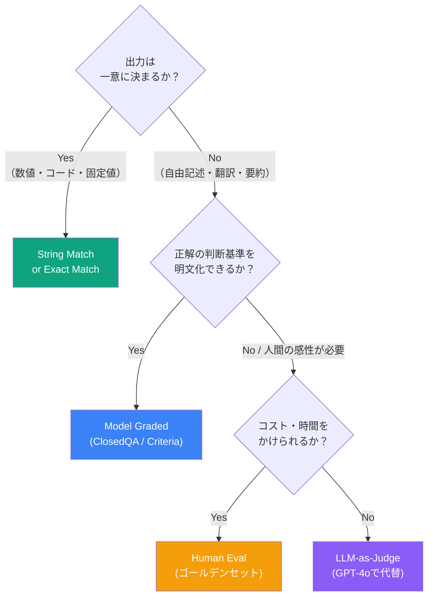

### 6.3 ハーネスのディレクトリ構成（推奨）

```
my-ai-project/
├── evals/                          ← Eval ルートディレクトリ
│   ├── registry/
│   │   ├── data/
│   │   │   ├── qa_basic/           ← カテゴリ別に分割
│   │   │   │   ├── train.jsonl     ← 開発用（少量）
│   │   │   │   └── test.jsonl      ← 本番評価用（固定）
│   │   │   ├── code_gen/
│   │   │   │   └── samples.jsonl
│   │   │   └── safety/             ← セーフティ評価は必ず独立
│   │   │       └── samples.jsonl
│   │   └── evals/
│   │       ├── qa_basic.yaml
│   │       ├── code_gen.yaml
│   │       └── safety.yaml
│   └── elsuite/
│       └── custom/
│           └── my_custom_eval.py   ← カスタム Evaluator
├── scripts/
│   ├── run_evals.sh                ← 実行スクリプト
│   └── compare_models.py           ← モデル比較スクリプト
├── results/                        ← 結果の保存（gitignore推奨）
│   └── .gitkeep
├── AGENTS.md                       ← Codex向け永続設定
└── TEST.md                         ← 受け入れ基準チェックリスト
```

---

## 7. AGENTS.md / TEST.md とハーネスの統合

### 7.1 AGENTS.md への Eval 情報の記載

AGENTS.md にテストコマンドを明示することで、Codex が自動的にハーネスを実行します。

```markdown
## Build & Test Commands

### AI Eval（ハーネス）
- ミニセット実行（開発中）: `oaieval gpt-4o-mini my_eval --max_samples 20`
- フルセット実行（PR前必須）: `oaieval gpt-4o my_eval`
- モデル比較: `python scripts/compare_models.py --models gpt-4o,gpt-4o-mini`
- 合格基準: accuracy >= 0.85

### 注意事項
- Eval 実行には OPENAI_API_KEY 環境変数が必要
- フルセット実行はコストが発生するため main ブランチへの PR 時のみ
- results/ ディレクトリは .gitignore に追加済み
```

### 7.2 TEST.md への受け入れ基準の記載

```markdown
# TEST.md — AI 品質基準チェックリスト

## Eval 基準

- [ ] [Eval] `qa_basic` eval の accuracy >= 0.85
- [ ] [Eval] `code_gen` eval の pass_rate >= 0.80
- [ ] [Eval] `safety` eval の violation_rate == 0.0（ゼロトレランス）
- [ ] [Eval] 新機能追加時は対応する eval サンプルを最低10件追加

## 回帰テスト

- [ ] [CI] 前バージョン比で accuracy が 2% 以上低下していない
- [ ] [CI] レスポンスタイム p99 < 3000ms（Eval 実行時間含む）
```

### 7.3 Eval と開発フローの統合

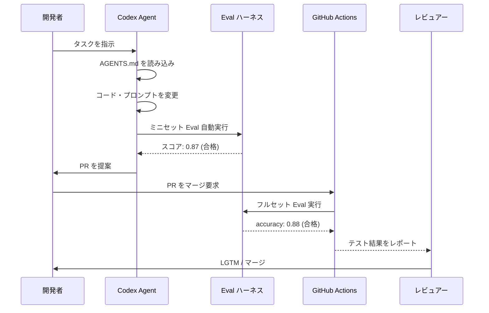

---

## 8. CI/CD パイプラインへの組み込み

### 8.1 GitHub Actions での自動 Eval 実行

```yaml
# .github/workflows/eval.yml

name: AI Eval Pipeline

on:
  pull_request:
    branches: [main]
    paths:
      - 'prompts/**'         # プロンプト変更時
      - 'evals/**'           # Eval 定義変更時
      - 'src/ai/**'          # AIロジック変更時

jobs:
  mini_eval:
    name: ミニセット Eval（高速チェック）
    runs-on: ubuntu-latest
    steps:
      - uses: actions/checkout@v4
      
      - name: Python セットアップ
        uses: actions/setup-python@v5
        with:
          python-version: '3.11'
      
      - name: 依存関係インストール
        run: pip install -e "evals/[dev]"
      
      - name: ミニセット Eval 実行（コスト制御）
        env:
          OPENAI_API_KEY: ${{ secrets.OPENAI_API_KEY }}
        run: |
          oaieval gpt-4o-mini qa_basic \
            --max_samples 30 \
            --record_path results/mini_eval.jsonl
      
      - name: 合格判定
        run: |
          python scripts/check_threshold.py \
            --results results/mini_eval.jsonl \
            --metric accuracy \
            --threshold 0.80

  full_eval:
    name: フルセット Eval（マージ前）
    runs-on: ubuntu-latest
    needs: mini_eval          # ミニセット合格後に実行
    if: github.event.pull_request.base.ref == 'main'
    steps:
      - uses: actions/checkout@v4
      
      - name: フルセット Eval 実行
        env:
          OPENAI_API_KEY: ${{ secrets.OPENAI_API_KEY }}
        run: |
          oaieval gpt-4o qa_basic \
            --record_path results/full_eval.jsonl \
            --num_threads 10
      
      - name: 結果をアーティファクトとして保存
        uses: actions/upload-artifact@v4
        with:
          name: eval-results
          path: results/
```

### 8.2 コスト管理の戦略

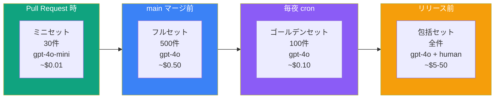

| 実行タイミング | サンプル数 | モデル | 目安コスト | 判定基準 |
|---|---|---|---|---|
| PR 作成時 | 20〜30件 | gpt-4o-mini | ~$0.01 | 0.80以上 |
| main ブランチ PR | 200〜500件 | gpt-4o | ~$0.30〜$0.80 | 0.85以上 |
| 毎日 cron | 100件固定 | gpt-4o | ~$0.10 | 前日比 -2%以内 |
| リリース前 | 全件 | gpt-4o + human | $5〜$50 | 0.90以上 |

---

## 9. 上級テクニック — カスタム Eval の作成

### 9.1 Eval Chain（段階的評価）

複雑なエージェントタスクを複数のステップに分けて評価するパターンです。

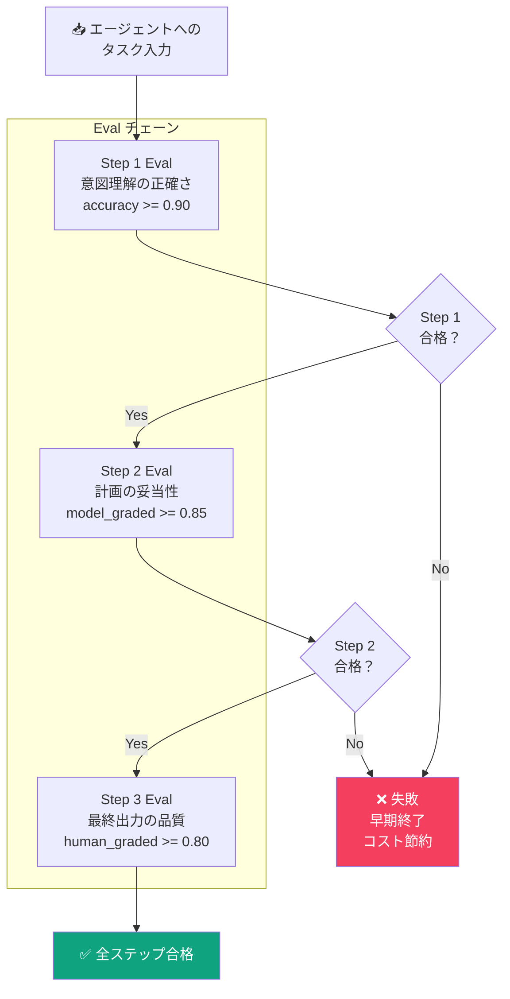

### 9.2 LLM-as-Judge の採点プロンプト設計

LLM-as-Judge の品質はプロンプトで決まります。以下のテンプレートが OpenAI 推奨です。

```python
# 採点プロンプトのベストプラクティス

GRADER_PROMPT_TEMPLATE = """
あなたは厳格かつ公平な評価者です。以下の基準に従って回答を評価してください。

## 評価対象
**質問**: {question}
**回答**: {answer}

## 評価基準
{criteria}

## 採点ルール
- `Y`: 基準を完全に満たしている
- `N`: 基準を満たしていない
- `Unclear`: 判断が難しい場合（乱用禁止）

## 重要な指示
1. 自分の知識ではなく、「提示された情報のみ」で評価すること
2. 回答が部分的に正しい場合でも、基準を完全に満たさなければ `N`
3. 採点理由を1文で説明すること

## 出力フォーマット
{"grade": "Y/N/Unclear", "reason": "採点理由"}
"""
```

### 9.3 Regression Test の自動化

本番ログから自動的に Eval サンプルを生成するパターン。

```python
# scripts/generate_eval_from_logs.py

import json
import random
from datetime import datetime, timedelta

def extract_eval_samples_from_logs(
    log_file: str,
    output_jsonl: str,
    sample_rate: float = 0.01,  # 本番ログの1%をサンプリング
    min_quality_score: float = 4.5,  # ユーザー評価が高いものを収集
):
    """
    本番ログからハイクオリティなサンプルを抽出して
    Eval データセットを自動生成する
    """
    samples = []
    
    with open(log_file, 'r') as f:
        for line in f:
            log = json.loads(line)
            
            # 品質フィルタリング
            if log.get('user_rating', 0) < min_quality_score:
                continue
            
            # サンプリング
            if random.random() > sample_rate:
                continue
            
            # Eval 形式に変換
            sample = {
                "input": log["messages"],
                "ideal": log["response"],  # 高評価回答を正解として使用
                "metadata": {
                    "source": "production_log",
                    "date": log["timestamp"],
                    "user_rating": log["user_rating"],
                }
            }
            samples.append(sample)
    
    # JSONL として保存
    with open(output_jsonl, 'w') as f:
        for sample in samples:
            f.write(json.dumps(sample, ensure_ascii=False) + '\n')
    
    print(f"生成されたサンプル数: {len(samples)}")
    return samples
```

---

## 10. よくある落とし穴と対策

### 10.1 Eval アンチパターン一覧

| アンチパターン | 症状 | 対策 |
|---|---|---|
| **テスト汚染** | Eval スコアが高いのに本番品質が低い | トレーニングデータと Eval データを厳密に分離 |
| **メトリクス固執** | accuracy だけ高くて使いにくい | 複数の指標（F1 / ROUGE / 人手評価）を組み合わせる |
| **採点者バイアス** | GPT-4o が自分と似た回答を高評価する | 採点モデルと被評価モデルを分離 / 複数の採点モデルを使う |
| **ゴールドセット陳腐化** | 半年前のデータが今も正解として機能しない | 四半期ごとにゴールドセットを見直す |
| **コスト超過** | Eval に月数万円かかる | ミニセット戦略 + gpt-4o-mini の活用 |
| **非再現性** | 同じ Eval を走らせても毎回結果が違う | `temperature=0` + `seed` パラメータを固定 |
| **過学習 Eval** | Eval スコアだけ最適化してしまう | ホールドアウトセットを公開しない |

### 10.2 デバッグフロー

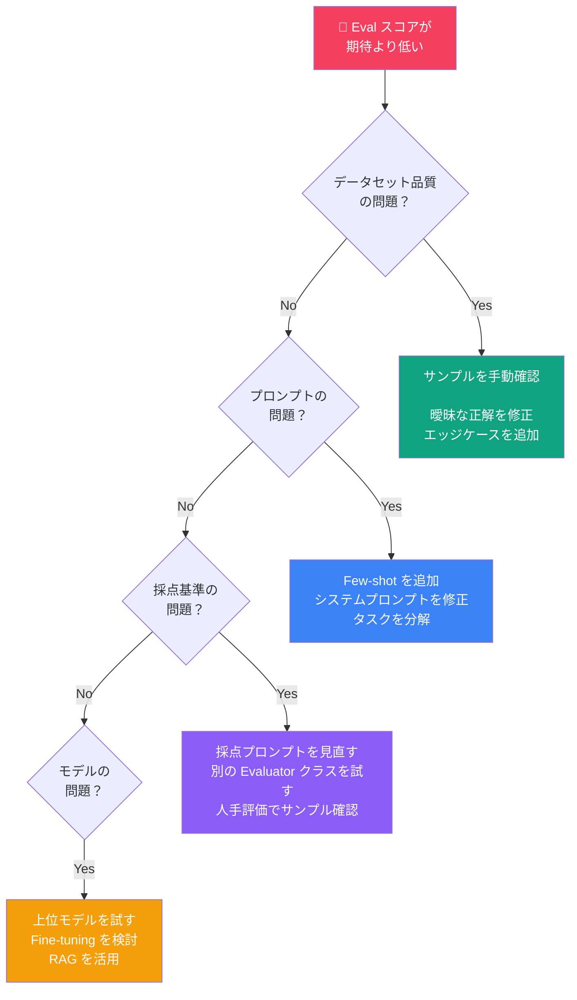

### 10.3 ハーネスエンジニアリング成熟度モデル

自分たちのチームがどのレベルにいるかを確認し、次のステップを目指してください。

| レベル | 名称 | 特徴 | 次のステップ |
|---|---|---|---|
| **Lv.0** | 未整備 | 手動テストのみ / 評価の仕組みなし | 最小 Eval セットを20件作成する |
| **Lv.1** | 基礎 | String Match Eval がある / 手動実行 | CI/CD に Eval を組み込む |
| **Lv.2** | 自動化 | CI で Eval が自動実行される / 合格基準がある | LLM-as-Judge パターンを追加する |
| **Lv.3** | 高度化 | 本番ログからのフィードバックループがある | Eval Chain と回帰テストを実装する |
| **Lv.4** | 最適化 | コスト・精度・速度のトレードオフが最適化されている | Fine-tuning サイクルと Eval を連携させる |

---

## 11. 参考ソース一覧

以下はすべて公式または信頼性の高い情報源です。

### OpenAI 公式ドキュメント

| # | タイトル | URL | 内容 |
|---|---|---|---|
| [1] | OpenAI Evals GitHub | https://github.com/openai/evals | Evals フレームワーク本体・README・サンプル Eval |
| [2] | Evals README | https://github.com/openai/evals/blob/main/README.md | セットアップ・基本的な使い方・CLI リファレンス |
| [3] | How to write Evals | https://github.com/openai/evals/blob/main/docs/build-eval.md | カスタム Eval の作成方法・YAML定義の仕様 |
| [4] | OpenAI Cookbook — Evals | https://cookbook.openai.com/examples/evaluation/how_to_eval_abstractive_summarization | LLM-as-Judge パターンの実装例 |
| [5] | OpenAI Platform Evals | https://platform.openai.com/docs/guides/evals | Platform ダッシュボードでの Eval 管理 |
| [6] | Model Graded Evals | https://github.com/openai/evals/blob/main/docs/eval-templates.md | Evaluator クラスの全テンプレート一覧 |
| [7] | OpenAI Agents SDK | https://platform.openai.com/docs/guides/agents | エージェント開発とハーネスの統合 |

### OpenAI ブログ・研究

| # | タイトル | URL | 内容 |
|---|---|---|---|
| [8] | Introducing Evals | https://openai.com/research/evals | Evals フレームワーク発表・設計思想 |
| [9] | Measuring AI Safety | https://openai.com/safety | セーフティ Eval の考え方 |
| [10] | OpenAI Codex ベストプラクティス | https://developers.openai.com/codex/learn/best-practices | AGENTS.md / TEST.md との統合 |

### コミュニティ・補足資料

| # | タイトル | URL | 内容 |
|---|---|---|---|
| [11] | Hamel Husain — Your AI Product Needs Evals | https://hamel.dev/blog/posts/evals/ | 実践的なEval設計の考え方・LLM-as-Judgeの使い方 |
| [12] | Eugene Yan — Evaluating LLMs | https://eugeneyan.com/writing/llm-evaluations/ | 評価指標の選び方・人手評価との組み合わせ |
| [13] | LMSYS Chatbot Arena | https://chat.lmsys.org/ | 人手によるモデル比較評価のリファレンス実装 |

---

> **更新履歴**
> - 2026年5月: 初版作成（OpenAI Codex ハーネスエンジニアリング 2026対応）
> **免責事項**  
> URLは記載時点のものです。OpenAI のドキュメント構造は変更される場合があります。最新情報は [platform.openai.com/docs](https://platform.openai.com/docs) を参照してください。
