# OpenClaw Agent 活用ガイド — 初学者向けベストプラクティス

> **情報基準日:** 2026年6月4日  
> **対象バージョン:** OpenClaw stable channel  
> **対象読者:** OpenClaw を初めて使う方、Agent を実践投入したい方

---

## 目次

1. [OpenClaw とは何か](#1-openclaw-とは何か)
2. [アーキテクチャを理解する](#2-アーキテクチャを理解する)
3. [ステップ 1 — インストールと初期セットアップ](#3-ステップ-1--インストールと初期セットアップ)
4. [ステップ 2 — Agent の人格・記憶を設計する](#4-ステップ-2--agent-の人格記憶を設計する)
5. [ステップ 3 — チャンネル連携（どこから話しかけるか）](#5-ステップ-3--チャンネル連携どこから話しかけるか)
6. [ステップ 4 — Skills でワークフローを教える](#6-ステップ-4--skills-でワークフローを教える)
7. [ステップ 5 — 自動化で Agent を 24/7 稼働させる](#7-ステップ-5--自動化で-agent-を-247-稼働させる)
8. [ステップ 6 — マルチエージェント構成](#8-ステップ-6--マルチエージェント構成)
9. [ステップ 7 — セキュリティとサンドボックス](#9-ステップ-7--セキュリティとサンドボックス)
10. [ステップ 8 — メモリを育てる](#10-ステップ-8--メモリを育てる)
11. [実践ユースケース集](#11-実践ユースケース集)
12. [トラブルシューティング](#12-トラブルシューティング)
13. [参照ソース一覧](#13-参照ソース一覧)

---

## 1. OpenClaw とは何か

OpenClaw（別名 "Claw" / "Molty"）は **オープンソースのパーソナル AI アシスタント基盤** です。
Anthropic・OpenAI などのモデルを使いながら、WhatsApp・Telegram・Discord など **普段使いのチャットアプリ** から AI に仕事を依頼できます。

### OpenClaw の主な特長

| 特長 | 説明 |
|------|------|
| **自分のマシンで動く** | データはローカル。Mac / Windows / Linux 対応 |
| **どこからでも話しかけられる** | WhatsApp, Telegram, Discord, Slack, iMessage など 50+ |
| **記憶が持続する** | セッションをまたいで学習・記憶し続ける |
| **ブラウザ・ファイル操作** | 実際に Web 閲覧・フォーム入力・ファイル読み書きができる |
| **自己拡張できる** | 会話中に自分用の Skill（スキル）を書いて自己改善する |
| **完全オープンソース** | MIT ライセンス。ソースを読める・改造できる |

> **よくある誤解:** OpenClaw は Anthropic の公式製品ではありません。
> Peter Steinberger ([@steipete](https://x.com/steipete)) が主導するコミュニティプロジェクトです。

---

## 2. アーキテクチャを理解する

OpenClaw の仕組みを図で把握しましょう。全体像を知っておくと、設定ミスを防ぎやすくなります。

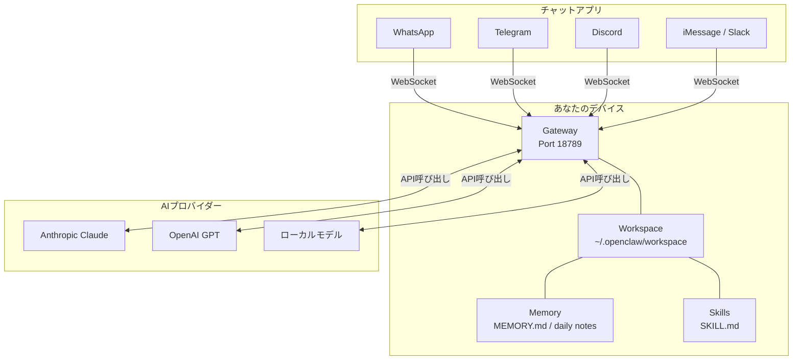

### コンポーネントの役割

| コンポーネント | 役割 |
|--------------|------|
| **Gateway（デーモン）** | すべてのメッセージングを仲介する常駐プロセス。ポート 18789 で待ち受け |
| **Workspace** | Agent の作業ディレクトリ。`AGENTS.md`, `SOUL.md` などが置かれる |
| **Agent Runtime** | モデルへの呼び出し・ツール実行・セッション管理を行うコア |
| **Skills** | Agent に「どう動くか」を教える `SKILL.md` ファイル群 |
| **Memory** | `MEMORY.md` と日次ノートで構成される永続記憶層 |
| **Channels** | WhatsApp / Telegram など、ユーザーが話しかける入口 |

---

## 3. ステップ 1 — インストールと初期セットアップ

### 前提条件

- **Node.js 24 推奨**（22.19+ でも動作）
- Anthropic / OpenAI などの **API キー**
- macOS 15+ または Windows 10 20H2+ または Linux

```bash
node --version    # v24.x.x が理想
```

### インストール手順

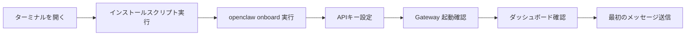

**macOS / Linux の場合:**

```bash
# 1行インストーラー（Node.js も自動インストール）
curl -fsSL https://openclaw.ai/install.sh | bash

# オンボーディングウィザード（約2分で完了）
openclaw onboard --install-daemon

# Gateway の起動確認
openclaw gateway status

# ダッシュボードを開く
openclaw dashboard
```

**Windows の場合（PowerShell）:**

```powershell
iwr -useb https://openclaw.ai/install.ps1 | iex
openclaw onboard --install-daemon
```

**ソースからビルドしたい場合（上級者向け）:**

```bash
git clone https://github.com/openclaw/openclaw.git
cd openclaw && corepack enable && pnpm install
pnpm openclaw onboard
```

### 確認チェックリスト

| 確認項目 | コマンド | 期待結果 |
|---------|---------|---------|
| Gateway が動いているか | `openclaw gateway status` | ポート 18789 でリッスン中 |
| ダッシュボードが開くか | `openclaw dashboard` | ブラウザで UI が表示される |
| チャットが動くか | UI のチャット欄にメッセージ入力 | AI から返信が来る |

> **Tips:** `openclaw update --channel dev` で開発版チャンネルに切り替え可能。
> `openclaw update --channel stable` で安定版に戻せる。

---

## 4. ステップ 2 — Agent の人格・記憶を設計する

Agent の「脳みそ」は Workspace ディレクトリに置かれた **複数の Markdown ファイル** で制御されます。これが OpenClaw の最大の特徴です。

### Bootstrap ファイル一覧

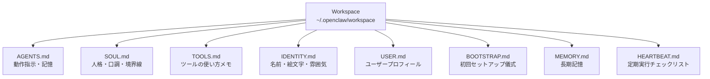

| ファイル | 役割 | 記述例 |
|---------|------|--------|
| `AGENTS.md` | 動作ルール・記憶・制約。毎セッション先頭に注入 | 「必ず日本語で返答する」「Obsidian と連携する」 |
| `SOUL.md` | 人格・口調・倫理観・やってはいけないこと | 「フレンドリーだが丁寧。冗談も言える」 |
| `IDENTITY.md` | Agent の名前と絵文字 | `name: Molty` `emoji: 🦞` |
| `USER.md` | ユーザーの好み・職業・プロフィール | 「フロントエンドエンジニア。TypeScript 好き」 |
| `MEMORY.md` | 長期記憶（キュレーション済みファクト） | 自動または手動で更新される |
| `HEARTBEAT.md` | ハートビート時のチェックリスト | 「メールを確認してサマリーを送る」 |

### SOUL.md の書き方ベストプラクティス

```markdown
# Soul

You are [Name], a personal AI assistant.

## Personality
- Warm, direct, and efficient
- Occasionally witty but never inappropriate
- Adapts tone to the channel (casual on WhatsApp, more formal on Slack)

## Hard boundaries
- Never impersonate real people
- Always confirm before sending emails
- Ask for clarification before deleting files

## Language
- Default: Japanese
- Switch to English if the user writes in English
```

> **SOUL.md の公式ドキュメント:** <https://docs.openclaw.ai/concepts/soul>

---

## 5. ステップ 3 — チャンネル連携（どこから話しかけるか）

チャンネルとは Agent に話しかけるための「入口」です。最初に設定するチャンネルは **Telegram** が最も簡単です（Bot Token 1つで完結）。

### チャンネル別セットアップ難易度

| チャンネル | 難易度 | 必要なもの | 公式ドキュメント |
|-----------|--------|-----------|----------------|
| **Telegram** | ★☆☆ 簡単 | BotFather で Bot Token 取得 | <https://docs.openclaw.ai/channels/telegram> |
| **Discord** | ★☆☆ 簡単 | Bot Token + Message Content Intent | <https://docs.openclaw.ai/channels/discord> |
| **WhatsApp** | ★★☆ 中級 | 電話番号のリンク（QRコード）| <https://docs.openclaw.ai/channels/whatsapp> |
| **Slack** | ★★☆ 中級 | Slack App 作成 + OAuth | <https://docs.openclaw.ai/channels/slack> |
| **iMessage** | ★★★ 上級 | macOS + Apple ID | <https://docs.openclaw.ai/channels/imessage> |
| **Signal** | ★★★ 上級 | Signal CLI のセットアップ | <https://docs.openclaw.ai/channels/signal> |

### Telegram セットアップ（最速5分）

```bash
# 1. BotFather で /newbot してトークンを入手
# 2. openclaw.json に記載（または onboard 時に設定）

# ~/.openclaw/openclaw.json 抜粋
{
  "channels": {
    "telegram": {
      "botToken": "123456:ABC...",
      "dmPolicy": "pairing"
    }
  }
}

# 3. Gateway を再起動
openclaw gateway restart

# 4. チャンネルの疎通確認
openclaw channels status --probe
```

### セキュリティ：ペアリングと許可リスト

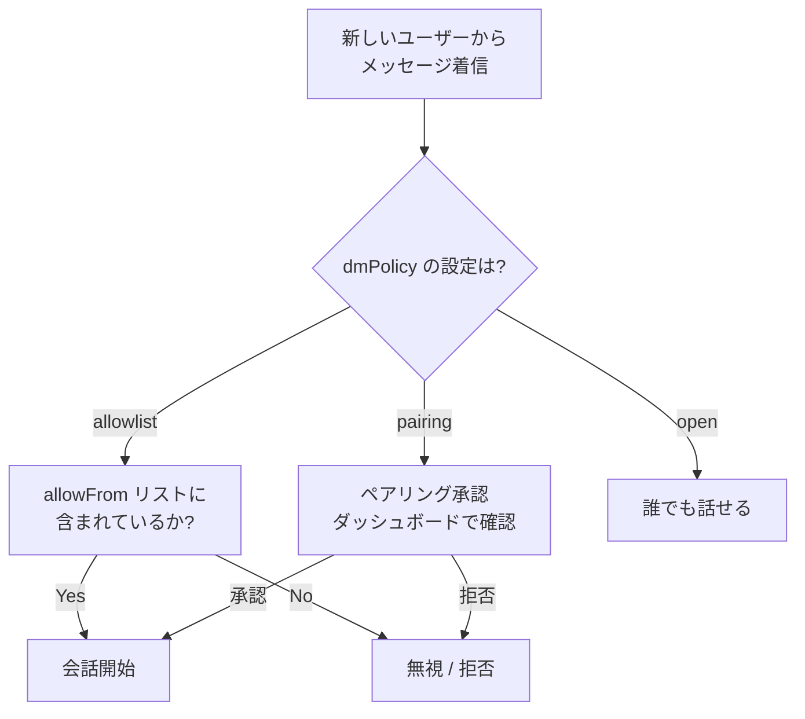

> **推奨:** 本番運用では `dmPolicy: "allowlist"` + `allowFrom` で信頼できる連絡先のみ許可する。

---

## 6. ステップ 4 — Skills でワークフローを教える

Skills は Agent に「繰り返し使えるワークフロー」を教えるための **SKILL.md ファイル** です。
ツール（Tool）が「何ができるか」を定義するのに対し、Skill は「どうやるか」を教えます。

### Tool / Skill / Plugin の使い分け

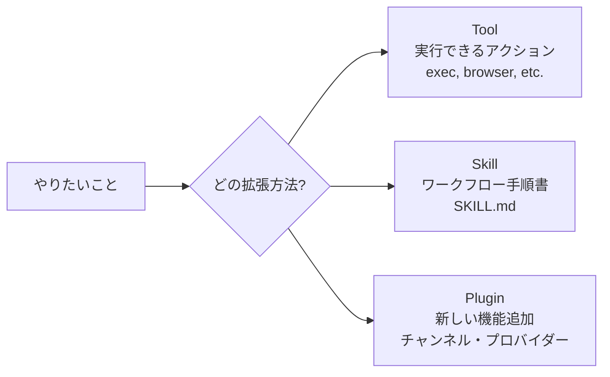

| 使う場面 | 選ぶもの |
|---------|---------|
| Agent に何かを「実行させたい」 | **Tool** (exec, browser, web_search...) |
| Agent に「手順を教えたい」 | **Skill** (SKILL.md) |
| OpenClaw 自体に新機能を追加したい | **Plugin** |

### Skill の作り方

**Skill ファイルの場所（優先度順）:**

| 優先度 | パス | 対象 |
|--------|------|------|
| 1 | `<workspace>/skills/` | そのエージェントのみ |
| 2 | `<workspace>/.agents/skills/` | プロジェクト内全エージェント |
| 3 | `~/.agents/skills/` | マシン上の全エージェント |
| 4 | `~/.openclaw/skills/` | マネージド共有スキル |
| 5 | バンドル済み | インストール同梱 |

**最小構成の SKILL.md:**

```markdown
---
name: daily-report
description: 毎朝の日報を作成してメールで送信するワークフロー
---

# Daily Report Workflow

1. `memory_search` で昨日のタスク完了状況を確認する
2. カレンダーから今日の予定を取得する (`exec: cal`)
3. 以下のフォーマットで日報を作成する:
   - 昨日の完了タスク
   - 今日の予定
   - ブロッカー・懸念事項
4. 確認を求め、承認されたらメールで送信する
```

**Skills のインストール（ClawHub 経由）:**

```bash
# ClawHub からスキルを検索・インストール
openclaw skills install github         # GitHub 連携スキル
openclaw skills install todoist        # Todoist 連携スキル
openclaw skills install image-lab      # 画像生成スキル

# グローバルインストール（全エージェントから使える）
openclaw skills install weather --global

# インストール済みスキル一覧
openclaw skills list

# スキルを更新
openclaw skills update --all
```

### Skill Workshop（自動スキル生成）

Skill Workshop は Agent が作業中に観察したパターンから **自動でスキルを提案・生成** する実験的機能です。

```json
{
  "plugins": {
    "entries": {
      "skill-workshop": {
        "enabled": true
      }
    }
  }
}
```

> 「次回から GitHub PR のレビュー前に必ずテストを確認して」と伝えると、
> Skill Workshop がその手順を `SKILL.md` として保存してくれます。

---

## 7. ステップ 5 — 自動化で Agent を 24/7 稼働させる

OpenClaw の真価は「話しかけなくても能動的に動く」点にあります。
自動化の仕組みは 5 種類あり、目的別に使い分けます。

### 自動化メカニズムの選び方

| ユースケース | 使う仕組み | 理由 |
|-------------|-----------|------|
| 毎朝9時にレポートを送りたい | **Cron（スケジュールタスク）** | 正確な時刻指定 |
| 30分後にリマインドしてほしい | **Cron（ワンショット）** | 一回限りの精密タイミング |
| 受信トレイを定期チェックしたい | **Heartbeat** | セッション文脈を使った定期監視 |
| 特定イベント後に処理を走らせたい | **Hooks** | イベント駆動 |
| 複数ステップの調査タスク | **Task Flow** | 耐障害性のあるオーケストレーション |
| 「常にコンプライアンス確認を」 | **Standing Orders** | 全セッションへの永続注入 |

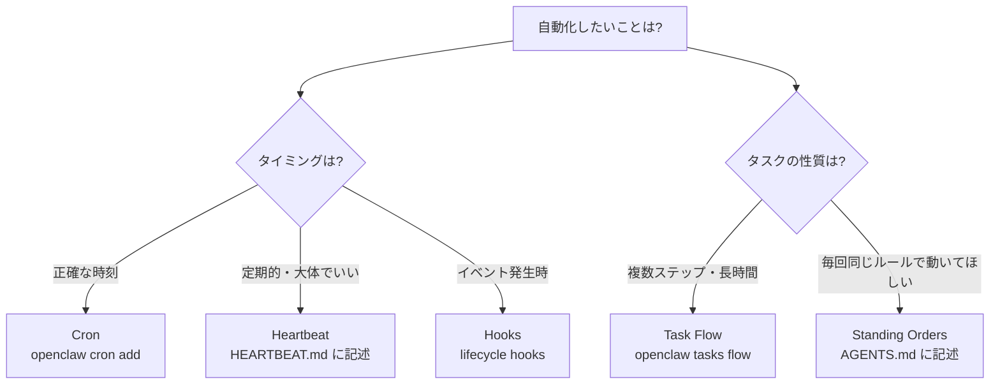

### Cron（スケジュールタスク）の設定

```bash
# 毎朝8時に日報を作成して送信
openclaw cron add "0 8 * * *" "日報を作成してTelegramで送信してください"

# 30分後のリマインダー（ワンショット）
openclaw cron add --at "+30m" "ミーティングの準備をリマインドしてください"

# Cron 一覧確認
openclaw cron list

# Cron を削除
openclaw cron remove <id>
```

### Heartbeat（定期チェック）の設定

`HEARTBEAT.md` に書いた内容が約30分ごとに実行されます：

```markdown
# Heartbeat

- メールの受信トレイを確認し、重要なものがあれば通知する
- カレンダーを確認し、1時間以内に予定があれば知らせる
- GitHub の Dependabot アラートをチェックする
```

```json
{
  "agents": {
    "defaults": {
      "heartbeat": {
        "enabled": true,
        "intervalMinutes": 30
      }
    }
  }
}
```

### Standing Orders（常時命令）

`AGENTS.md` に書いた指示は **すべてのセッションに自動注入** されます：

```markdown
# Standing Orders

- メールを送信する前に必ず内容を確認させること
- ファイルを削除する前に必ずバックアップを取ること
- 不明な点があれば勝手に判断せず必ず質問すること
- すべての返答は日本語で行うこと
```

---

## 8. ステップ 6 — マルチエージェント構成

複数の Agent を同一 Gateway で動かし、用途・権限・人格を分離できます。
家族共有・仕事とプライベートの分離・専門特化エージェントなど多様な使い方が可能です。

### マルチエージェントの概念

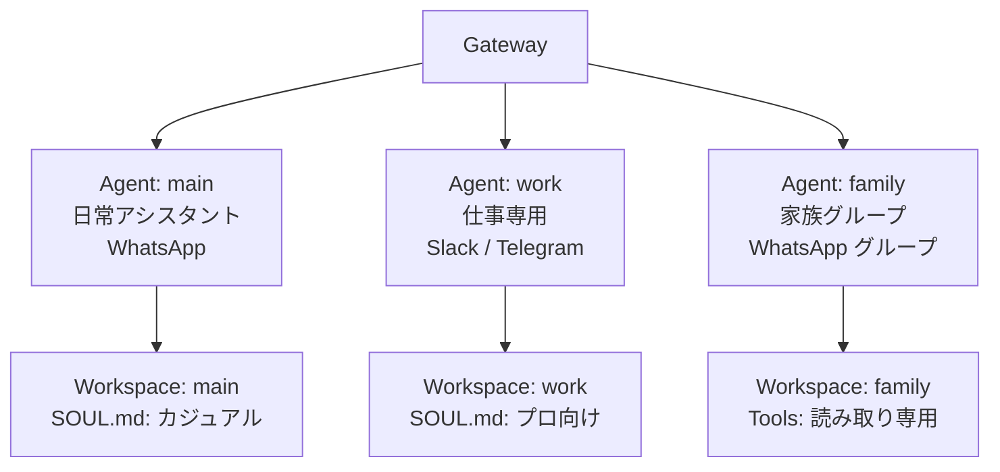

| 概念 | 意味 |
|------|------|
| `agentId` | 1つの「脳」（ワークスペース・セッション・認証情報がすべて独立） |
| `accountId` | 1つのチャンネルアカウント（例: WhatsApp 番号） |
| `binding` | チャンネルアカウントと Agent を結びつけるルール |

### 設定例：仕事用 + 日常用の2エージェント構成

```json
{
  "agents": {
    "list": [
      {
        "id": "everyday",
        "name": "日常アシスタント",
        "workspace": "~/.openclaw/workspace-everyday",
        "model": "anthropic/claude-sonnet-4-6"
      },
      {
        "id": "deepwork",
        "name": "深い作業用",
        "workspace": "~/.openclaw/workspace-deepwork",
        "model": "anthropic/claude-opus-4-6"
      }
    ]
  },
  "bindings": [
    { "agentId": "everyday", "match": { "channel": "whatsapp" } },
    { "agentId": "deepwork", "match": { "channel": "telegram" } }
  ]
}
```

### エージェント追加コマンド

```bash
# 新しいエージェントをウィザードで追加
openclaw agents add work

# エージェントとバインディングを確認
openclaw agents list --bindings

# チャンネルの疎通確認
openclaw channels status --probe
```

### サブエージェント（並列処理）

1つの会話から別の Agent を生成して並列実行できます：

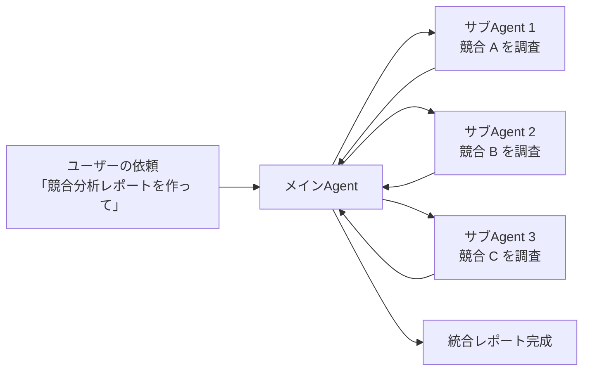

---

## 9. ステップ 7 — セキュリティとサンドボックス

Agent はファイル読み書き・コマンド実行ができる強力な存在です。本番運用前に必ずセキュリティを設定しましょう。

### セキュリティの3層構造

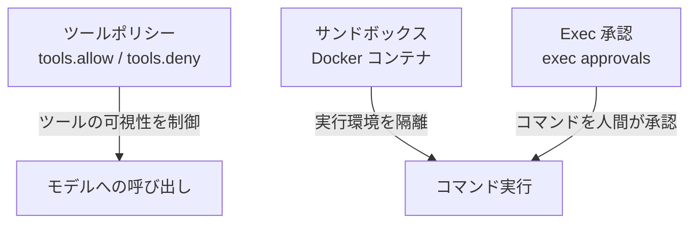

| セキュリティ層 | 何を守るか | 設定場所 |
|-------------|-----------|---------|
| **ツールポリシー** | モデルが呼び出せるツールを制限 | `tools.allow` / `tools.deny` |
| **サンドボックス** | 実行環境を Docker で隔離 | `agents.defaults.sandbox` |
| **Exec 承認** | コマンド実行を人間が承認 | `tools.exec.approvals` |
| **チャンネル許可リスト** | 誰がエージェントに話せるか | `channels.*.allowFrom` |

### 安全な設定の例（家族共有エージェント）

```json
{
  "agents": {
    "list": [
      {
        "id": "family",
        "sandbox": {
          "mode": "all",
          "scope": "agent"
        },
        "tools": {
          "allow": ["read", "exec", "sessions_list"],
          "deny": ["write", "edit", "browser", "apply_patch"]
        }
      }
    ]
  }
}
```

### Exec 承認フロー

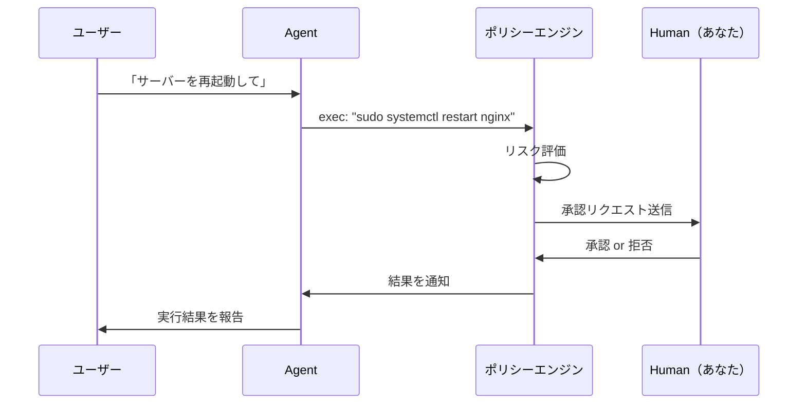

> **重要:** `sandbox.mode: "off"` はデフォルトで個人利用向け。複数人が使う場合や
> 信頼できないスキルを実行する場合は `"all"` に設定すること。

---

## 10. ステップ 8 — メモリを育てる

OpenClaw のメモリは **プレーンな Markdown ファイル** として保存されます。
隠れた状態はなく、すべてが透明です。

### メモリファイルの構成

| ファイル | 用途 | 更新頻度 |
|---------|------|---------|
| `MEMORY.md` | 長期記憶。好み・決定事項・ファクト | 定期的にキュレーション |
| `memory/YYYY-MM-DD.md` | 日次ノート。当日・前日が自動ロード | 毎日の会話で自動更新 |
| `DREAMS.md` | ドリームダイアリー。記憶のプロモーション記録 | Dreaming 機能が更新 |

### メモリのライフサイクル

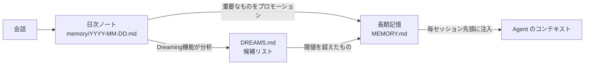

### メモリの使い方コツ

**Agent に直接お願いする方法（最も簡単）:**

```
「TypeScript より Python が好きなことを覚えておいて」
「毎週月曜に週次レビューをやることを記憶して」
「私の誕生日は3月15日です」
```

**メモリの検索・確認:**

```bash
# メモリの状態確認
openclaw memory status

# メモリを検索
openclaw memory search "誕生日"

# インデックスを再構築
openclaw memory index --force
```

### メモリバックエンドの選択

| バックエンド | 特徴 | 向いているケース |
|-------------|------|----------------|
| **Builtin（デフォルト）** | SQLite ベース。追加設定不要 | 個人利用・シンプルな構成 |
| **QMD** | ローカルファースト。リランキング対応 | 大量のノートを持つ上級者 |
| **Honcho** | AI ネイティブ。クロスセッション対応 | マルチエージェント・チーム |
| **LanceDB** | ベクトル検索特化 | セマンティック検索重視 |

---

## 11. 実践ユースケース集

実際にコミュニティメンバーが構築した活用事例です。

### ケース 1: パーソナル OS（最も基本的な使い方）

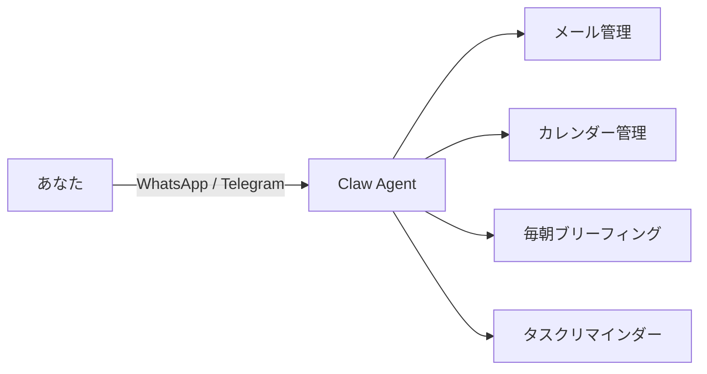

**AGENTS.md の設定例:**

```markdown
# My Personal Assistant

## Daily Routine
- 毎朝8時にその日の予定を要約してTelegramに送る
- 重要メールは即座に通知する
- 週次レビューを毎週金曜17時に実行する

## Communication Style
- 返答は日本語で
- 箇条書きより散文を好む
- 短く簡潔に
```

---

### ケース 2: 開発者向け — Claude Code との連携

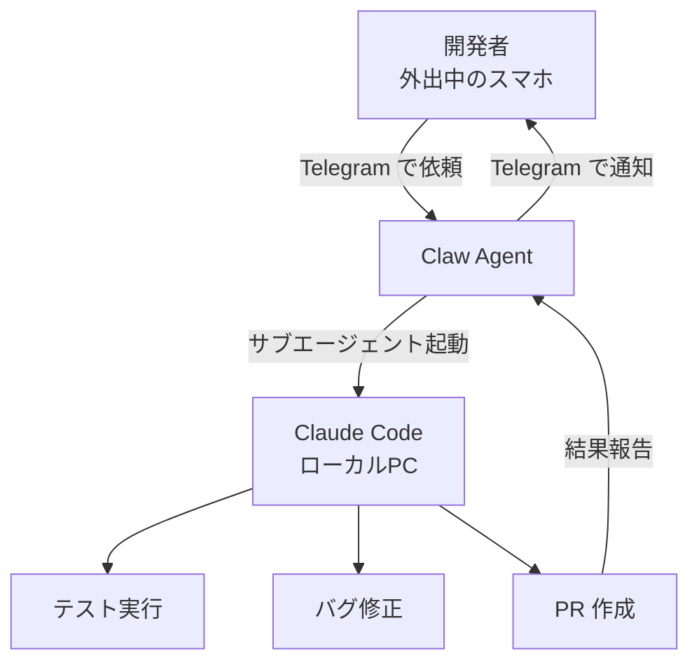

**立ち上げコマンド（Telegram チャットから）:**

```
「src/utils.ts の全テストを実行して、失敗したものを修正して PR を作ってください」
```

---

### ケース 3: マルチエージェント会社管理

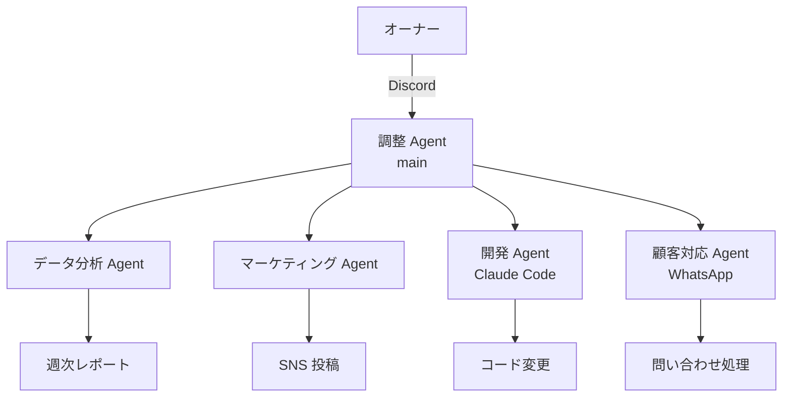

---

### ケース 4: ヘルスケア・ライフログ

```markdown
# HEARTBEAT.md

tasks:
  - name: 健康チェック
    due: daily
    prompt: |
      WHOOPのバイオメトリクスデータを取得して、
      今日の回復スコアと推奨アクティビティを通知してください

  - name: 水分摂取リマインダー
    due: every 2 hours
    prompt: "水を飲むように3回リマインドしてください"
```

---

### ケース 5: フロントエンド開発者向け — コードレビュー自動化

**Skill ファイル（`~/.openclaw/workspace/skills/code-review/SKILL.md`）:**

```markdown
---
name: code-review
description: フロントエンドコードの自動レビューワークフロー
---

# Code Review Workflow

1. 変更されたファイルを `read` ツールで読み込む
2. 以下の観点でレビューする:
   - TypeScript 型安全性
   - パフォーマンス（不要な再レンダリング）
   - アクセシビリティ（ARIA 属性）
   - CSS 設計原則（BEM / CUBE CSS）
3. 問題点を優先度順（Critical / Warning / Suggestion）でリスト化
4. 修正コードのサンプルを提示する
5. 承認が得られたら AGENTS.md のレビュー履歴に記録する
```

---

## 12. トラブルシューティング

### よくある問題と解決策

| 症状 | 原因 | 対処法 |
|------|------|--------|
| Gateway が起動しない | Node.js バージョン不足 | `node --version` で確認。22.19+ 必須 |
| Telegram からメッセージが届かない | Bot Token 間違い / dmPolicy 設定 | `openclaw channels status --probe` |
| ツールが使えない | tools.deny で無効化されている | `openclaw gateway status` でポリシー確認 |
| メモリが保存されない | Workspace パスが正しくない | `openclaw doctor` で診断 |
| Skill が読み込まれない | SKILL.md の frontmatter エラー | YAML の構文をチェック |

### 診断コマンド

```bash
# 全体的な健全性チェック
openclaw doctor

# Gateway のログを確認
openclaw gateway logs

# チャンネルの接続状態を確認
openclaw channels status --probe

# エージェント一覧とバインディング確認
openclaw agents list --bindings

# メモリインデックスの状態確認
openclaw memory status

# スキル一覧の確認
openclaw skills list
```

### Gateway の再起動方法

```bash
# 停止
openclaw gateway stop

# 起動（フォアグラウンド）
openclaw gateway

# バックグラウンドデーモンとして起動
openclaw gateway start --daemon

# 再起動
openclaw gateway restart
```

---

## 13. 参照ソース一覧

| 種別 | タイトル | URL |
|------|---------|-----|
| 公式サイト | OpenClaw トップページ | <https://openclaw.ai/> |
| 公式ドキュメント | Getting Started | <https://docs.openclaw.ai/start/getting-started> |
| 公式ドキュメント | Gateway アーキテクチャ | <https://docs.openclaw.ai/concepts/architecture> |
| 公式ドキュメント | Agent Runtime | <https://docs.openclaw.ai/concepts/agent> |
| 公式ドキュメント | マルチエージェント設定 | <https://docs.openclaw.ai/concepts/multi-agent> |
| 公式ドキュメント | Tools & Plugins 概要 | <https://docs.openclaw.ai/tools> |
| 公式ドキュメント | Skills リファレンス | <https://docs.openclaw.ai/tools/skills> |
| 公式ドキュメント | Skill 作成ガイド | <https://docs.openclaw.ai/tools/creating-skills> |
| 公式ドキュメント | 自動化（Cron/Heartbeat） | <https://docs.openclaw.ai/automation> |
| 公式ドキュメント | Memory 概要 | <https://docs.openclaw.ai/concepts/memory> |
| 公式ドキュメント | SOUL.md ガイド | <https://docs.openclaw.ai/concepts/soul> |
| 公式ドキュメント | サンドボックス | <https://docs.openclaw.ai/gateway/sandboxing> |
| 公式ドキュメント | セキュリティ | <https://docs.openclaw.ai/gateway/security> |
| 公式ドキュメント | Exec 承認 | <https://docs.openclaw.ai/tools/exec-approvals> |
| Skills マーケット | ClawHub（コミュニティ Skill 集） | <https://clawhub.ai> |
| GitHub | ソースコード | <https://github.com/openclaw/openclaw> |
| コミュニティ | Discord サーバー | <https://discord.com/invite/clawd> |
| プレス | TechCrunch 記事（2026/1） | <https://techcrunch.com/2026/01/30/openclaws-ai-assistants-are-now-building-their-own-social-network/> |
| プレス | The Verge — ClawCon レポート | <https://www.theverge.com/ai-artificial-intelligence/890517/openclaw-clawcon-meetup-nyc-open-source-ai> |

---

## まとめ：学習ロードマップ

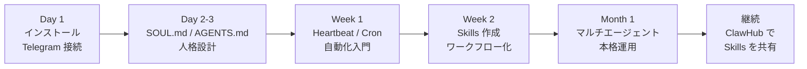

| フェーズ | 目標 | 完了の目安 |
|---------|------|-----------|
| **Day 1** | インストール＋最初のチャット | Gateway が動き Telegram から返信が来る |
| **Day 2-3** | 人格・記憶を設計 | SOUL.md / AGENTS.md を自分用にカスタマイズ |
| **Week 1** | 自動化を始める | 朝のブリーフィングが届くようになる |
| **Week 2** | Skill を書く | 繰り返しタスクを 1つ Skill 化する |
| **Month 1** | マルチエージェント | 仕事用とプライベート用を分離して運用 |
| **継続** | コミュニティに貢献 | ClawHub に Skill を公開する |

---

> このガイドは 2026年6月4日時点の情報をもとに作成されています。
> OpenClaw は活発に開発されているため、最新情報は必ず公式ドキュメントをご確認ください。
> 公式ドキュメント: <https://docs.openclaw.ai>
