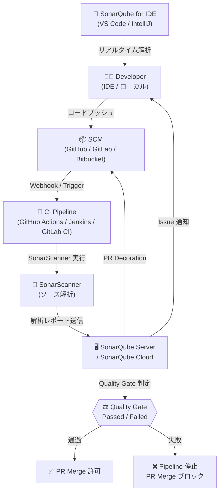
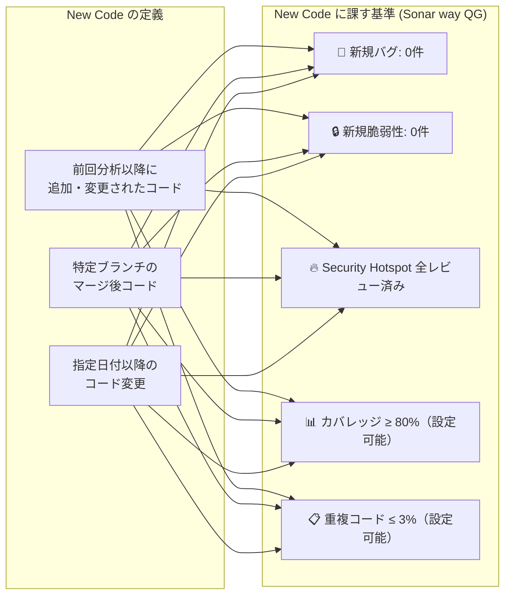
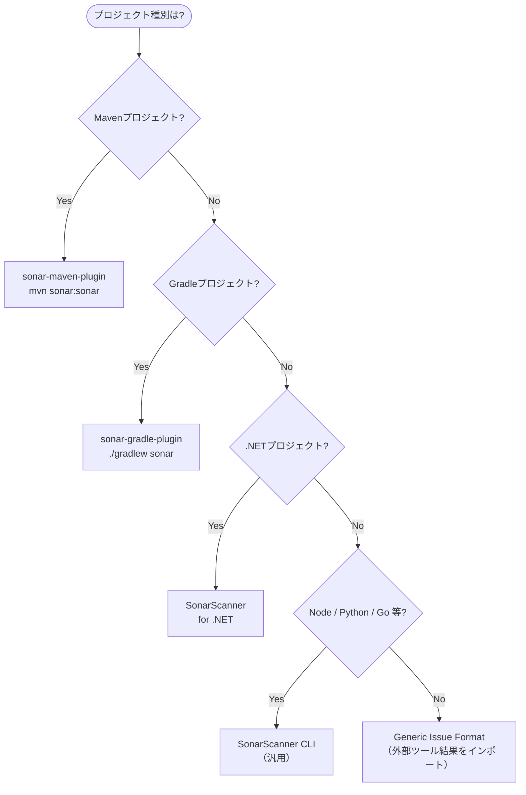
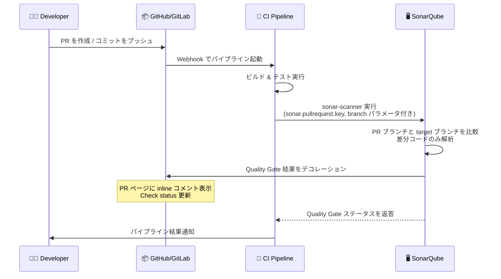
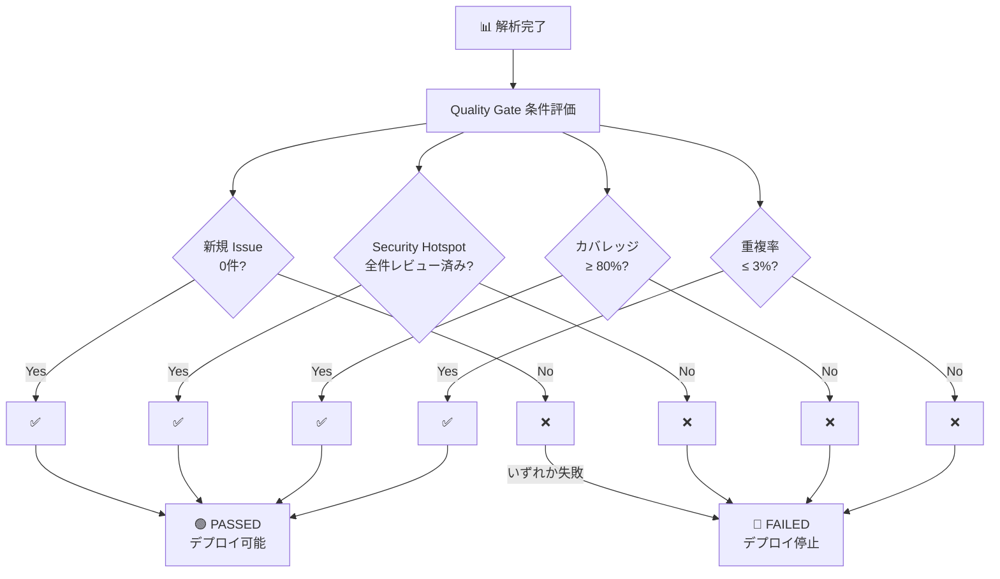
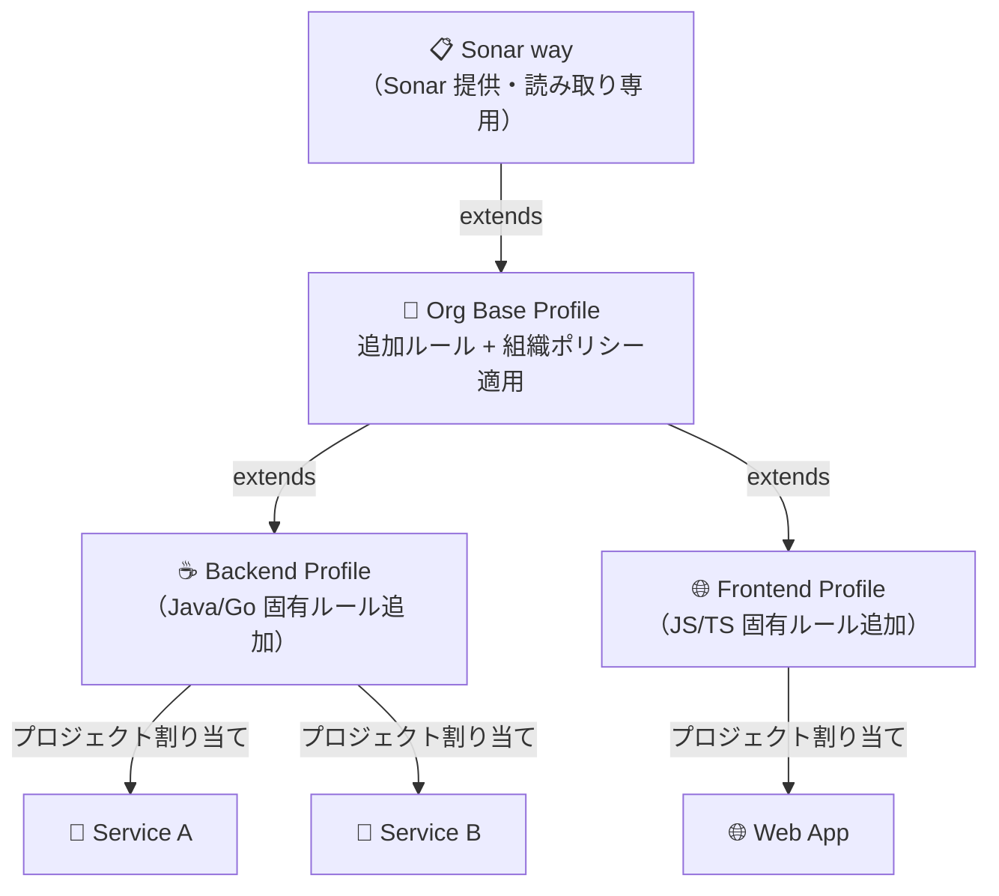
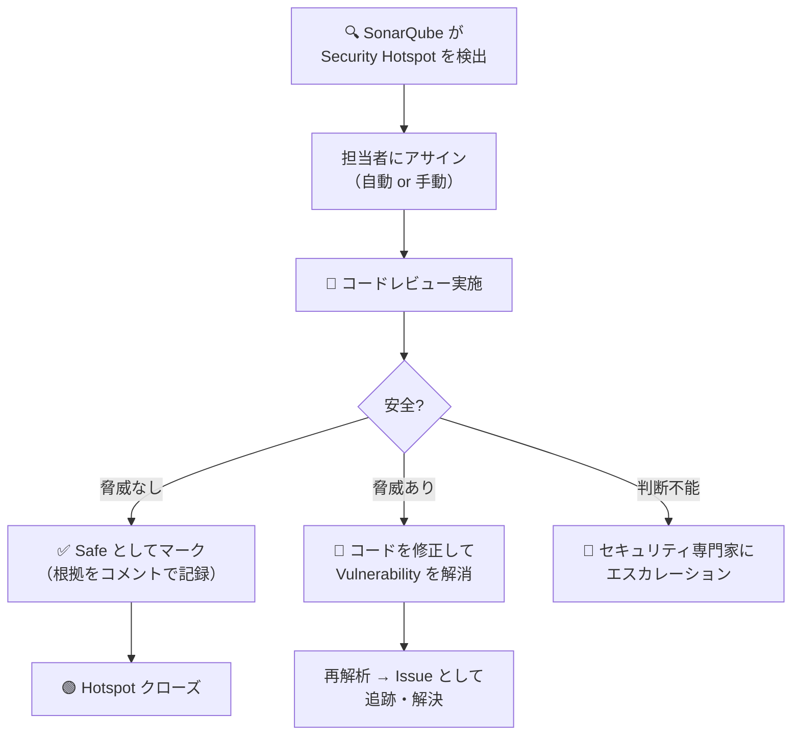
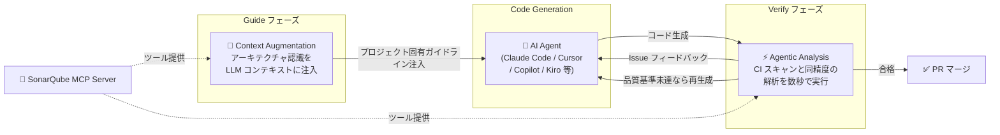
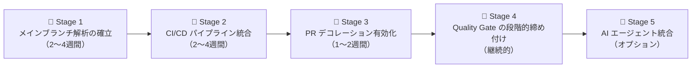

# SonarQube Code Review 実践ガイド
> 中級者〜上級者向け | SonarQube Server 2026.x / SonarQube Cloud 対応

---

## 目次

1. [SonarQube の全体像](#1-sonarqube-の全体像)
2. [コアコンセプト](#2-コアコンセプト)
3. [プロジェクト設定とスキャナー構成](#3-プロジェクト設定とスキャナー構成)
4. [CI/CD パイプラインへの統合](#4-cicd-パイプラインへの統合)
5. [Pull Request 解析とデコレーション](#5-pull-request-解析とデコレーション)
6. [Quality Gates の高度な設計](#6-quality-gates-の高度な設計)
7. [Quality Profiles とカスタムルール](#7-quality-profiles-とカスタムルール)
8. [セキュリティ解析の活用](#8-セキュリティ解析の活用)
9. [AI エージェント統合 (2026 最新機能)](#9-ai-エージェント統合-2026-最新機能)
10. [Web API による自動化](#10-web-api-による自動化)
11. [運用ベストプラクティス](#11-運用ベストプラクティス)

---

## 1. SonarQube の全体像

SonarQube は**継続的インスペクション**プラットフォームであり、静的解析によってコードの信頼性・セキュリティ・保守性を自動評価する。Fortune 100 企業の 75% が採用し、毎日 7,500 億行以上のコードを解析している。

### 1.1 アーキテクチャ概要



### 1.2 エディション比較

| 機能 | Community Build | Developer Edition | Enterprise Edition | Data Center Edition |
|------|:-----------:|:---------------:|:----------------:|:-----------------:|
| メインブランチ解析 | ✅ | ✅ | ✅ | ✅ |
| マルチブランチ解析 | ❌ | ✅ | ✅ | ✅ |
| PR 解析 & デコレーション | ❌ | ✅ | ✅ | ✅ |
| Portfolio / Application 管理 | ❌ | ❌ | ✅ | ✅ |
| セキュリティレポート (OWASP 等) | ❌ | ❌ | ✅ | ✅ |
| 高可用性クラスタ | ❌ | ❌ | ❌ | ✅ |
| Remediation Agent (Beta) | ❌ | ❌ | ✅ (Cloud) | ✅ (Cloud) |

---

## 2. コアコンセプト

### 2.1 Clean as You Code (CaYC)

SonarQube が推奨する品質戦略。既存の負債を一度に解消しようとするのではなく、**新規コード（New Code）に常に高い品質基準を課す**アプローチ。



> **戦略的意義：** 既存のレガシーコードに縛られず、開発者は自分が手を加えた範囲のみに責任を持つ。SonarQube は新規 Issue を自動的に作成者にアサインする。

### 2.2 ルールの 4 分類（MQR モード）

SonarQube 2026 では**Multi-Quality Rule (MQR) モード**が標準。ルールは単一カテゴリではなく複数の品質特性に影響する場合がある。

| ルール種別 | 説明 | False Positive 目標 |
|-----------|------|:-----------------:|
| **Bug** | 実行時の誤動作を引き起こすコード | 0% |
| **Vulnerability** | 攻撃者が悪用できるコード（インジェクション等） | < 20% |
| **Security Hotspot** | セキュリティ観点でレビューが必要なコード | 手動レビュー後 80% 解決 |
| **Code Smell** | 保守性・可読性を損なうコード | 0% |

### 2.3 メトリクスの定義

| メトリクス | 定義 | 良好値の目安 |
|-----------|------|------------|
| **Coverage** | テストが実行するコード行の割合 | 新規コード ≥ 80% |
| **Duplications** | 重複したコードブロックの割合 | 新規コード ≤ 3% |
| **Reliability Rating** | バグの深刻度に基づく A〜E 評価 | A（バグなし） |
| **Security Rating** | 脆弱性の深刻度に基づく A〜E 評価 | A（脆弱性なし） |
| **Maintainability Rating** | Code Smell の修正工数率 | A（≤ 5%） |
| **SQALE Index** | 技術的負債の修正に要する推定時間 | プロジェクト規模による |

---

## 3. プロジェクト設定とスキャナー構成

### 3.1 sonar-project.properties の設計

プロジェクトルートに配置する設定ファイル。明示的に記述することでスキャナーの自動検出に依存しない堅牢な設定が実現できる。

```properties
# ===== プロジェクト識別子 =====
sonar.projectKey=com.example:my-service
sonar.projectName=My Service
sonar.projectVersion=1.0.0

# ===== ソースコード設定 =====
sonar.sources=src/main
sonar.tests=src/test
sonar.sourceEncoding=UTF-8

# ===== 言語固有設定 (Java 例) =====
sonar.java.binaries=target/classes
sonar.java.libraries=target/dependency/*.jar
sonar.java.test.binaries=target/test-classes

# ===== カバレッジレポート =====
sonar.coverage.jacoco.xmlReportPaths=target/site/jacoco/jacoco.xml

# ===== 除外設定 =====
# 自動生成コード・テストデータ・設定ファイルは解析対象外
sonar.exclusions=**/generated/**,**/vendor/**,**/*.min.js
sonar.coverage.exclusions=**/config/**,**/dto/**,**/entity/**
sonar.test.exclusions=**/testdata/**

# ===== New Code 定義（プロジェクトレベル上書き） =====
# previous_version: 前回バージョン以降
# NUMBER_OF_DAYS: 直近N日
# reference_branch: 特定ブランチとの差分
sonar.newCode.referenceBranch=main

# ===== ブランチ設定（Developer Edition 以上） =====
# CI 環境では環境変数から自動取得されるが、ローカル実行時は明示指定
# sonar.branch.name=feature/my-feature
```

### 3.2 スキャナー選択ガイド



### 3.3 トークン管理のベストプラクティス

```bash
# NG: トークンをファイルに直書き（セキュリティリスク）
sonar.login=sqp_xxxxxxxxxxxxxxxx

# OK: 環境変数経由で渡す（CI のシークレット管理を利用）
SONAR_TOKEN=sqp_xxxxxxxxxxxxxxxx
sonar-scanner -Dsonar.token="${SONAR_TOKEN}"
```

**トークン種別の使い分け：**

| トークン種別 | スコープ | 推奨用途 |
|------------|--------|--------|
| User Token | ユーザー権限相当 | ローカル開発・デバッグ |
| Project Analysis Token | 単一プロジェクトの解析のみ | CI/CD パイプライン（最小権限原則） |
| Global Analysis Token | 全プロジェクトの解析 | 中央集権 CI（使用は最小限に） |

---

## 4. CI/CD パイプラインへの統合

### 4.1 GitHub Actions

#### 標準的なワークフロー構成

```yaml
# .github/workflows/sonarqube.yml
name: SonarQube Analysis

on:
  push:
    branches: [main, develop]
  pull_request:
    types: [opened, synchronize, reopened]

jobs:
  sonarqube:
    name: SonarQube Scan
    runs-on: ubuntu-latest

    steps:
      - name: Checkout repository
        uses: actions/checkout@v4
        with:
          fetch-depth: 0  # 完全な Git 履歴取得（New Code 検出に必須）

      - name: Set up JDK 21
        uses: actions/setup-java@v4
        with:
          java-version: '21'
          distribution: 'temurin'
          cache: 'maven'

      - name: Cache SonarQube packages
        uses: actions/cache@v4
        with:
          path: ~/.sonar/cache
          key: ${{ runner.os }}-sonar
          restore-keys: ${{ runner.os }}-sonar

      - name: Build and run tests with coverage
        run: mvn -B verify -Pcoverage

      - name: SonarQube Scan
        uses: SonarSource/sonarqube-scan-action@v5
        env:
          SONAR_TOKEN: ${{ secrets.SONAR_TOKEN }}
          SONAR_HOST_URL: ${{ secrets.SONAR_HOST_URL }}

      # Quality Gate の結果を待機してパイプラインを制御
      - name: SonarQube Quality Gate check
        id: sonarqube-quality-gate-check
        uses: SonarSource/sonarqube-quality-gate-action@v1
        timeout-minutes: 5
        env:
          SONAR_TOKEN: ${{ secrets.SONAR_TOKEN }}
          SONAR_HOST_URL: ${{ secrets.SONAR_HOST_URL }}

      - name: "Fail if Quality Gate failed"
        if: steps.sonarqube-quality-gate-check.outputs.quality-gate-status == 'FAILED'
        run: |
          echo "Quality Gate FAILED: ${{ steps.sonarqube-quality-gate-check.outputs.quality-gate-status }}"
          exit 1
```

> **重要:** `fetch-depth: 0` は必須。浅いクローン（shallow clone）では Git の変更履歴が取得できず、New Code の検出精度が大幅に低下する。

### 4.2 GitLab CI/CD

```yaml
# .gitlab-ci.yml
stages:
  - test
  - sonarqube

variables:
  SONAR_USER_HOME: "${CI_PROJECT_DIR}/.sonar"
  GIT_DEPTH: "0"  # 完全な Git 履歴（GitHub Actions の fetch-depth: 0 相当）

sonarqube-check:
  stage: sonarqube
  image: 
    name: sonarsource/sonar-scanner-cli:latest
    entrypoint: [""]
  cache:
    key: "${CI_JOB_NAME}"
    paths:
      - .sonar/cache
  script:
    - sonar-scanner
      -Dsonar.qualitygate.wait=true
  allow_failure: false
  rules:
    - if: $CI_PIPELINE_SOURCE == 'merge_request_event'
    - if: $CI_COMMIT_BRANCH == 'main'
    - if: $CI_COMMIT_BRANCH == 'develop'
```

### 4.3 Jenkins Declarative Pipeline

```groovy
// Jenkinsfile
pipeline {
    agent any

    tools {
        jdk 'JDK21'
        maven 'Maven3'
    }

    environment {
        SONAR_ENV = 'SonarQube'  // Jenkins Global Configuration での名前
    }

    stages {
        stage('Checkout') {
            steps {
                checkout scm
            }
        }

        stage('Build & Test') {
            steps {
                sh 'mvn -B clean verify -Pcoverage'
            }
            post {
                always {
                    junit 'target/surefire-reports/*.xml'
                    jacoco(
                        execPattern: 'target/*.exec',
                        classPattern: 'target/classes',
                        sourcePattern: 'src/main/java'
                    )
                }
            }
        }

        stage('SonarQube Analysis') {
            steps {
                withSonarQubeEnv(env.SONAR_ENV) {
                    sh 'mvn sonar:sonar'
                }
            }
        }

        stage('Quality Gate') {
            steps {
                // Webhook を使ったノンブロッキング待機（推奨）
                timeout(time: 5, unit: 'MINUTES') {
                    waitForQualityGate abortPipeline: true
                }
            }
        }
    }

    post {
        failure {
            // Slack / Teams / メール通知
            slackSend(
                color: 'danger',
                message: "❌ SonarQube Quality Gate Failed: ${env.JOB_NAME} #${env.BUILD_NUMBER}"
            )
        }
    }
}
```

**Webhook 設定（Jenkins 連携に必須）：**  
SonarQube 管理画面 → Administration → Configuration → Webhooks で  
`http://<jenkins-host>/sonarqube-webhook/` を登録する。

### 4.4 CI/CD 統合パターンの比較

| 方式 | 利点 | 欠点 | 推奨シーン |
|------|------|------|----------|
| `sonar.qualitygate.wait=true` | 設定シンプル | スキャナーがポーリング（CPU・時間消費） | 小規模・シンプルな構成 |
| Quality Gate Action（GitHub） | 非同期・効率的 | Actions 依存 | GitHub Actions |
| `waitForQualityGate`（Jenkins） | Webhook 活用で軽量 | Jenkins Webhook 設定が必要 | Jenkins |
| 外部 API ポーリング | CI ツール非依存 | 実装コスト高 | 独自 CI 基盤 |

---

## 5. Pull Request 解析とデコレーション

### 5.1 PR 解析のフロー



### 5.2 PR パラメータの設定

SonarScanner は多くの CI 環境でパラメータを自動検出するが、手動設定が必要な場合：

```bash
sonar-scanner \
  -Dsonar.pullrequest.key=${PR_NUMBER} \
  -Dsonar.pullrequest.branch=${SOURCE_BRANCH} \
  -Dsonar.pullrequest.base=${TARGET_BRANCH} \
  -Dsonar.pullrequest.provider=GitHub \
  -Dsonar.pullrequest.github.repository=org/repo
```

**自動検出が対応している CI 環境：** GitHub Actions, GitLab CI, Jenkins (Multibranch), CircleCI, Azure Pipelines, Bitbucket Pipelines

### 5.3 PR 解析の挙動と制約

- PR 解析は**PR ブランチに追加・変更されたコードのみ**を対象とする
- ターゲットブランチ上の既存 Issue は報告されない（Issue バックデーティング適用外）
- マージ後の最初のメインブランチ解析では、PR 解析で未検出だった Issue が出現することがある
- PR 解析結果は**デフォルト 30 日間**保持（`Administration → Housekeeping` で変更可能）
- Issue の属性（ステータス・アサイン・コメント）はターゲットブランチと同期される

---

## 6. Quality Gates の高度な設計

### 6.1 Quality Gate の評価フロー



### 6.2 カスタム Quality Gate の設計指針

組織・プロジェクト特性に応じた Quality Gate の条件設計例：

**厳格な本番サービス向け：**

| 条件 | メトリクス | 演算子 | 閾値 | 対象 |
|------|----------|-------|-----|------|
| 新規 Issue ゼロ | Issues | is greater than | 0 | New Code |
| 全 Hotspot レビュー | Security Hotspots Reviewed | is less than | 100% | New Code |
| 高カバレッジ | Coverage | is less than | 85% | New Code |
| 重複最小化 | Duplicated Lines (%) | is greater than | 2% | New Code |
| 信頼性評価 | Reliability Rating | is worse than | A | New Code |
| セキュリティ評価 | Security Rating | is worse than | A | New Code |

**初期導入・レガシー移行期向け（段階的締め付け）：**

| フェーズ | Coverage 閾値 | 重複率閾値 | コメント |
|---------|:------------:|:--------:|--------|
| Phase 1（導入期） | ≥ 50% | ≤ 10% | まず分析を回すことを優先 |
| Phase 2（安定期） | ≥ 70% | ≤ 5% | カバレッジを本格化 |
| Phase 3（成熟期） | ≥ 80% | ≤ 3% | 業界標準水準 |

### 6.3 Quality Gate のスコープ管理

```
Administration → Quality Gates
├── Sonar way（デフォルト・読み取り専用）
├── My Org Strict（本番サービス用）
│   └── プロジェクト A, B に割り当て
└── My Org Relaxed（実験的プロジェクト用）
    └── プロジェクト C, D に割り当て
```

**権限モデル：** `Administer Quality Gates` 権限を持つユーザーが特定 QG の管理権限を特定ユーザー・グループに委譲できる。

---

## 7. Quality Profiles とカスタムルール

### 7.1 Quality Profile の継承戦略

`Sonar way` プロファイルを直接変更せず、**継承（Extend）** を使うことで公式アップデートを自動取得できる。



**継承の利点：**
- 親プロファイル更新時に新ルールが自動継承される
- 子プロファイルで追加ルールを有効化できる
- インスタンス設定によっては親のルールを子で無効化することも可能

### 7.2 カスタムルールの追加方法

**方法 1: XPath ルール（UI から即座に作成可能）**

```
Quality Profiles → ルール詳細画面 → テンプレートから作成
```

テンプレートルールが存在する言語（Java, C# 等）でのみ利用可能。実装コストが低いが機能が限定的。

**方法 2: Java Plugin API（フル機能・推奨）**

```java
@Rule(key = "NoSystemOutPrintlnRule")
public class NoSystemOutPrintlnRule extends IssuableSubscriptionVisitor {
    
    @Override
    public List<Tree.Kind> nodesToVisit() {
        return Collections.singletonList(Tree.Kind.EXPRESSION_STATEMENT);
    }

    @Override
    public void visitNode(Tree tree) {
        ExpressionStatementTree expr = (ExpressionStatementTree) tree;
        String text = expr.firstToken().text();
        if (text.contains("System.out.println")) {
            reportIssue(tree, "System.out.println を使用しないでください。ロガーを使用してください。");
        }
    }
}
```

**方法 3: Generic Issue Format（外部ツール結果のインポート）**

ESLint・Semgrep・Checkstyle 等の結果を SonarQube に取り込む。

```json
{
  "issues": [
    {
      "engineId": "eslint",
      "ruleId": "no-console",
      "severity": "MINOR",
      "type": "CODE_SMELL",
      "primaryLocation": {
        "message": "console.log の使用を避けてください",
        "filePath": "src/utils/helper.js",
        "textRange": {
          "startLine": 42,
          "endLine": 42
        }
      }
    }
  ]
}
```

```bash
sonar-scanner \
  -Dsonar.externalIssuesReportPaths=eslint-report.json
```

### 7.3 ルールのカスタムパラメータ調整

既存ルールのパラメータ（閾値等）を Quality Profile 単位で調整できる。

```
Quality Profiles → Java Profile → Rules → 対象ルール → Change Severity / Parameters
```

例：`java:S1135`（TODO コメントのルール）のデフォルト severity を `INFO → MINOR` に変更し、CI を止めないよう調整するなど。

---

## 8. セキュリティ解析の活用

### 8.1 Security Hotspot のレビューワークフロー

Hotspot は脆弱性ではなく「セキュリティに敏感なコード」であり、**必ず人間によるレビューが必要**。



### 8.2 Security-Injection ルールの拡張設定（Enterprise）

カスタムフレームワーク固有の入力源・サニタイザー・シンクを Taint 解析に登録：

```xml
<!-- security-custom-config.xml -->
<customConfiguration>
  <sources>
    <method>
      <name>getCustomInput</name>
      <className>com.example.CustomRequestWrapper</className>
    </method>
  </sources>
  <sanitizers>
    <method>
      <name>sanitizeInput</name>
      <className>com.example.InputSanitizer</className>
    </method>
  </sanitizers>
  <sinks>
    <method>
      <name>executeQuery</name>
      <className>com.example.CustomDbWrapper</className>
      <args>0</args>
    </method>
  </sinks>
</customConfiguration>
```

### 8.3 セキュリティ標準へのマッピング

SonarQube が対応しているセキュリティ標準：

| 標準 | 対応内容 |
|------|--------|
| OWASP Top 10 2021 | A01〜A10 全カテゴリのルールをマッピング |
| OWASP ASVS | Level 1〜3 の要件に対応 |
| CWE | 個別 CWE 番号でフィルタリング可能 |
| SANS Top 25 | 全 25 カテゴリに対応 |
| PCI DSS | 関連ルールをタグで識別 |
| CERT | C/C++/Java の CERT 標準に対応 |
| MISRA C++ 2023 | Enterprise Edition 以上 |

---

## 9. AI エージェント統合 (2026 最新機能)

### 9.1 SonarQube の AI 機能全体像



### 9.2 SonarQube MCP Server の設定

SonarQube MCP Server は Claude Code, Cursor, VS Code + Copilot, Windsurf, Kiro, Zed 等の AI エージェントに接続できる。

**Docker を使った設定（推奨・最も簡単）：**

```json
// Claude Code / Cursor の mcp_config.json
{
  "mcpServers": {
    "sonarqube": {
      "command": "docker",
      "args": [
        "run", "--init", "--pull=always",
        "-i", "--rm",
        "-e", "SONARQUBE_TOKEN",
        "-e", "SONARQUBE_ORG",
        "mcp/sonarqube"
      ],
      "env": {
        "SONARQUBE_TOKEN": "<YOUR_PROJECT_ANALYSIS_TOKEN>",
        "SONARQUBE_ORG": "<YOUR_ORG_KEY>"
      }
    }
  }
}
```

**利用可能なツールセット：**

| ツールセット | 提供する能力 | 要件 |
|------------|------------|------|
| `issues` | Issue の取得・フィルタリング・コメント追加 | 標準 |
| `quality-gates` | QG ステータスの確認 | 標準 |
| `security-hotspots` | Hotspot のレビュー支援 | 標準 |
| `analysis` | コードスニペットの即時解析 | 標準 |
| `coverage` | テストカバレッジ情報 | 標準 |
| `cag` (Context Augmentation) | コールフロー・クラス階層・ガイドライン | Cloud アドオン |

### 9.3 Context Augmentation の活用

Context Augmentation は AI コーディングエージェントがコードを生成・編集する**前**に、プロジェクト固有の知識を注入する。

提供されるコンテキストの 4 カテゴリ：

- **ガイドライン（Guidelines）：** エージェントのプロンプト内容に基づき、関連する Sonar ルールを LLM コンテキストに挿入。例：DB アクセスに関する操作 → SQL インジェクション関連ルールを自動挿入
- **コードナビゲーション（Code Navigation）：** テキスト検索ではなく、コールスタック・クラス階層・参照情報に基づきコードベースを意味的に探索
- **サードパーティ依存関係（Dependency Guidance）：** 新規ライブラリ追加前に、既知の脆弱性・サプライチェーンマルウェア・ライセンス準拠を事前確認
- **コーディング標準（Coding Standards）：** プロジェクト固有の過去 Issue 傾向から適切な標準を推奨

### 9.4 Remediation Agent（Beta）

SonarQube Cloud の Team / Enterprise プランで利用可能。PR の Issue を自動修正する AI エージェント。

**動作フロー：**
1. PR 解析で Issue が検出される
2. 「Assign to Agent」ボタンをクリック（またはバックログ Issue に適用）
3. Remediation Agent が独立して Issue を解析・修正 PR を作成
4. 開発者がレビューして承認

> **注意：** Beta 機能であり、現時点では Reliability・Maintainability Issue に対応。Security Issue への自動修正提案は人間の最終確認が必須。

---

## 10. Web API による自動化

### 10.1 主要 API エンドポイント

| エンドポイント | 用途 | メソッド |
|--------------|------|--------|
| `/api/qualitygates/project_status` | 特定プロジェクトの QG ステータス取得 | GET |
| `/api/issues/search` | Issue の検索・フィルタリング | GET |
| `/api/measures/component` | メトリクス値の取得 | GET |
| `/api/projects/search` | プロジェクト一覧取得 | GET |
| `/api/qualityprofiles/search` | Quality Profile 一覧取得 | GET |
| `/api/webhooks/create` | Webhook の登録 | POST |
| `/api/user_tokens/generate` | API トークン発行 | POST |

### 10.2 Quality Gate ステータスの取得

```bash
# プロジェクトの QG ステータスをチェック
curl -u "${SONAR_TOKEN}:" \
  "${SONAR_HOST_URL}/api/qualitygates/project_status?projectKey=com.example:my-service&branch=main" \
  | jq '{
      status: .projectStatus.status,
      conditions: [
        .projectStatus.conditions[] | 
        select(.status != "OK") | 
        {metric: .metricKey, status: .status, actual: .actualValue, threshold: .errorThreshold}
      ]
    }'
```

**レスポンス例（失敗時）：**

```json
{
  "status": "ERROR",
  "conditions": [
    {
      "metric": "new_coverage",
      "status": "ERROR",
      "actual": "72.3",
      "threshold": "80"
    }
  ]
}
```

### 10.3 Issue ダッシュボードの自動生成

```python
import requests
import os

SONAR_TOKEN = os.environ["SONAR_TOKEN"]
SONAR_HOST = os.environ["SONAR_HOST_URL"]
PROJECT_KEY = "com.example:my-service"

def get_new_code_issues(branch: str = "main") -> dict:
    """新規コードの Issue サマリーを取得"""
    params = {
        "componentKeys": PROJECT_KEY,
        "resolved": "false",
        "sinceLeakPeriod": "true",  # New Code のみ
        "branch": branch,
        "facets": "types,severities",
        "ps": 1  # カウントだけ必要
    }
    resp = requests.get(
        f"{SONAR_HOST}/api/issues/search",
        params=params,
        auth=(SONAR_TOKEN, "")
    )
    resp.raise_for_status()
    return resp.json()

issues = get_new_code_issues()
print(f"New Code Issues: {issues['total']}")
for facet in issues.get("facets", []):
    if facet["property"] == "types":
        for v in facet["values"]:
            print(f"  {v['val']}: {v['count']}")
```

---

## 11. 運用ベストプラクティス

### 11.1 段階的導入ロードマップ



### 11.2 チームへの展開における注意点

**False Positive への対応：**

- `// NOSONAR` はルール違反の免罪符ではなく、**設計上の例外**として使用する
- Issue を `Won't Fix` にする場合はコメントで根拠を必ず記録する
- 過度な NOSONAR はメトリクスを歪めるため、チームでの承認プロセスを設ける

**Issue 優先度付けの指針：**

| 優先度 | 対象 Issue | 対応方針 |
|-------|------------|--------|
| 🔴 最高 | Blocker Bug / Blocker Vulnerability | 即座に修正・リリースブロック |
| 🟠 高 | Critical Bug / Vulnerability | 次スプリントで必ず修正 |
| 🟡 中 | Major Code Smell / Minor Vulnerability | バックログに積み、計画的に対応 |
| 🟢 低 | Info / Minor Code Smell | 余裕があれば対応 |

### 11.3 パフォーマンスチューニング

**解析時間の短縮：**

```properties
# テスト済みの依存ライブラリは解析対象外
sonar.exclusions=**/node_modules/**,**/vendor/**,**/dist/**

# 大規模プロジェクトでは並列解析を有効化
sonar.java.jvmArgs=-Xmx4g

# キャッシュ活用（SonarScanner CLI）
sonar.scanner.cacheDirectory=/opt/sonar-cache
```

**キャッシュ戦略（GitHub Actions）：**

```yaml
- uses: actions/cache@v4
  with:
    path: |
      ~/.sonar/cache
      ~/.m2/repository
    key: sonar-${{ runner.os }}-${{ hashFiles('**/pom.xml') }}
    restore-keys: sonar-${{ runner.os }}-
```

### 11.4 モノレポ対応

複数サービスを 1 リポジトリで管理する場合の設定：

```yaml
# GitHub Actions - モノレポ並列解析
jobs:
  sonar-service-a:
    uses: ./.github/workflows/sonar-scan.yml
    with:
      project-key: com.example:service-a
      sources-path: services/service-a/src
    secrets: inherit

  sonar-service-b:
    uses: ./.github/workflows/sonar-scan.yml
    with:
      project-key: com.example:service-b
      sources-path: services/service-b/src
    secrets: inherit
```

---

## 参考リソース

| リソース | URL |
|---------|-----|
| SonarQube Server 2026.2 公式ドキュメント | https://docs.sonarsource.com/sonarqube-server/2026.2/ |
| SonarQube Cloud 公式ドキュメント | https://docs.sonarsource.com/sonarqube-cloud/ |
| SonarQube MCP Server ドキュメント | https://docs.sonarsource.com/sonarqube-mcp-server/ |
| Sonar Context Augmentation | https://www.sonarsource.com/blog/introducing-sonar-context-augmentation |
| SonarQube MCP Server GitHub | https://github.com/SonarSource/sonarqube-mcp-server |
| SonarSource コミュニティフォーラム | https://community.sonarsource.com/ |
| Sonar ルールエクスプローラー | https://rules.sonarsource.com/ |

---

> **最終更新:** 2026 年 6 月  
> **対応バージョン:** SonarQube Server 2026.2 / SonarQube Cloud (2026.1 LTA 準拠)  
> **情報源:** [docs.sonarsource.com](https://docs.sonarsource.com/) を一次情報源として使用
